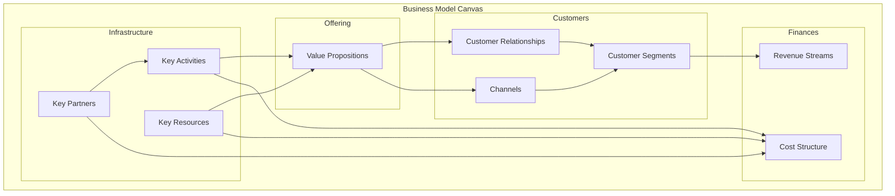
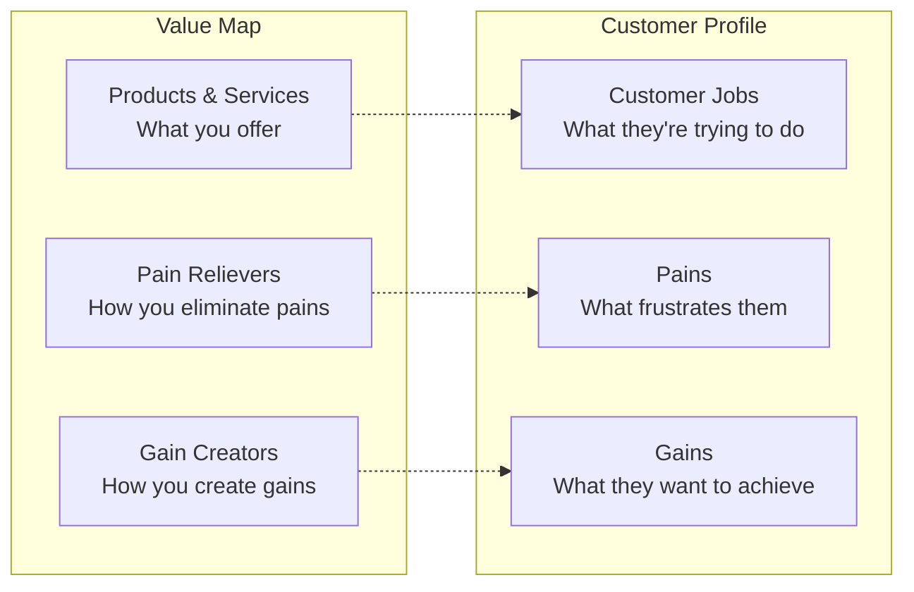
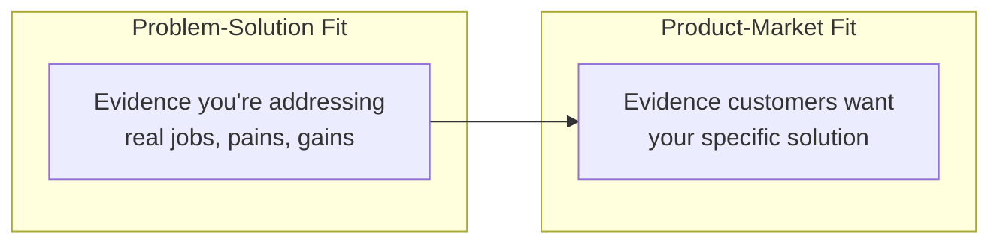

# Business Model Frameworks

Frameworks for designing, analyzing, and innovating how organizations create, deliver, and capture value.

## Frameworks in This Category

| Framework | Purpose | When to Use |
|-----------|---------|-------------|
| [Business Model Canvas](#business-model-canvas) | Visualize complete business model | New ventures, competitor analysis, innovation |
| [Value Proposition Canvas](#value-proposition-canvas) | Design customer-solution fit | Value proposition design, product-market fit |

---

## Business Model Canvas

**Purpose**: Visualizes how a business creates, delivers, and captures value across nine building blocks.

**Strengths**:
- Provides shared language for business model discussion
- Reveals interdependencies between business components
- Enables rapid business model prototyping and comparison

**When to use**:
- Designing new business models or ventures
- Analyzing competitor business models
- Identifying business model innovation opportunities
- Communicating strategy to stakeholders

### The Nine Building Blocks



### Building Block Details

| Block | Key Questions | Examples |
|-------|--------------|----------|
| **Customer Segments** | Who are we creating value for? Which customers matter most? | Mass market, niche, segmented, diversified, multi-sided |
| **Value Propositions** | What value do we deliver? What problem do we solve? | Newness, performance, customization, design, price, risk reduction |
| **Channels** | How do we reach and deliver to customers? | Direct sales, web, stores, partners, wholesale |
| **Customer Relationships** | What relationship does each segment expect? | Personal, self-service, automated, communities, co-creation |
| **Revenue Streams** | What are customers willing to pay for? How? | Asset sale, subscription, licensing, advertising, usage fees |
| **Key Resources** | What assets are required for the model? | Physical, intellectual, human, financial |
| **Key Activities** | What must we do well to deliver value? | Production, problem-solving, platform management |
| **Key Partners** | Who helps us operate the model? | Strategic alliances, coopetition, joint ventures, suppliers |
| **Cost Structure** | What are the major cost drivers? | Fixed costs, variable costs, economies of scale/scope |

### Canvas Template

```
┌─────────────────┬─────────────────┬─────────────────┬─────────────────┬─────────────────┐
│  KEY PARTNERS   │ KEY ACTIVITIES  │     VALUE       │   CUSTOMER      │    CUSTOMER     │
│                 │                 │  PROPOSITIONS   │  RELATIONSHIPS  │    SEGMENTS     │
│  Who are our    │ What key        │                 │                 │                 │
│  key partners?  │ activities do   │  What value do  │  What type of   │  For whom are   │
│                 │ our value       │  we deliver?    │  relationship   │  we creating    │
│  Who are our    │ propositions    │                 │  does each      │  value?         │
│  key suppliers? │ require?        │  Which customer │  segment        │                 │
│                 │                 │  needs are we   │  expect?        │  Who are our    │
│                 ├─────────────────┤  satisfying?    │                 │  most important │
│                 │  KEY RESOURCES  │                 ├─────────────────┤  customers?     │
│                 │                 │                 │    CHANNELS     │                 │
│                 │ What key        │                 │                 │                 │
│                 │ resources do    │                 │  How do we      │                 │
│                 │ our value       │                 │  reach our      │                 │
│                 │ propositions    │                 │  customer       │                 │
│                 │ require?        │                 │  segments?      │                 │
├─────────────────┴─────────────────┼─────────────────┴─────────────────┴─────────────────┤
│         COST STRUCTURE            │                  REVENUE STREAMS                    │
│                                   │                                                     │
│  What are the most important      │  For what value are customers willing to pay?      │
│  costs inherent in our model?     │  How are they currently paying?                    │
│                                   │  How would they prefer to pay?                     │
└───────────────────────────────────┴─────────────────────────────────────────────────────┘
```

### Business Model Patterns

Common patterns to consider:

| Pattern | Description | Example |
|---------|-------------|---------|
| **Freemium** | Basic free, premium paid | Spotify, Dropbox |
| **Razor & Blade** | Low-cost base, recurring consumables | Printers/ink, Keurig/pods |
| **Platform** | Connect multiple user groups | Uber, Airbnb, App stores |
| **Subscription** | Recurring payment for access | Netflix, SaaS |
| **Long Tail** | Many niche products vs. few hits | Amazon, Netflix catalog |
| **Open Business** | Value from external collaboration | Android, Wikipedia |

### Process

1. **Start with Customer Segments** - Who are you serving?
2. **Define Value Propositions** - What value for each segment?
3. **Map Channels and Relationships** - How to reach and retain?
4. **Identify Revenue Streams** - How will you monetize?
5. **Determine Key Resources** - What do you need?
6. **Define Key Activities** - What must you do well?
7. **Identify Key Partners** - Who can help?
8. **Calculate Cost Structure** - What will it cost?
9. **Test and Iterate** - Validate assumptions

**Output**: Single-page canvas with all nine blocks populated

**See**: [references/business-model-canvas.md](../references/business-model-canvas.md) for detailed templates and patterns

**Related frameworks**: Value Proposition Canvas (zooms into VP/CS), Lean Canvas (startup variant), JTBD (informs value proposition)

---

## Value Proposition Canvas

**Purpose**: Zooms into the fit between customer jobs/pains/gains and product features/pain relievers/gain creators.

**Strengths**:
- Forces explicit connection between customer needs and product features
- Reveals gaps in value proposition coverage
- Enables systematic value proposition design

**When to use**:
- Designing or refining value propositions
- Validating product-market fit
- Differentiating from competitors
- Aligning product and marketing messaging

### Structure



### Customer Profile

**Customer Jobs** - Tasks customers are trying to perform:
- **Functional jobs**: Practical tasks to complete
- **Social jobs**: How they want to be perceived
- **Emotional jobs**: How they want to feel
- **Supporting jobs**: Jobs in the context of buying/using

**Pains** - What annoys or blocks customers:
- Undesired outcomes or problems
- Obstacles preventing job completion
- Risks they want to avoid

**Gains** - Outcomes customers want:
- Required gains (minimum expectations)
- Expected gains (standard expectations)
- Desired gains (beyond expectations)
- Unexpected gains (delightful surprises)

### Value Map

**Products & Services** - Your offerings:
- Physical/tangible products
- Intangible services
- Digital products
- Financial products

**Pain Relievers** - How you address pains:
- Eliminate frustrations
- Reduce risks
- Remove obstacles

**Gain Creators** - How you deliver gains:
- Produce outcomes customers expect
- Exceed expectations
- Create surprising benefits

### Canvas Template

```
┌─────────────────────────────────────────────────────────────────────────────────────────┐
│                              VALUE PROPOSITION CANVAS                                    │
├────────────────────────────────────────┬────────────────────────────────────────────────┤
│              VALUE MAP                 │              CUSTOMER PROFILE                  │
│                                        │                                                │
│   ┌────────────────────────────┐       │       ┌────────────────────────────┐          │
│   │    GAIN CREATORS           │       │       │    GAINS                   │          │
│   │                            │       │       │                            │          │
│   │  How do your products      │  ───► │       │  What outcomes and         │          │
│   │  and services create       │       │       │  benefits do customers     │          │
│   │  customer gains?           │       │       │  want?                     │          │
│   └────────────────────────────┘       │       └────────────────────────────┘          │
│                                        │                                                │
│   ┌────────────────────────────┐       │       ┌────────────────────────────┐          │
│   │    PRODUCTS & SERVICES     │       │       │    CUSTOMER JOBS           │          │
│   │                            │       │       │                            │          │
│   │  What products and         │  ───► │       │  What are customers        │          │
│   │  services do you offer?    │       │       │  trying to get done?       │          │
│   └────────────────────────────┘       │       └────────────────────────────┘          │
│                                        │                                                │
│   ┌────────────────────────────┐       │       ┌────────────────────────────┐          │
│   │    PAIN RELIEVERS          │       │       │    PAINS                   │          │
│   │                            │       │       │                            │          │
│   │  How do your products      │  ───► │       │  What annoys customers     │          │
│   │  and services alleviate    │       │       │  or prevents them from     │          │
│   │  customer pains?           │       │       │  getting jobs done?        │          │
│   └────────────────────────────┘       │       └────────────────────────────┘          │
└────────────────────────────────────────┴────────────────────────────────────────────────┘
```

### Fit Types



1. **Problem-Solution Fit**: You have evidence that you're addressing real customer jobs, pains, and gains that matter to them
2. **Product-Market Fit**: You have evidence that your specific products and services, pain relievers, and gain creators are getting traction in the market

### Process

1. **Select a customer segment** from your Business Model Canvas
2. **Map their jobs** - functional, social, emotional
3. **Identify their pains** - frustrations, obstacles, risks
4. **Identify their gains** - outcomes, benefits, aspirations
5. **Rank jobs, pains, gains** by importance to customer
6. **List your products and services**
7. **Map pain relievers** to specific pains
8. **Map gain creators** to specific gains
9. **Evaluate fit** - do you address the most important items?

### Fit Evaluation

| Fit Quality | Indicators |
|-------------|------------|
| **Strong Fit** | Pain relievers address top pains; gain creators deliver top gains |
| **Weak Fit** | Addressing low-priority items; missing critical jobs/pains/gains |
| **No Fit** | No connection between value map and customer profile |

**Output**: Two-sided canvas showing customer profile and value map with explicit connections

**See**: [references/value-proposition-canvas.md](../references/value-proposition-canvas.md) for canvas template and fit testing methods

**Related frameworks**: JTBD (informs customer jobs), Business Model Canvas (parent framework), Kano Model (classifies gains)

---

## References

- [references/business-model-canvas.md](../references/business-model-canvas.md) - Canvas template, patterns, examples
- [references/value-proposition-canvas.md](../references/value-proposition-canvas.md) - Canvas template, fit testing methodology
