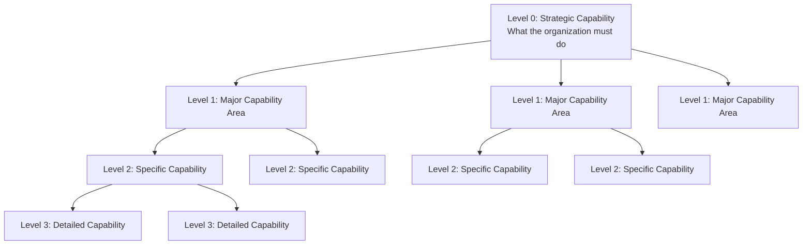
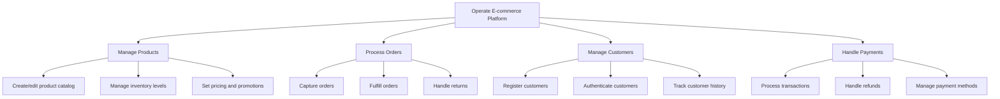
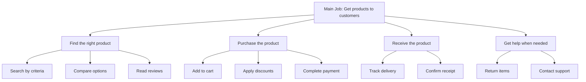
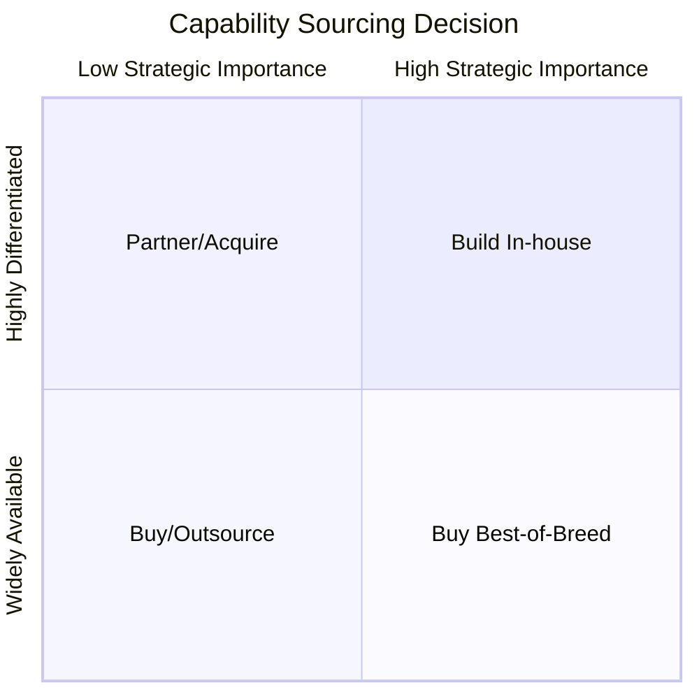
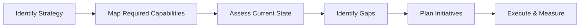

# Capability & Scope Frameworks

Frameworks for defining what an organization, product, or platform must be able to do—independent of specific solutions.

## Frameworks in This Category

| Framework | Purpose | When to Use |
|-----------|---------|-------------|
| [Capability Tree / Job Tree](#capability-tree--job-tree) | Decompose required capabilities | Requirements definition, platform strategy, transformation planning |

---

## Capability Tree / Job Tree

**Purpose**: Decomposes what an organization or product must be able to do, independent of solutions.

**Strengths**:
- Clarifies scope and avoids solution fixation with stable language
- Identifies gaps in current capabilities
- Enables build/buy/partner decisions based on strategic importance

**When to use**:
- Defining product or platform requirements
- Planning organizational transformation
- Evaluating technology investments
- Creating platform strategies

### What is a Capability?

A **capability** is an ability to do something—independent of how it's done. Capabilities are expressed as verbs or verb phrases:

| Solution-Focused (Avoid) | Capability-Focused (Preferred) |
|-------------------------|--------------------------------|
| "Salesforce CRM" | "Manage customer relationships" |
| "PostgreSQL database" | "Store and retrieve data" |
| "Stripe integration" | "Process payments" |

### Capability Tree Structure



### Example: E-commerce Platform



### Job Tree Variant

A **Job Tree** focuses on the jobs customers need to accomplish (from JTBD perspective):



### Building a Capability Tree

#### Step 1: Define the Scope

Start with the top-level capability that encompasses the entire scope:
- "Operate [product/service/platform]"
- "Deliver [outcome] to [customer]"
- "Enable [organization] to [achieve goal]"

#### Step 2: Decompose into Major Areas

Break the top level into 4-8 major capability areas. Use MECE (Mutually Exclusive, Collectively Exhaustive) principle.

**Common Decomposition Patterns**:

| Pattern | Example |
|---------|---------|
| **Value Chain** | Acquire → Engage → Retain → Expand |
| **Lifecycle** | Create → Use → Maintain → Retire |
| **Functional** | Marketing, Sales, Operations, Finance |
| **Stakeholder** | Customer-facing, Employee-facing, Partner-facing |

#### Step 3: Continue Decomposition

For each major area, identify specific capabilities needed. Continue until capabilities are:
- **Actionable**: Can be implemented or acquired
- **Assignable**: Can be owned by a team
- **Measurable**: Can assess if you have the capability

#### Step 4: Assess Current State

For each capability, assess:

| Assessment | Description |
|------------|-------------|
| **Have it** | Capability exists and is sufficient |
| **Partial** | Have something but gaps exist |
| **Don't have** | Need to build/buy/partner |
| **Not needed** | Removed from scope |

### Capability Assessment Matrix

```
┌─────────────────────────────────────────────────────────────────────────────┐
│                        CAPABILITY ASSESSMENT                                │
├────────────────────────┬─────────────┬─────────────┬──────────────────────-─┤
│ Capability             │ Current     │ Target      │ Gap / Action           │
│                        │ Maturity    │ Maturity    │                        │
├────────────────────────┼─────────────┼─────────────┼───────────────────-────┤
│ Process payments       │ ●●●○○       │ ●●●●●       │ Add fraud detection    │
│ Manage inventory       │ ●●○○○       │ ●●●●○       │ Build or buy           │
│ Track shipments        │ ●●●●○       │ ●●●●○       │ No gap                 │
│ Handle returns         │ ○○○○○       │ ●●●○○       │ New capability needed  │
└────────────────────────┴─────────────┴─────────────┴───────────────────-────┘

Maturity: ○ = None  ● = Low  ●● = Basic  ●●● = Good  ●●●● = Strong  ●●●●● = Excellent
```

### Strategic Sourcing Decisions

Use the capability map to guide build/buy/partner decisions:



| Quadrant | Strategy | Rationale |
|----------|----------|-----------|
| **High importance + Differentiated** | Build in-house | Core competitive advantage |
| **High importance + Available** | Buy best-of-breed | Critical but not unique |
| **Low importance + Differentiated** | Partner/Acquire | Specialized but not core |
| **Low importance + Available** | Buy/Outsource | Commodity, minimize cost |

### Capability-Based Planning

Use capability gaps to drive planning:



### Template: Capability Definition

```
┌─────────────────────────────────────────────────────────────────────────────┐
│ CAPABILITY DEFINITION                                                       │
├─────────────────────────────────────────────────────────────────────────────┤
│ Capability Name: [Verb phrase describing what we can do]                    │
│                                                                             │
│ Description: [2-3 sentences explaining the capability]                      │
│                                                                             │
│ Parent Capability: [Link to higher-level capability]                        │
│                                                                             │
│ Sub-Capabilities:                                                           │
│   - [Child capability 1]                                                    │
│   - [Child capability 2]                                                    │
│                                                                             │
│ Strategic Importance: [High / Medium / Low]                                 │
│ Current Maturity: [1-5 scale]                                               │
│ Target Maturity: [1-5 scale]                                                │
│                                                                             │
│ Sourcing Strategy: [Build / Buy / Partner / Outsource]                      │
│                                                                             │
│ Owner: [Team or role responsible]                                           │
│                                                                             │
│ Dependencies: [Other capabilities this depends on]                          │
└─────────────────────────────────────────────────────────────────────────────┘
```

### Common Mistakes

| Mistake | Problem | Solution |
|---------|---------|----------|
| Describing solutions | Limits options, becomes outdated | Use capability language (verbs) |
| Too detailed too fast | Overwhelming, loses strategic view | Start broad, decompose as needed |
| Missing MECE | Overlaps or gaps | Review for completeness and exclusivity |
| No prioritization | Everything seems equally important | Assess strategic importance |
| Static document | Becomes stale | Review regularly, tie to strategy |

**Output**: Hierarchical tree of capabilities from high-level to detailed

**See**: [references/capability-tree.md](../references/capability-tree.md) for detailed methodology

**Related frameworks**: Wardley Map (adds evolutionary dimension), OST (connects to solutions), JTBD (customer job focus)

---

## References

- [references/capability-tree.md](../references/capability-tree.md) - Capability decomposition methodology and templates
