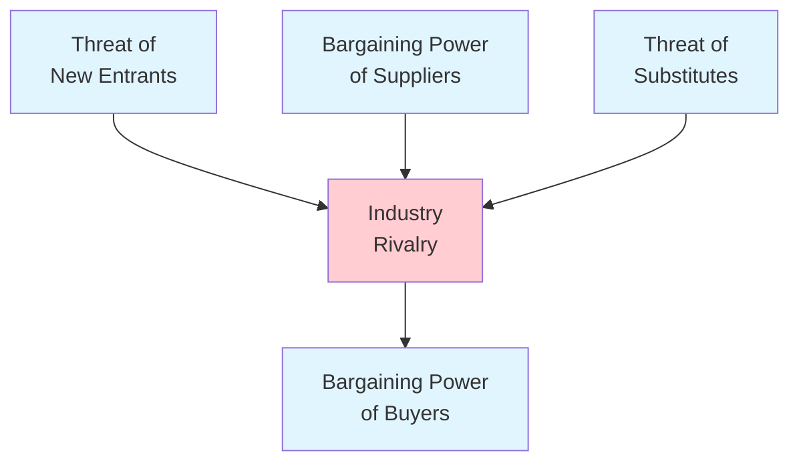
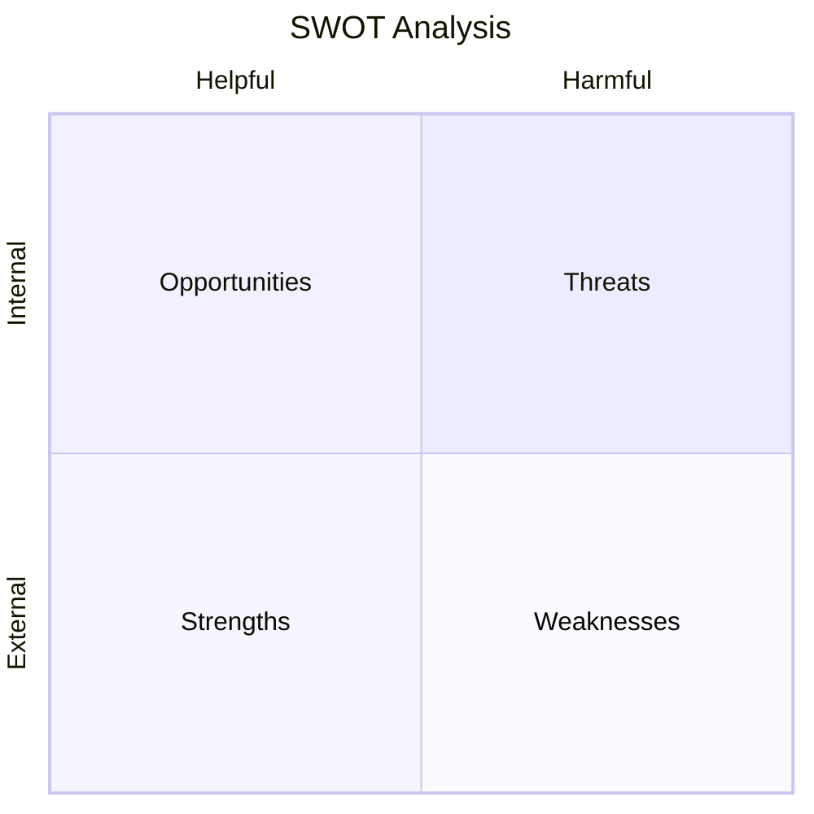
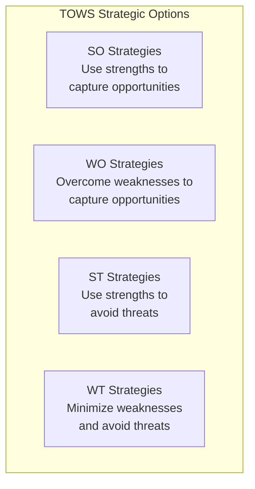
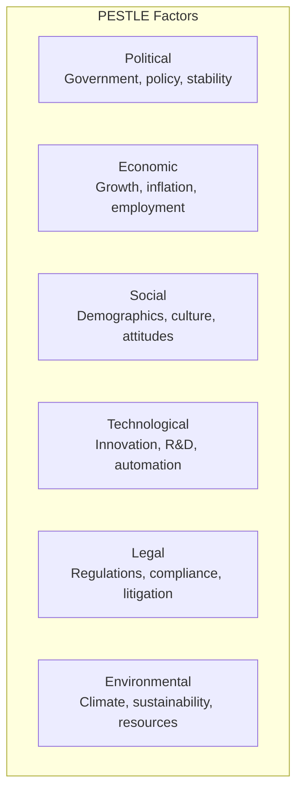

# Competitive & Environmental Analysis Frameworks

Frameworks for analyzing industry structure, competitive dynamics, and macro-environmental forces that shape strategic context.

## Frameworks in This Category

| Framework | Purpose | When to Use |
|-----------|---------|-------------|
| [Porter's Five Forces](#porters-five-forces) | Analyze industry competitive intensity | Industry analysis, market entry, positioning |
| [SWOT Analysis](#swot-analysis) | Summarize internal/external factors | Strategic planning, quick assessment |
| [PESTLE Analysis](#pestle-analysis) | Scan macro-environment | Long-term planning, market entry, risk identification |

---

## Porter's Five Forces

**Purpose**: Analyzes industry structure and competitive intensity through five forces that determine industry profitability.

**Strengths**:
- Reveals structural drivers of industry profitability
- Identifies threats beyond direct competitors
- Informs strategic positioning decisions

**When to use**:
- Evaluating industry attractiveness
- Understanding competitive dynamics
- Identifying strategic opportunities and threats
- Market entry decisions

### The Five Forces



### Force Analysis

#### 1. Industry Rivalry

How intense is competition among existing players?

| High Rivalry When | Low Rivalry When |
|-------------------|------------------|
| Many similar-sized competitors | Few competitors or clear leader |
| Slow industry growth | Fast industry growth |
| High fixed costs | Low fixed costs |
| Low differentiation | High differentiation |
| High exit barriers | Low exit barriers |

#### 2. Threat of New Entrants

How easy is it for new competitors to enter?

| High Threat When | Low Threat When |
|------------------|-----------------|
| Low capital requirements | High capital requirements |
| No economies of scale | Strong economies of scale |
| Easy channel access | Restricted distribution |
| No switching costs | High switching costs |
| Weak incumbent response | Strong retaliation expected |

**Barriers to Entry**:
- Economies of scale
- Product differentiation
- Capital requirements
- Switching costs
- Access to distribution
- Government policy
- Incumbent advantages

#### 3. Threat of Substitutes

What alternatives can solve the same customer problem?

| High Threat When | Low Threat When |
|------------------|-----------------|
| Substitutes improving rapidly | No viable alternatives |
| Low switching costs | High switching costs |
| Substitutes are cheaper | Price disadvantage |
| High buyer propensity to switch | Strong brand loyalty |

#### 4. Bargaining Power of Buyers

Can customers dictate terms?

| High Power When | Low Power When |
|-----------------|----------------|
| Few, large buyers | Many fragmented buyers |
| Standardized products | Differentiated products |
| Low switching costs | High switching costs |
| Buyer is price-sensitive | Buyer values quality |
| Credible backward integration | No integration threat |

#### 5. Bargaining Power of Suppliers

Can suppliers dictate terms?

| High Power When | Low Power When |
|-----------------|----------------|
| Few suppliers, concentrated | Many suppliers available |
| No substitutes for input | Multiple input sources |
| High switching costs | Low switching costs |
| Credible forward integration | No integration threat |
| Industry not important to supplier | Supplier depends on industry |

### Analysis Template

```
┌─────────────────────────────────────────────────────────────────────────────┐
│ PORTER'S FIVE FORCES ANALYSIS: [Industry Name]                              │
├─────────────────────────────────────────────────────────────────────────────┤
│ INDUSTRY RIVALRY                                           Rating: ●●●○○    │
│ Key factors:                                                                │
│ - [Factor 1]                                                                │
│ - [Factor 2]                                                                │
├─────────────────────────────────────────────────────────────────────────────┤
│ THREAT OF NEW ENTRANTS                                     Rating: ●●○○○    │
│ Key factors:                                                                │
│ - [Factor 1]                                                                │
│ - [Factor 2]                                                                │
├─────────────────────────────────────────────────────────────────────────────┤
│ THREAT OF SUBSTITUTES                                      Rating: ●●●●○    │
│ Key factors:                                                                │
│ - [Factor 1]                                                                │
│ - [Factor 2]                                                                │
├─────────────────────────────────────────────────────────────────────────────┤
│ BARGAINING POWER OF BUYERS                                 Rating: ●●●○○    │
│ Key factors:                                                                │
│ - [Factor 1]                                                                │
│ - [Factor 2]                                                                │
├─────────────────────────────────────────────────────────────────────────────┤
│ BARGAINING POWER OF SUPPLIERS                              Rating: ●○○○○    │
│ Key factors:                                                                │
│ - [Factor 1]                                                                │
│ - [Factor 2]                                                                │
├─────────────────────────────────────────────────────────────────────────────┤
│ OVERALL INDUSTRY ATTRACTIVENESS:                                            │
│ [Summary assessment and strategic implications]                             │
└─────────────────────────────────────────────────────────────────────────────┘

Rating: ○ = Very Low  ●○○○○ = Low  ●●○○○ = Moderate  ●●●○○ = High  ●●●●● = Very High
```

### Strategic Responses

| Force | Strategic Response Options |
|-------|---------------------------|
| High rivalry | Differentiate, focus on niche, innovate |
| New entrant threat | Build barriers, retaliate, acquire entrants |
| Substitute threat | Improve value, increase switching costs |
| Buyer power | Differentiate, find smaller buyers, integrate forward |
| Supplier power | Multiple sources, integrate backward, partnerships |

**Output**: Force-by-force analysis with strategic implications

**See**: [references/porters-five-forces.md](../references/porters-five-forces.md) for detailed analysis template

**Related frameworks**: SWOT (internal/external summary), Blue Ocean (escaping forces), Wardley Map (evolution context)

---

## SWOT Analysis

**Purpose**: Summarizes internal strengths/weaknesses and external opportunities/threats.

**Strengths**:
- Simple, widely understood framework
- Integrates internal and external analysis
- Good starting point for strategic discussion

**When to use**:
- Strategic planning kickoffs
- Quick situational assessment
- Stakeholder alignment on current state
- Identifying strategic options

### Structure



### The Four Quadrants

| Quadrant | Origin | Questions |
|----------|--------|-----------|
| **Strengths** | Internal | What do we do well? What advantages do we have? What resources do we have? |
| **Weaknesses** | Internal | Where do we struggle? What do competitors do better? What resources do we lack? |
| **Opportunities** | External | What trends favor us? What gaps exist? What changes could we exploit? |
| **Threats** | External | What obstacles do we face? What are competitors doing? What changes could hurt us? |

### SWOT Template

```
┌─────────────────────────────────────────────────────────────────────────────┐
│                              SWOT ANALYSIS                                  │
├─────────────────────────────────┬───────────────────────────────────────────┤
│          STRENGTHS              │            WEAKNESSES                     │
│                                 │                                           │
│  What do we do well?            │  Where do we struggle?                    │
│                                 │                                           │
│  •                              │  •                                        │
│  •                              │  •                                        │
│  •                              │  •                                        │
│  •                              │  •                                        │
│                                 │                                           │
├─────────────────────────────────┼───────────────────────────────────────────┤
│         OPPORTUNITIES           │              THREATS                      │
│                                 │                                           │
│  What external trends favor us? │  What external forces could hurt us?      │
│                                 │                                           │
│  •                              │  •                                        │
│  •                              │  •                                        │
│  •                              │  •                                        │
│  •                              │  •                                        │
│                                 │                                           │
└─────────────────────────────────┴───────────────────────────────────────────┘
```

### TOWS Matrix: From Analysis to Strategy

The TOWS matrix converts SWOT into strategic options:



| Strategy | Combination | Approach |
|----------|-------------|----------|
| **SO** | Strengths + Opportunities | Aggressive growth; leverage advantages |
| **WO** | Weaknesses + Opportunities | Improve to capture; develop capabilities |
| **ST** | Strengths + Threats | Defensive; use advantages to mitigate |
| **WT** | Weaknesses + Threats | Survival; minimize vulnerabilities |

### Process

1. **Gather diverse input** - Include multiple perspectives
2. **List all factors** - Don't filter initially
3. **Prioritize** - Focus on most significant items
4. **Analyze interactions** - How do factors relate?
5. **Generate strategies** - Use TOWS matrix
6. **Validate externally** - Test assumptions

### Common Mistakes

| Mistake | Problem | Solution |
|---------|---------|----------|
| Too long lists | Lose focus | Limit to 5-7 per quadrant |
| Vague items | Can't act on them | Be specific and concrete |
| Confusing S/W with O/T | Misclassifies | S/W = internal, O/T = external |
| No prioritization | Everything equal | Rank by importance |
| Analysis paralysis | No action | Move to TOWS strategies |

**Output**: 2x2 matrix with prioritized items and TOWS strategic options

**See**: [references/swot-analysis.md](../references/swot-analysis.md) for facilitation guide and TOWS matrix

**Related frameworks**: PESTLE (informs O/T), Porter's Five Forces (informs O/T), Capability Tree (informs S/W)

---

## PESTLE Analysis

**Purpose**: Scans macro-environment across Political, Economic, Social, Technological, Legal, and Environmental factors.

**Strengths**:
- Comprehensive external environment scan
- Surfaces factors often overlooked in industry analysis
- Identifies long-term trends and disruptions

**When to use**:
- Strategic planning and scenario building
- Market entry assessment
- Risk identification
- Long-term trend analysis

### The Six Factors



### Factor Details

#### Political

Government and political factors that affect the operating environment.

| Consider | Examples |
|----------|----------|
| Government stability | Elections, regime changes, political unrest |
| Policy direction | Pro-business, regulatory, interventionist |
| Trade policy | Tariffs, trade agreements, sanctions |
| Taxation | Corporate rates, incentives, changes |
| Government spending | Infrastructure, healthcare, defense |

#### Economic

Economic conditions and trends.

| Consider | Examples |
|----------|----------|
| GDP growth | Expansion, recession, recovery |
| Interest rates | Cost of capital, investment climate |
| Inflation | Input costs, pricing power |
| Exchange rates | Import/export competitiveness |
| Employment | Labor availability, wage pressure |
| Consumer confidence | Spending patterns |

#### Social

Societal and demographic trends.

| Consider | Examples |
|----------|----------|
| Demographics | Age distribution, population growth |
| Lifestyle trends | Work-life balance, health consciousness |
| Education levels | Skill availability, knowledge economy |
| Cultural attitudes | Values, preferences, behaviors |
| Social mobility | Class structure, opportunity |

#### Technological

Technology developments and adoption.

| Consider | Examples |
|----------|----------|
| R&D activity | Innovation rate, research spending |
| Automation | AI, robotics, process automation |
| Technology adoption | Digital transformation, connectivity |
| Disruption potential | Emerging technologies, new platforms |
| Infrastructure | Digital infrastructure, connectivity |

#### Legal

Laws and regulations affecting operations.

| Consider | Examples |
|----------|----------|
| Employment law | Labor rights, working conditions |
| Consumer protection | Product safety, data privacy |
| Industry regulations | Licensing, standards, compliance |
| Intellectual property | Patents, trademarks, copyrights |
| Health and safety | Workplace requirements |

#### Environmental

Ecological and environmental factors.

| Consider | Examples |
|----------|----------|
| Climate change | Weather patterns, carbon policy |
| Sustainability pressure | Consumer expectations, ESG |
| Resource availability | Raw materials, water, energy |
| Waste and pollution | Regulations, public pressure |
| Biodiversity | Ecosystem impacts, regulations |

### Analysis Template

```
┌─────────────────────────────────────────────────────────────────────────────┐
│ PESTLE ANALYSIS: [Context/Market]                                           │
├─────────────────────────────────────────────────────────────────────────────┤
│ POLITICAL                                                                   │
│ Factor                          │ Impact │ Timeframe │ Implication          │
│ ─────────────────────────────────────────────────────────────────────────── │
│ [Factor 1]                      │ H/M/L  │ S/M/L     │ [What it means]      │
│ [Factor 2]                      │ H/M/L  │ S/M/L     │ [What it means]      │
├─────────────────────────────────────────────────────────────────────────────┤
│ ECONOMIC                                                                    │
│ [Factor 1]                      │ H/M/L  │ S/M/L     │ [What it means]      │
│ [Factor 2]                      │ H/M/L  │ S/M/L     │ [What it means]      │
├─────────────────────────────────────────────────────────────────────────────┤
│ SOCIAL                                                                      │
│ [Factor 1]                      │ H/M/L  │ S/M/L     │ [What it means]      │
│ [Factor 2]                      │ H/M/L  │ S/M/L     │ [What it means]      │
├─────────────────────────────────────────────────────────────────────────────┤
│ TECHNOLOGICAL                                                               │
│ [Factor 1]                      │ H/M/L  │ S/M/L     │ [What it means]      │
│ [Factor 2]                      │ H/M/L  │ S/M/L     │ [What it means]      │
├─────────────────────────────────────────────────────────────────────────────┤
│ LEGAL                                                                       │
│ [Factor 1]                      │ H/M/L  │ S/M/L     │ [What it means]      │
│ [Factor 2]                      │ H/M/L  │ S/M/L     │ [What it means]      │
├─────────────────────────────────────────────────────────────────────────────┤
│ ENVIRONMENTAL                                                               │
│ [Factor 1]                      │ H/M/L  │ S/M/L     │ [What it means]      │
│ [Factor 2]                      │ H/M/L  │ S/M/L     │ [What it means]      │
└─────────────────────────────────────────────────────────────────────────────┘

Impact: H=High, M=Medium, L=Low
Timeframe: S=Short-term (<1yr), M=Medium-term (1-3yr), L=Long-term (>3yr)
```

### From PESTLE to Strategy

1. **Identify key trends** - What matters most?
2. **Assess impact** - Positive or negative for your business?
3. **Determine timeframe** - When will this affect you?
4. **Feed into SWOT** - Trends become O/T
5. **Develop responses** - How to adapt or capitalize?

**Output**: Factor-by-factor analysis with implications and time horizons

**See**: [references/pestle-analysis.md](../references/pestle-analysis.md) for research sources and scenario integration

**Related frameworks**: SWOT (PESTLE informs O/T), Porter's Five Forces (industry level), Scenario Planning

---

## References

- [references/porters-five-forces.md](../references/porters-five-forces.md) - Five forces analysis template
- [references/swot-analysis.md](../references/swot-analysis.md) - SWOT facilitation and TOWS matrix
- [references/pestle-analysis.md](../references/pestle-analysis.md) - Macro-environment scanning methodology
