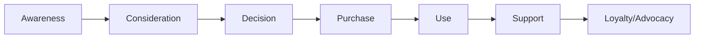
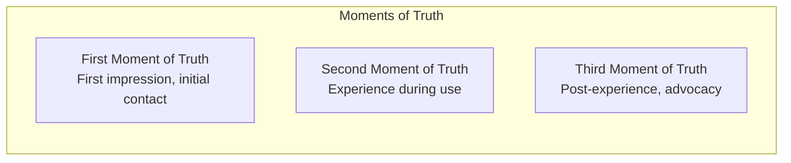
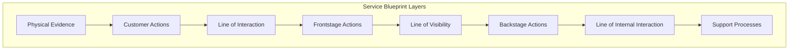
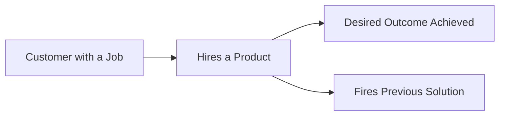
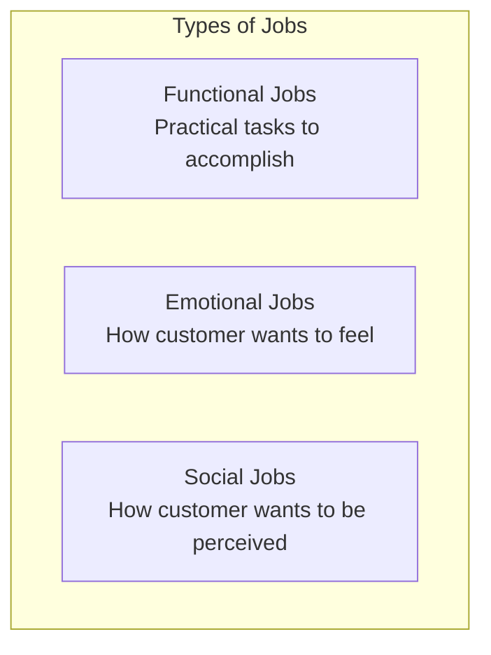
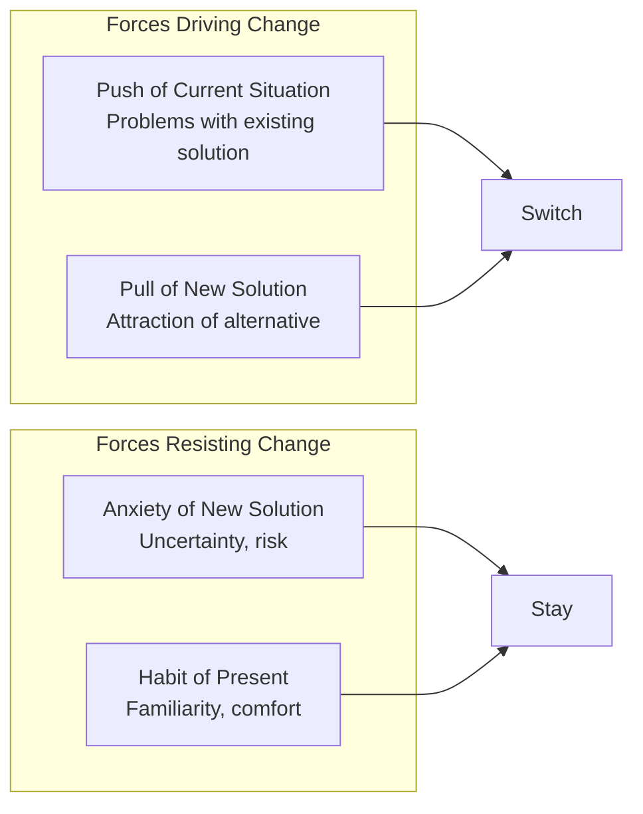
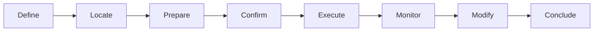

# Customer Experience Frameworks

Frameworks for understanding, mapping, and designing customer experiences across touchpoints and journeys.

## Frameworks in This Category

| Framework | Purpose | When to Use |
|-----------|---------|-------------|
| [Customer Journey Map](#customer-journey-map) | Visualize end-to-end customer experience | Experience design, pain point identification |
| [Service Blueprint](#service-blueprint) | Layer customer experience with operations | Service design, operational alignment |
| [Jobs-to-be-Done (JTBD)](#jobs-to-be-done-jtbd) | Uncover customer motivations | Innovation, value proposition design |

---

## Customer Journey Map

**Purpose**: Visualizes the end-to-end customer experience across stages and touchpoints over time.

**Strengths**:
- Surfaces experience gaps and cross-functional friction from the customer's view
- Reveals emotional highs and lows throughout the journey
- Identifies moments of truth that disproportionately impact perception

**When to use**:
- Understanding current customer experience
- Identifying pain points and opportunities
- Aligning teams around customer perspective
- Designing new products or services

### Journey Map Structure



### Journey Map Layers

| Layer | Description | What to Capture |
|-------|-------------|-----------------|
| **Stages** | Major phases of the journey | Awareness, Consideration, Purchase, etc. |
| **Actions** | What the customer does | Steps, tasks, behaviors |
| **Touchpoints** | Where interactions occur | Channels, interfaces, people |
| **Thoughts** | What the customer is thinking | Questions, concerns, expectations |
| **Emotions** | How the customer feels | Satisfaction, frustration, delight |
| **Pain Points** | Where experience breaks down | Friction, confusion, delays |
| **Opportunities** | Where to improve | Quick wins, innovations |

### Journey Map Template

```
┌───────────────────────────────────────────────────────────────────────────────────────────-──┐
│ CUSTOMER JOURNEY MAP: [Persona Name] - [Journey Name]                                        │
├──────────────┬─────────────┬─────────────┬─────────────┬─────────────┬─────────────┬─────────┤
│ STAGE        │ Awareness   │ Consider    │ Purchase    │ Onboarding  │ Use         │ Support │
├──────────────┼─────────────┼─────────────┼─────────────┼─────────────┼─────────────┼─────────┤
│ ACTIONS      │             │             │             │             │             │         │
│              │             │             │             │             │             │         │
├──────────────┼─────────────┼─────────────┼─────────────┼─────────────┼─────────────┼─────────┤
│ TOUCHPOINTS  │             │             │             │             │             │         │
│              │             │             │             │             │             │         │
├──────────────┼─────────────┼─────────────┼─────────────┼─────────────┼─────────────┼─────────┤
│ THOUGHTS     │             │             │             │             │             │         │
│              │             │             │             │             │             │         │
├──────────────┼─────────────┼─────────────┼─────────────┼─────────────┼─────────────┼─────────┤
│ EMOTIONS     │   😊        │   😐         │   😟        │   😊        │   😐         │   😡    │
│              │             │             │             │             │             │         │
├──────────────┼─────────────┼─────────────┼─────────────┼─────────────┼─────────────┼─────────┤
│ PAIN POINTS  │             │             │             │             │             │         │
│              │             │             │             │             │             │         │
├──────────────┼─────────────┼─────────────┼─────────────┼─────────────┼─────────────┼─────────┤
│ OPPORTUNITIES│             │             │             │             │             │         │
│              │             │             │             │             │             │         │
└──────────────┴─────────────┴─────────────┴─────────────┴─────────────┴─────────────┴─────────┘
```

### Moments of Truth

Identify critical moments that disproportionately impact customer perception:



### Process

1. **Define the persona** - Who is this journey for?
2. **Define the journey scope** - Start and end points
3. **Map stages** - High-level phases
4. **Identify actions** - What does the customer do?
5. **List touchpoints** - Where do interactions happen?
6. **Capture thoughts/emotions** - What are they thinking/feeling?
7. **Identify pain points** - Where does experience break down?
8. **Find opportunities** - How can we improve?

**Output**: Timeline-based visualization showing stages, actions, touchpoints, emotions, and pain points

**See**: [references/customer-journey.md](../references/customer-journey.md) for detailed methodology

**Related frameworks**: Service Blueprint (adds operational layer), JTBD (why customers engage)

---

## Service Blueprint

**Purpose**: Layers customer experience with frontstage and backstage operations.

**Strengths**:
- Connects customer experience to internal execution
- Reveals what customers see vs. what happens behind the scenes
- Exposes operational dependencies and failure points

**When to use**:
- Designing or improving service delivery
- Aligning customer-facing and operational teams
- Identifying where backstage limitations impact frontstage experience
- Planning operational requirements for new services

### Blueprint Structure



### Blueprint Layers Explained

| Layer | Description | Examples |
|-------|-------------|----------|
| **Physical Evidence** | Tangible elements customers encounter | Website, store, packaging, receipts |
| **Customer Actions** | Steps the customer takes | Browse, order, pay, receive |
| **Line of Interaction** | Boundary of direct interaction | Where customer and employee meet |
| **Frontstage Actions** | Employee actions visible to customer | Greeting, explaining, serving |
| **Line of Visibility** | What customer can/cannot see | Screen between front and back |
| **Backstage Actions** | Employee actions hidden from customer | Preparing, processing, coordinating |
| **Line of Internal Interaction** | Internal handoffs | Between teams/systems |
| **Support Processes** | Internal activities supporting service | IT systems, training, inventory |

### Blueprint Template

```
┌─────────────────────────────────────────────────────────────────────────────────────────────┐
│ SERVICE BLUEPRINT: [Service Name]                                                            │
├─────────────────┬───────────────┬───────────────┬───────────────┬───────────────────────────┤
│ Stage           │ [Stage 1]     │ [Stage 2]     │ [Stage 3]     │ [Stage 4]                 │
├─────────────────┼───────────────┼───────────────┼───────────────┼───────────────────────────┤
│ PHYSICAL        │               │               │               │                           │
│ EVIDENCE        │               │               │               │                           │
├─────────────────┼───────────────┼───────────────┼───────────────┼───────────────────────────┤
│ CUSTOMER        │               │               │               │                           │
│ ACTIONS         │               │               │               │                           │
├─────────────────┴───────────────┴───────────────┴───────────────┴───────────────────────────┤
│ ════════════════════════════════════ LINE OF INTERACTION ═══════════════════════════════════ │
├─────────────────┬───────────────┬───────────────┬───────────────┬───────────────────────────┤
│ FRONTSTAGE      │               │               │               │                           │
│ ACTIONS         │               │               │               │                           │
├─────────────────┴───────────────┴───────────────┴───────────────┴───────────────────────────┤
│ ════════════════════════════════════ LINE OF VISIBILITY ════════════════════════════════════ │
├─────────────────┬───────────────┬───────────────┬───────────────┬───────────────────────────┤
│ BACKSTAGE       │               │               │               │                           │
│ ACTIONS         │               │               │               │                           │
├─────────────────┴───────────────┴───────────────┴───────────────┴───────────────────────────┤
│ ═══════════════════════════════ LINE OF INTERNAL INTERACTION ═══════════════════════════════ │
├─────────────────┬───────────────┬───────────────┬───────────────┬───────────────────────────┤
│ SUPPORT         │               │               │               │                           │
│ PROCESSES       │               │               │               │                           │
└─────────────────┴───────────────┴───────────────┴───────────────┴───────────────────────────┘
```

### Identifying Failure Points

Mark potential failure points in the blueprint:

| Symbol | Meaning |
|--------|---------|
| ⚠️ | Potential failure point |
| ⏱️ | Wait time / delay |
| 🔄 | Rework / repeat |
| ❓ | Decision point |

### Process

1. **Identify the service** - What service are we mapping?
2. **Define the customer segment** - Who uses this service?
3. **Map customer actions** - What does the customer do?
4. **Add physical evidence** - What tangible elements exist?
5. **Map frontstage actions** - What do employees do visibly?
6. **Map backstage actions** - What happens behind the scenes?
7. **Add support processes** - What systems/processes support delivery?
8. **Identify failure points** - Where can things go wrong?
9. **Add metrics** - Time, quality, cost at each step

**Output**: Multi-layer diagram with customer actions, frontstage actions, backstage actions, and support processes

**See**: [references/service-blueprint.md](../references/service-blueprint.md) for template and examples

**Related frameworks**: Customer Journey Map (customer layer), Value Stream Map (process flow)

---

## Jobs-to-be-Done (JTBD)

**Purpose**: Uncovers the functional, emotional, and social jobs customers are trying to accomplish.

**Strengths**:
- Reveals true customer motivations beyond surface-level feature requests
- Provides stable foundation for innovation (jobs change slowly, solutions change fast)
- Enables competitive analysis across category boundaries

**When to use**:
- Understanding why customers hire/fire products
- Identifying unmet needs and innovation opportunities
- Reframing competitive landscape around outcomes
- Designing value propositions that resonate

### Core Concept

Customers don't buy products—they "hire" them to get a job done.



### Job Statement Structure

```
When I [situation/trigger]
I want to [motivation/force]
So I can [expected outcome/job]
```

**Example**:
```
When I'm commuting to work
I want to use my time productively
So I can feel prepared for the day ahead
```

### Job Types



| Type | Definition | Example (Coffee) |
|------|------------|------------------|
| **Functional** | The practical task | Get energy boost |
| **Emotional** | Desired feeling | Feel comforted, relaxed |
| **Social** | Desired perception | Appear sophisticated |

### Forces of Progress

Understanding why customers switch solutions:



| Force | Direction | Questions to Ask |
|-------|-----------|------------------|
| **Push** | Toward change | What's frustrating about current solution? |
| **Pull** | Toward change | What's attractive about alternatives? |
| **Anxiety** | Against change | What worries you about switching? |
| **Habit** | Against change | What's comfortable about current solution? |

### Job Mapping

Map the job to identify innovation opportunities:



| Step | Description | Example (Travel) |
|------|-------------|------------------|
| **Define** | Determine objectives | Decide destination |
| **Locate** | Find required inputs | Find flights, hotels |
| **Prepare** | Set up for execution | Book, pack |
| **Confirm** | Verify readiness | Confirm reservations |
| **Execute** | Perform the job | Take the trip |
| **Monitor** | Track progress | Check flight status |
| **Modify** | Make adjustments | Change plans |
| **Conclude** | Finish the job | Return home |

### Opportunity Assessment

Rate jobs by importance and satisfaction:

```mermaid
quadrantChart
    title Job Opportunity Landscape
    x-axis Low Satisfaction --> High Satisfaction
    y-axis Low Importance --> High Importance
    quadrant-1 Low Priority
    quadrant-2 Underserved (Opportunity!)
    quadrant-3 Table Stakes
    quadrant-4 Overserved
```

**Opportunity Score Formula**:
```
Opportunity = Importance + (Importance - Satisfaction)
```

Where scores > 10 indicate significant opportunities.

### JTBD Interview Guide

**Opening questions**:
- Tell me about the last time you [did X]
- Walk me through what happened
- What were you trying to accomplish?

**Diving deeper**:
- What led up to that moment?
- What did you do first? Then what?
- What was going through your mind?
- How did that make you feel?

**Understanding alternatives**:
- What did you do before?
- What else did you consider?
- Why did you choose this over alternatives?

**Uncovering forces**:
- What wasn't working about your old way?
- What attracted you to this solution?
- What concerns did you have?
- What almost stopped you?

**Output**: Job statements with importance and satisfaction ratings

**See**: [references/jtbd.md](../references/jtbd.md) for interview methodology and job mapping

**Related frameworks**: Customer Journey (when jobs occur), Value Proposition Canvas (job-solution fit), Kano Model (job satisfaction)

---

## References

- [references/customer-journey.md](../references/customer-journey.md) - Journey mapping process and templates
- [references/service-blueprint.md](../references/service-blueprint.md) - Blueprint structure and examples
- [references/jtbd.md](../references/jtbd.md) - Jobs-to-be-Done interview methodology
