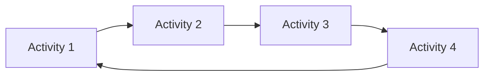
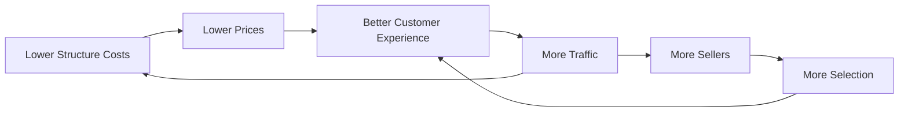
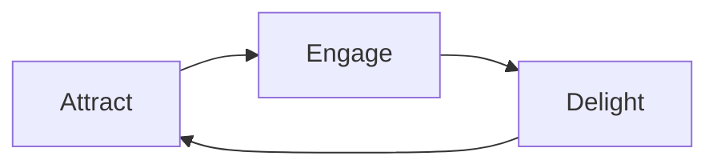
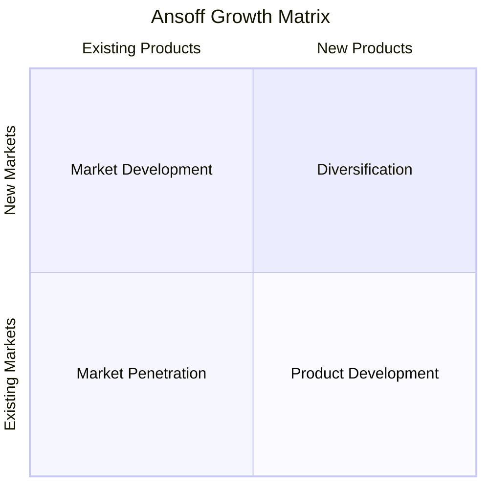
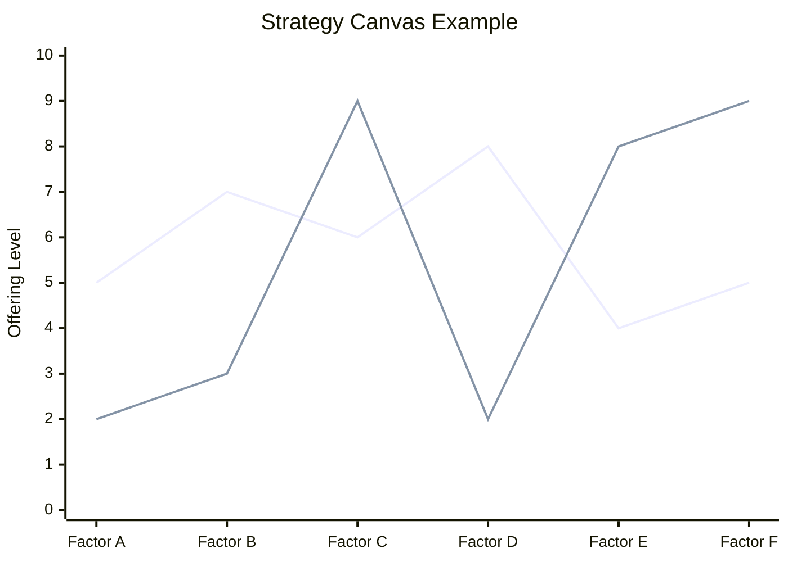
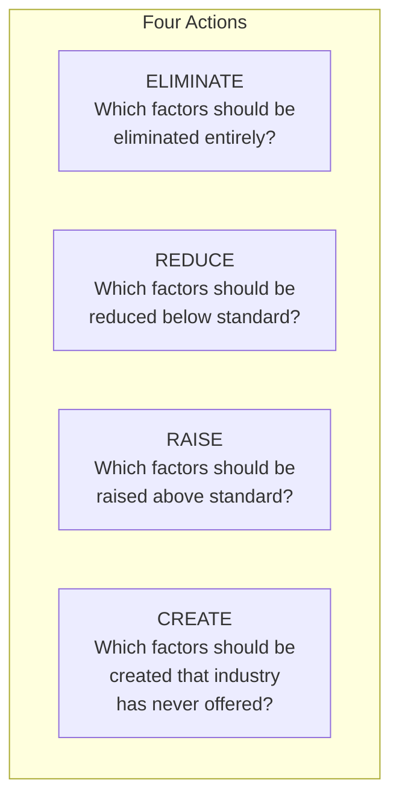
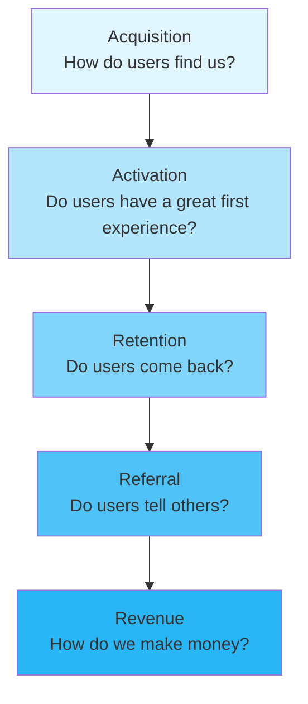
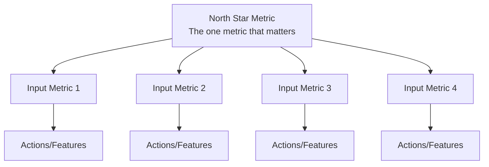

# Growth & Strategy Frameworks

Frameworks for designing, analyzing, and optimizing growth strategies and business momentum.

## Frameworks in This Category

| Framework | Purpose | When to Use |
|-----------|---------|-------------|
| [Flywheel](#flywheel) | Design self-reinforcing growth loops | Business model design, growth strategy |
| [Ansoff Matrix](#ansoff-matrix) | Map growth strategy options | Strategic planning, expansion decisions |
| [Blue Ocean Strategy](#blue-ocean-strategy) | Create uncontested market space | Differentiation, market creation |
| [AARRR / Pirate Metrics](#aarrr--pirate-metrics) | Track customer lifecycle metrics | Growth optimization, funnel analysis |
| [North Star Framework](#north-star-framework) | Align teams on guiding metric | Product strategy, team alignment |

---

## Flywheel

**Purpose**: Shows reinforcing activities that compound over time.

**Strengths**:
- Communicates compounding advantage and strategic momentum
- Reveals which activities feed into each other
- Helps prioritize initiatives that strengthen the entire system

**When to use**:
- Designing business models with network effects
- Understanding competitive moats
- Prioritizing initiatives for maximum leverage
- Communicating growth strategy to stakeholders

### Flywheel Concept



Each activity feeds the next, creating a self-reinforcing loop that accelerates over time.

### Famous Flywheel Examples

**Amazon Flywheel**:


**HubSpot Flywheel**:


### Designing Your Flywheel

**Step 1: Identify Core Loop**
- What activity creates the most value for customers?
- What happens as a result of that value?
- How does that result enable more value creation?

**Step 2: Map the Activities**
- What are the key activities in sequence?
- How does each activity enable the next?
- Where do reinforcing effects occur?

**Step 3: Identify Accelerators**
- What speeds up the flywheel?
- What friction slows it down?
- Where can you reduce friction?

**Step 4: Find the Entry Point**
- Where is the best place to start pushing?
- What initial investment creates momentum?

### Flywheel Analysis Template

```
┌─────────────────────────────────────────────────────────────────────────────┐
│ FLYWHEEL ANALYSIS                                                            │
├─────────────────────────────────────────────────────────────────────────────┤
│ Core Value Creation: [What creates value for customers]                     │
│                                                                              │
│ The Loop:                                                                    │
│ [Activity 1] → leads to → [Activity 2]                                       │
│ [Activity 2] → enables → [Activity 3]                                        │
│ [Activity 3] → creates → [Activity 4]                                        │
│ [Activity 4] → reinforces → [Activity 1]                                     │
│                                                                              │
│ Accelerators (what speeds it up):                                            │
│ •                                                                            │
│ •                                                                            │
│                                                                              │
│ Friction (what slows it down):                                               │
│ •                                                                            │
│ •                                                                            │
│                                                                              │
│ Entry Point: [Where to start pushing]                                        │
└─────────────────────────────────────────────────────────────────────────────┘
```

**Output**: Circular diagram showing self-reinforcing cycle

**See**: [references/flywheel.md](../references/flywheel.md) for examples and design principles

**Related frameworks**: North Star Framework (defines the goal), Value Stream Map (shows the flow)

---

## Ansoff Matrix

**Purpose**: Maps four growth strategies based on market and product dimensions.

**Strengths**:
- Clarifies growth strategy options and their relative risk
- Forces explicit choice about where to compete
- Enables portfolio-level growth planning

**When to use**:
- Strategic planning for growth
- Evaluating expansion opportunities
- Balancing risk across growth initiatives
- Communicating growth strategy to stakeholders

### The Four Strategies



### Strategy Details

| Strategy | Description | Risk Level | Tactics |
|----------|-------------|------------|---------|
| **Market Penetration** | Grow share in existing markets with existing products | Lowest | Price, promotion, distribution, retention |
| **Product Development** | New products for existing customers | Medium | R&D, extensions, features, acquisitions |
| **Market Development** | Existing products into new markets | Medium | New geographies, segments, channels |
| **Diversification** | New products for new markets | Highest | Related or unrelated diversification |

### Applying the Matrix

**Step 1: Assess Current Position**
- Which markets do we serve?
- What products do we offer?
- What's our market share?

**Step 2: Evaluate Each Quadrant**

```
┌─────────────────────────────────────────────────────────────────────────────┐
│ ANSOFF STRATEGY EVALUATION                                                   │
├─────────────────────────────────────────────────────────────────────────────┤
│ MARKET PENETRATION                     │ PRODUCT DEVELOPMENT                │
│ Existing products + Existing markets   │ New products + Existing markets    │
│                                        │                                    │
│ Opportunities:                         │ Opportunities:                     │
│ • Increase usage                       │ • Product extensions               │
│ • Win competitor customers             │ • New features                     │
│ • Convert non-users                    │ • New categories                   │
│                                        │                                    │
│ Market potential: [size]               │ Investment required: [level]       │
│ Competitive intensity: [level]         │ Capability gap: [level]            │
├─────────────────────────────────────────────────────────────────────────────┤
│ MARKET DEVELOPMENT                     │ DIVERSIFICATION                    │
│ Existing products + New markets        │ New products + New markets         │
│                                        │                                    │
│ Opportunities:                         │ Opportunities:                     │
│ • New geographies                      │ • Related diversification          │
│ • New segments                         │ • Unrelated diversification        │
│ • New channels                         │ • Vertical integration             │
│                                        │                                    │
│ Market attractiveness: [level]         │ Strategic rationale: [reason]      │
│ Entry barriers: [level]                │ Risk assessment: [level]           │
└─────────────────────────────────────────────────────────────────────────────┘
```

**Step 3: Prioritize and Sequence**
- Balance risk across the portfolio
- Consider dependencies between strategies
- Sequence for capability building

**Output**: Classification of growth initiatives by quadrant with risk assessment

**See**: [references/ansoff-matrix.md](../references/ansoff-matrix.md) for strategy selection criteria

**Related frameworks**: Horizon Model (timing of strategies), BCG Matrix (portfolio view)

---

## Blue Ocean Strategy

**Purpose**: Identifies uncontested market space by eliminating, reducing, raising, and creating value factors.

**Strengths**:
- Shifts focus from competing to creating new demand
- Provides systematic approach to differentiation
- Reveals industry assumptions that can be challenged

**When to use**:
- Breaking out of commoditized markets
- Designing differentiated offerings
- Identifying industry blind spots
- Creating new market categories

### Red Ocean vs. Blue Ocean

| Red Ocean | Blue Ocean |
|-----------|------------|
| Compete in existing market | Create uncontested market |
| Beat the competition | Make competition irrelevant |
| Exploit existing demand | Create and capture new demand |
| Value-cost trade-off | Break value-cost trade-off |
| Differentiation OR low cost | Differentiation AND low cost |

### Strategy Canvas



The strategy canvas shows:
- X-axis: Competition factors in the industry
- Y-axis: Offering level for each factor
- Lines: Value curves of different players

### Four Actions Framework



### Four Actions Grid Template

```
┌─────────────────────────────────────────────────────────────────────────────┐
│ FOUR ACTIONS FRAMEWORK                                                       │
├───────────────────────────────────┬─────────────────────────────────────────┤
│ ELIMINATE                         │ RAISE                                   │
│ Factors to eliminate entirely     │ Factors to raise above standard         │
│                                   │                                         │
│ •                                 │ •                                       │
│ •                                 │ •                                       │
│ •                                 │ •                                       │
│                                   │                                         │
├───────────────────────────────────┼─────────────────────────────────────────┤
│ REDUCE                            │ CREATE                                  │
│ Factors to reduce below standard  │ Factors never offered by industry       │
│                                   │                                         │
│ •                                 │ •                                       │
│ •                                 │ •                                       │
│ •                                 │ •                                       │
│                                   │                                         │
└───────────────────────────────────┴─────────────────────────────────────────┘
```

### Blue Ocean Examples

| Company | Eliminated/Reduced | Raised/Created |
|---------|-------------------|----------------|
| **Cirque du Soleil** | Animal acts, star performers, multiple arenas | Artistic themes, refined environment, multiple productions |
| **Southwest Airlines** | Meals, lounges, seat selection | Frequency, friendly service, speed |
| **Yellow Tail** | Complexity, aging, prestige | Easy drinking, easy selection, fun |

**Output**: Strategy canvas comparing value curves, plus four actions grid

**See**: [references/blue-ocean.md](../references/blue-ocean.md) for strategy canvas methodology

**Related frameworks**: Value Proposition Canvas (value design), Kano Model (factor importance)

---

## AARRR / Pirate Metrics

**Purpose**: Tracks customer lifecycle through Acquisition, Activation, Retention, Referral, and Revenue.

**Strengths**:
- Provides full-funnel view of growth engine
- Identifies bottlenecks in customer journey
- Creates shared metrics across product/marketing/sales

**When to use**:
- Designing growth metrics frameworks
- Diagnosing growth bottlenecks
- Aligning teams around customer lifecycle
- Prioritizing growth experiments

### The Funnel



### Stage Details

| Stage | Definition | Key Metrics | Key Questions |
|-------|------------|-------------|---------------|
| **Acquisition** | How users find you | Traffic, signups, CAC, channel mix | Where do best users come from? |
| **Activation** | First great experience | Onboarding completion, time-to-value | What defines "activated"? |
| **Retention** | Users returning | DAU/MAU, churn rate, cohort curves | Why do users leave? |
| **Referral** | Users sharing | NPS, viral coefficient, referral rate | What triggers sharing? |
| **Revenue** | Monetization | LTV, ARPU, conversion rate, MRR | What drives revenue? |

### Metrics by Stage

```
┌─────────────────────────────────────────────────────────────────────────────┐
│ AARRR METRICS FRAMEWORK                                                      │
├─────────────────────────────────────────────────────────────────────────────┤
│ ACQUISITION                                                                  │
│ Primary Metric: [e.g., New signups]                                         │
│ Supporting: [Traffic by source] [CAC by channel] [Signup rate]              │
│ Target: [Number]     Current: [Number]     Gap: [+/-]                        │
├─────────────────────────────────────────────────────────────────────────────┤
│ ACTIVATION                                                                   │
│ Primary Metric: [e.g., Completed onboarding]                                │
│ Supporting: [Time to value] [Feature adoption] [Activation rate]            │
│ Target: [Number]     Current: [Number]     Gap: [+/-]                        │
├─────────────────────────────────────────────────────────────────────────────┤
│ RETENTION                                                                    │
│ Primary Metric: [e.g., D30 retention]                                       │
│ Supporting: [DAU/MAU] [Churn rate] [Session frequency]                      │
│ Target: [Number]     Current: [Number]     Gap: [+/-]                        │
├─────────────────────────────────────────────────────────────────────────────┤
│ REFERRAL                                                                     │
│ Primary Metric: [e.g., Referral rate]                                       │
│ Supporting: [NPS] [Viral coefficient] [Shares]                              │
│ Target: [Number]     Current: [Number]     Gap: [+/-]                        │
├─────────────────────────────────────────────────────────────────────────────┤
│ REVENUE                                                                      │
│ Primary Metric: [e.g., MRR]                                                 │
│ Supporting: [ARPU] [LTV] [Conversion rate]                                  │
│ Target: [Number]     Current: [Number]     Gap: [+/-]                        │
└─────────────────────────────────────────────────────────────────────────────┘
```

### Diagnosing the Funnel

For each stage:
1. What's the conversion rate to the next stage?
2. Where is the biggest drop-off?
3. What's the lever with highest impact?

**Output**: Funnel metrics with conversion rates and bottleneck identification

**See**: [references/aarrr-metrics.md](../references/aarrr-metrics.md) for metric definitions and benchmarks

**Related frameworks**: North Star Framework (top-level metric), KPI Tree (breaks down each stage)

---

## North Star Framework

**Purpose**: Links input metrics to a guiding metric signaling durable growth.

**Strengths**:
- Aligns action to value creation with a shared signal
- Balances short-term inputs with long-term outcomes
- Creates clarity on what truly drives sustainable growth

**When to use**:
- Defining product strategy and metrics
- Aligning cross-functional teams around shared goals
- Prioritizing features and initiatives
- Establishing product-market fit measurement

### North Star Structure



### Characteristics of Good North Star Metrics

| Criterion | Description | Example |
|-----------|-------------|---------|
| **Value Proxy** | Measures value delivered to customers | Weekly active users completing a core action |
| **Leading Indicator** | Predicts future success | Not lagging (revenue) but leading (engagement) |
| **Actionable** | Teams can influence it | Not market cap, but in-product behavior |
| **Understandable** | Everyone can explain it | Simple, intuitive metric |
| **Measurable** | Can track regularly | Available in analytics |

### North Star Examples

| Company | North Star Metric | Why It Works |
|---------|------------------|---------------|
| **Spotify** | Time spent listening | Captures value delivery |
| **Airbnb** | Nights booked | Core value exchange |
| **Slack** | Daily active users sending messages | Indicates engaged usage |
| **Facebook** | Daily active users | Measures habitual engagement |
| **Uber** | Rides completed | Core value delivered |

### Designing Your North Star

**Step 1: Define the Core Value**
- What value do you deliver to customers?
- What does success look like for them?
- What behavior indicates they received value?

**Step 2: Choose the Metric**
- What metric best captures that value?
- Is it measurable and actionable?
- Does it predict long-term success?

**Step 3: Identify Input Metrics**
- What drives the North Star?
- What levers can teams pull?
- How do inputs connect to outcome?

### North Star Template

```
┌─────────────────────────────────────────────────────────────────────────────┐
│ NORTH STAR FRAMEWORK                                                         │
├─────────────────────────────────────────────────────────────────────────────┤
│ Core Value: [What value we deliver to customers]                             │
│                                                                              │
│ North Star Metric: [The one metric that matters]                             │
│ Current Value: [Number]    Target: [Number]    Timeframe: [Period]           │
│                                                                              │
├─────────────────────────────────────────────────────────────────────────────┤
│ INPUT METRICS                                                                │
├─────────────────────────────────────────────────────────────────────────────┤
│ Input 1: [Metric]          │ Owner: [Team]     │ Target: [Number]            │
│ Input 2: [Metric]          │ Owner: [Team]     │ Target: [Number]            │
│ Input 3: [Metric]          │ Owner: [Team]     │ Target: [Number]            │
│ Input 4: [Metric]          │ Owner: [Team]     │ Target: [Number]            │
├─────────────────────────────────────────────────────────────────────────────┤
│ KEY INITIATIVES                                                              │
│ [Initiative 1] → Impacts [Input X]                                           │
│ [Initiative 2] → Impacts [Input Y]                                           │
│ [Initiative 3] → Impacts [Input Z]                                           │
└─────────────────────────────────────────────────────────────────────────────┘
```

**Output**: North Star Metric with supporting input metrics tree

**See**: [references/north-star.md](../references/north-star.md) for framework design

**Related frameworks**: KPI Tree (breaks down drivers), Flywheel (shows the engine), OKRs (goal setting)

---

## References

- [references/flywheel.md](../references/flywheel.md) - Flywheel design and examples
- [references/ansoff-matrix.md](../references/ansoff-matrix.md) - Growth strategy selection
- [references/blue-ocean.md](../references/blue-ocean.md) - Strategy canvas methodology
- [references/aarrr-metrics.md](../references/aarrr-metrics.md) - Pirate metrics definitions and benchmarks
- [references/north-star.md](../references/north-star.md) - North Star metric framework
