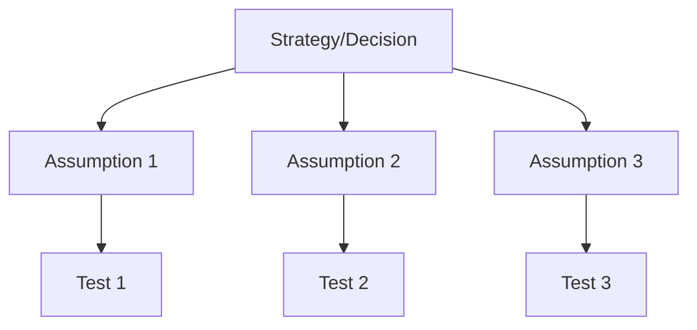

# Learning & Risk Frameworks

Frameworks for structuring beliefs, prioritizing learning, and reducing risk in strategic decisions.

## Frameworks in This Category

| Framework | Purpose | When to Use |
|-----------|---------|-------------|
| [Hypothesis Tree / Assumption Mapping](#hypothesis-tree--assumption-mapping) | Structure and test assumptions | New ventures, product planning, de-risking decisions |

---

## Hypothesis Tree / Assumption Mapping

**Purpose**: Structures beliefs to prioritize learning and risk reduction.

**Strengths**:
- Makes assumptions explicit and testable
- Prioritizes riskiest or most critical assumptions
- Guides experiment design and validation work

**When to use**:
- Planning new ventures or products
- De-risking strategic decisions
- Designing experiments and pilots
- Evaluating investment decisions

### Core Concept

Every strategy is built on assumptions. Some are well-validated; others are hopes dressed as facts. Hypothesis trees make these assumptions explicit so you can test the riskiest ones first.



### Types of Assumptions

| Type | Definition | Examples |
|------|------------|----------|
| **Desirability** | Customers want this | Will customers pay? Is there demand? |
| **Viability** | Business model works | Can we make money? Is margin sufficient? |
| **Feasibility** | We can build/deliver it | Can we execute? Do we have capabilities? |
| **Usability** | Users can use it | Is it intuitive? Can they succeed? |

### Assumption Mapping Matrix

Plot assumptions by importance and evidence:

```mermaid
quadrantChart
    title Assumption Priority Matrix
    x-axis Low Evidence --> High Evidence
    y-axis Low Importance --> High Importance
    quadrant-1 Known (Validate)
    quadrant-2 Risky (Test First!)
    quadrant-3 Low Priority
    quadrant-4 Safe (Monitor)
```

| Quadrant | Action |
|----------|--------|
| **Risky (High importance, Low evidence)** | Test these first |
| **Known (High importance, High evidence)** | Validate and monitor |
| **Safe (Low importance, High evidence)** | No action needed |
| **Low Priority (Low importance, Low evidence)** | Ignore for now |

### Building a Hypothesis Tree

**Step 1: State the Bet**
What are you betting on? What must be true for this to succeed?

**Step 2: Decompose into Assumptions**
Break down into testable components:
- Customer assumptions
- Product assumptions
- Business model assumptions
- Execution assumptions

**Step 3: Assess Each Assumption**
For each assumption, rate:
- **Importance**: How critical if wrong? (1-10)
- **Evidence**: How much evidence do we have? (1-10)

**Step 4: Prioritize**
Calculate risk score:
```
Risk = Importance × (10 - Evidence)
```
Higher score = Test first

**Step 5: Design Tests**
For high-risk assumptions, design experiments to gather evidence.

### Hypothesis Template

```
┌─────────────────────────────────────────────────────────────────────────────┐
│ HYPOTHESIS                                                                   │
├─────────────────────────────────────────────────────────────────────────────┤
│ We believe that [customer/situation]                                         │
│ will [behavior/outcome]                                                      │
│ because [reason/insight]                                                     │
│                                                                              │
│ We will know we're right when [measurable signal]                            │
├─────────────────────────────────────────────────────────────────────────────┤
│ ASSESSMENT                                                                   │
│ Importance (1-10): ___    Evidence (1-10): ___    Risk Score: ___            │
├─────────────────────────────────────────────────────────────────────────────┤
│ TEST                                                                         │
│ Method: [How we'll test]                                                     │
│ Metric: [What we'll measure]                                                 │
│ Success: [What success looks like]                                           │
│ Timeline: [When we'll have results]                                          │
└─────────────────────────────────────────────────────────────────────────────┘
```

### Assumption Inventory Example

```
┌─────────────────────────────────────────────────────────────────────────────┐
│ ASSUMPTION INVENTORY: [Project/Initiative Name]                              │
├─────────────────────────────────────────────────────────────────────────────┤
│ # │ Assumption                    │ Type   │ Imp │ Evid │ Risk │ Action     │
├───┼───────────────────────────────┼────────┼─────┼──────┼──────┼────────────┤
│ 1 │ Customers will pay $50/mo     │ Desir  │ 10  │  3   │  70  │ TEST NOW   │
│ 2 │ We can acquire for <$100 CAC  │ Viabil │  9  │  4   │  54  │ TEST NOW   │
│ 3 │ Users can complete onboarding │ Usabil │  8  │  6   │  32  │ Test soon  │
│ 4 │ Team can build in 3 months    │ Feasib │  7  │  7   │  21  │ Monitor    │
│ 5 │ Market is >$100M              │ Viabil │  6  │  8   │  12  │ Validated  │
└─────────────────────────────────────────────────────────────────────────────┘
```

### Testing Methods

Match test to assumption type:

| Assumption Type | Low-Cost Tests | Higher-Fidelity Tests |
|-----------------|----------------|----------------------|
| **Desirability** | Interviews, surveys, landing pages | Concierge MVP, pre-sales |
| **Viability** | Financial models, comps | Pilot pricing, unit economics |
| **Feasibility** | Spikes, prototypes | Technical POC, team assessment |
| **Usability** | Paper prototypes, walkthrough | Usability testing, beta |

### Experiment Design

For each high-risk assumption:

```
┌─────────────────────────────────────────────────────────────────────────────┐
│ EXPERIMENT CARD                                                              │
├─────────────────────────────────────────────────────────────────────────────┤
│ Assumption to test: [Statement]                                              │
│                                                                              │
│ Hypothesis: We believe [condition] will result in [outcome]                  │
│                                                                              │
│ Test method: [Approach]                                                      │
│                                                                              │
│ Success metric: [Measurable outcome]                                         │
│ Success threshold: [What number means success]                               │
│                                                                              │
│ Sample size: [How many]        Duration: [How long]                          │
│                                                                              │
│ Resources needed: [What's required]                                          │
│ Risks of test: [What could go wrong]                                         │
├─────────────────────────────────────────────────────────────────────────────┤
│ RESULTS                                                                      │
│ Outcome: [What happened]                                                     │
│ Learning: [What we learned]                                                  │
│ Decision: □ Proceed  □ Pivot  □ More testing  □ Stop                        │
└─────────────────────────────────────────────────────────────────────────────┘
```

### Common Mistakes

| Mistake | Problem | Solution |
|---------|---------|----------|
| Not explicit about assumptions | Hidden risks | List all assumptions explicitly |
| Testing easy assumptions first | Wasted time | Prioritize by risk |
| Weak tests | False confidence | Design rigorous experiments |
| Ignoring negative results | Confirmation bias | Commit to acting on results |
| One-time exercise | Assumptions change | Revisit regularly |

**Output**: Tree or matrix of assumptions with risk/importance ratings

**See**: [references/hypothesis-tree.md](../references/hypothesis-tree.md) for construction and testing

**Related frameworks**: OST (experiments test hypotheses), Horizon Model (manages risk across timescales), Lean Startup

---

## References

- [references/hypothesis-tree.md](../references/hypothesis-tree.md) - Assumption mapping and testing methodology
