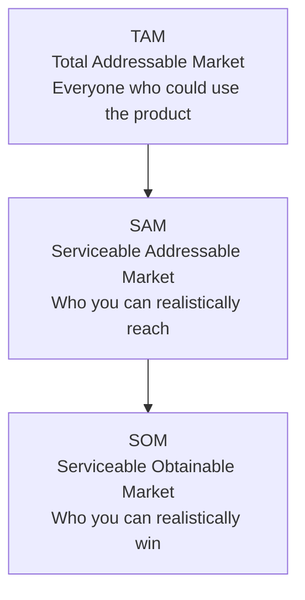

# Market & Segmentation Frameworks

Frameworks for understanding market size, customer segments, and market timing.

## Frameworks in This Category

| Framework | Purpose | When to Use |
|-----------|---------|-------------|
| [Customer Maturity Model](#customer-maturity-model) | Map customer sophistication progression | Product roadmaps, tiered offerings |
| [Market Sizing (TAM/SAM/SOM)](#market-sizing-tamsassom) | Quantify market opportunity | Business planning, investment |

---

## Customer Maturity Model

**Purpose**: Describes how customer needs or sophistication evolve over time.

**Strengths**:
- Guides segmentation and sequencing of features
- Reveals progression paths for customers
- Informs go-to-market strategy and pricing

**When to use**:
- Designing tiered products or services
- Planning feature roadmaps
- Segmenting customers by maturity
- Creating upgrade paths and expansion strategies

### Maturity Model Structure


### Defining Maturity Levels

| Level | Characteristics | Needs | Product Fit |
|-------|-----------------|-------|-------------|
| **Level 1** | Just starting, limited capability | Basic functionality, guidance | Entry tier |
| **Level 2** | Some experience, building skills | Expanded features, best practices | Standard tier |
| **Level 3** | Established practices, consistent | Optimization, efficiency | Professional tier |
| **Level 4** | Sophisticated, high performance | Advanced capabilities, customization | Enterprise tier |
| **Level 5** | Industry leading, innovating | Cutting edge, partnership | Strategic tier |

### Building Your Maturity Model

**Step 1: Define Dimensions**
What aspects of maturity matter?
- Process maturity
- Skill/capability maturity
- Technology maturity
- Organizational maturity

**Step 2: Define Levels**
Typically 4-5 levels from beginner to leader

**Step 3: Describe Each Level**
For each level, document:
- Characteristics (what they look like)
- Capabilities (what they can do)
- Challenges (what they struggle with)
- Needs (what they require)

**Step 4: Map to Offerings**
- Which product tier serves which level?
- What features matter at each level?
- What's the upgrade path?

### Maturity Model Template

```
┌─────────────────────────────────────────────────────────────────────────────┐
│ CUSTOMER MATURITY MODEL: [Domain]                                            │
├─────────────────────────────────────────────────────────────────────────────┤
│ LEVEL 1: [Name]                                                              │
│ Characteristics: [What defines customers at this level]                      │
│ Capabilities: [What they can do]                                             │
│ Challenges: [What they struggle with]                                        │
│ Needs: [What they require from solution]                                     │
│ Product Fit: [Which tier/features]                                           │
├─────────────────────────────────────────────────────────────────────────────┤
│ LEVEL 2: [Name]                                                              │
│ ...                                                                          │
├─────────────────────────────────────────────────────────────────────────────┤
│ LEVEL 3: [Name]                                                              │
│ ...                                                                          │
├─────────────────────────────────────────────────────────────────────────────┤
│ LEVEL 4: [Name]                                                              │
│ ...                                                                          │
├─────────────────────────────────────────────────────────────────────────────┤
│ LEVEL 5: [Name]                                                              │
│ ...                                                                          │
└─────────────────────────────────────────────────────────────────────────────┘
```

### Applications

| Application | How Maturity Model Helps |
|-------------|-------------------------|
| **Product tiers** | Match capabilities to maturity levels |
| **Pricing** | Price based on value at each level |
| **Marketing** | Target messaging by maturity |
| **Sales** | Qualify leads by maturity level |
| **Success** | Define progression paths |
| **Roadmap** | Prioritize features by level served |

**Output**: Maturity stages with characteristics and needs at each level

**See**: [references/maturity-model.md](../references/maturity-model.md) for design approach

**Related frameworks**: Customer Journey (maps experience at each stage), Kano Model (needs vary by maturity)

---

## Market Sizing (TAM / SAM / SOM)

**Purpose**: Estimates total, serviceable, and obtainable market size.

**Strengths**:
- Frames ambition and investment scale
- Grounds strategy in market reality
- Enables bottoms-up and tops-down validation

**When to use**:
- Business planning and fundraising
- Evaluating market opportunities
- Setting growth targets
- Prioritizing market segments

### The Three Tiers



### Definitions

| Tier | Definition | Question |
|------|------------|----------|
| **TAM** | Total demand for product/service if you had 100% share | How big is the entire market? |
| **SAM** | Portion of TAM you can realistically serve | What's accessible given your model? |
| **SOM** | Realistic market share you can capture | What can you actually win? |

### Calculation Methods

#### Top-Down Approach

Start with large market data and narrow down:

```
TAM = Total market value (from reports/data)
SAM = TAM × % addressable by your product/geography
SOM = SAM × Realistic market share %
```

**Pros**: Quick, uses existing data
**Cons**: May miss nuances, can be inflated

#### Bottom-Up Approach

Build from unit economics:

```
SOM = Number of customers × Revenue per customer
SAM = SOM × (1 / Market share %)
TAM = SAM expanded to full market
```

**Pros**: Grounded in specifics, more defensible
**Cons**: May underestimate, requires more data

### Market Sizing Template

```
┌─────────────────────────────────────────────────────────────────────────────┐
│ MARKET SIZING: [Product/Market]                                              │
├─────────────────────────────────────────────────────────────────────────────┤
│ TAM (TOTAL ADDRESSABLE MARKET)                                               │
│                                                                              │
│ Definition: [Who is included]                                                │
│ Calculation: [Method used]                                                   │
│ Sources: [Data sources]                                                      │
│                                                                              │
│ Value: $_____ [annually]                                                     │
│ Units: _____ customers/transactions                                          │
│                                                                              │
├─────────────────────────────────────────────────────────────────────────────┤
│ SAM (SERVICEABLE ADDRESSABLE MARKET)                                         │
│                                                                              │
│ Definition: [Who you can serve]                                              │
│ Filters applied:                                                             │
│   • Geography: [Regions served]                                              │
│   • Segment: [Customer types]                                                │
│   • Price point: [Affordability]                                             │
│   • Other: [Additional filters]                                              │
│                                                                              │
│ Value: $_____ [annually]     (___% of TAM)                                   │
│                                                                              │
├─────────────────────────────────────────────────────────────────────────────┤
│ SOM (SERVICEABLE OBTAINABLE MARKET)                                          │
│                                                                              │
│ Definition: [Realistic capture]                                              │
│ Assumptions:                                                                 │
│   • Market share: ___%                                                       │
│   • Timeframe: ___ years                                                     │
│   • Basis: [Why this share is achievable]                                    │
│                                                                              │
│ Value: $_____ [annually]     (___% of SAM)                                   │
│                                                                              │
├─────────────────────────────────────────────────────────────────────────────┤
│ VALIDATION                                                                   │
│                                                                              │
│ Top-down check: [Cross-reference with industry data]                         │
│ Bottom-up check: [Build from unit economics]                                 │
│ Comparables: [Similar companies' performance]                                │
│                                                                              │
└─────────────────────────────────────────────────────────────────────────────┘
```

### Bottom-Up Calculation Example

```
Step 1: Define target customer
- SMBs in retail with 10-50 employees

Step 2: Count potential customers
- 500,000 businesses match criteria

Step 3: Apply filters
- 200,000 are tech-forward (40%)
- 100,000 have budget (50% of above)

Step 4: Calculate revenue potential
- ARPU: $200/month = $2,400/year
- SAM: 100,000 × $2,400 = $240M

Step 5: Apply realistic share
- Target 5% share in 5 years
- SOM: $240M × 5% = $12M
```

### Common Mistakes

| Mistake | Problem | Solution |
|---------|---------|----------|
| TAM = Total economy | Meaningless | Define specific market |
| Only top-down | Not grounded | Validate with bottom-up |
| Ignoring competition | Overestimates SOM | Be realistic about share |
| Static view | Markets change | Update regularly |
| Missing constraints | SAM too broad | Apply realistic filters |

**Output**: Three-tier market size estimate with methodology

**See**: [references/market-sizing.md](../references/market-sizing.md) for calculation approaches

**Related frameworks**: Customer Maturity Model (segments market), Horizon Model (market timing)

---

## References

- [references/maturity-model.md](../references/maturity-model.md) - Maturity model design approach
- [references/market-sizing.md](../references/market-sizing.md) - TAM/SAM/SOM calculation methodologies
