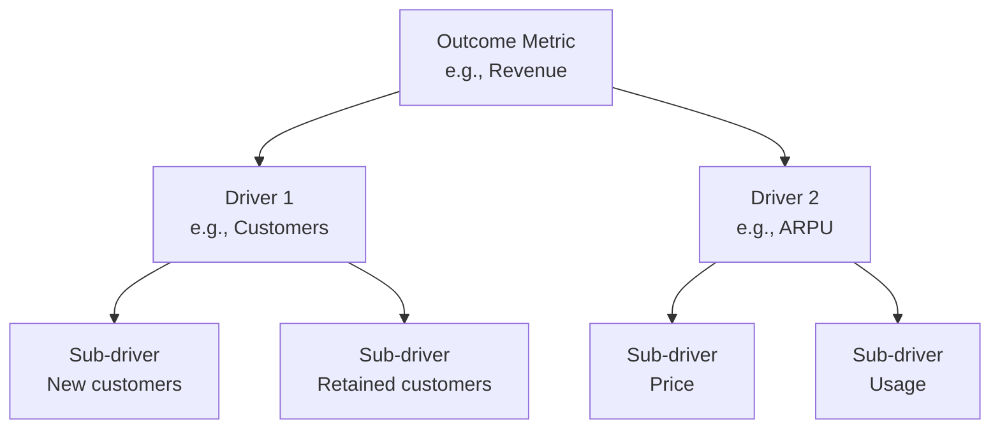
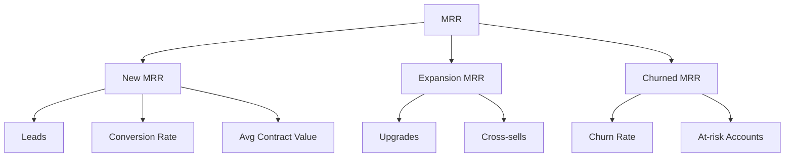
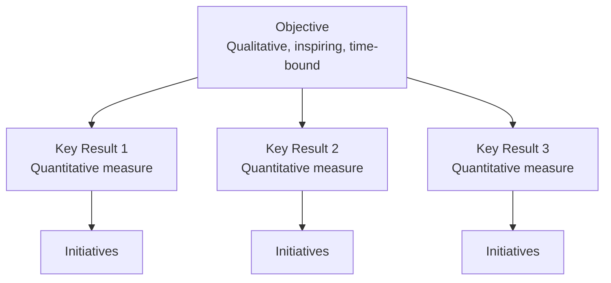
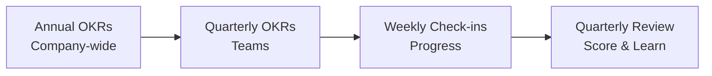

# Metrics & Measurement Frameworks

Frameworks for designing metrics hierarchies and goal-setting systems.

## Frameworks in This Category

| Framework | Purpose | When to Use |
|-----------|---------|-------------|
| [KPI Tree / Driver Tree](#kpi-tree--driver-tree) | Decompose outcomes into drivers | Metrics design, understanding levers |
| [OKR Framework](#okr-framework) | Link objectives to measurable results | Goal setting, alignment |

---

## KPI Tree / Driver Tree

**Purpose**: Breaks outcomes into measurable drivers and sub-drivers.

**Strengths**:
- Focuses attention on what appears to move results
- Makes cause-and-effect hypotheses explicit
- Enables data-driven prioritization and experimentation

**When to use**:
- Designing metrics frameworks
- Understanding what drives key outcomes
- Prioritizing optimization efforts
- Establishing OKRs and goals

### Structure



### Building a KPI Tree

**Step 1: Define the Outcome**
What's the top-level metric you want to improve?

**Step 2: Identify Direct Drivers**
What directly causes the outcome to change?
- Use mathematical relationships where possible
- Typically 2-4 direct drivers

**Step 3: Decompose Further**
For each driver, ask: what drives this?
- Continue until you reach actionable metrics
- Usually 3-4 levels deep

**Step 4: Identify Levers**
Which metrics can you actually influence?
- These become your focus areas

### Common KPI Tree Patterns

**Revenue Tree**:
```
Revenue = Customers × ARPU
Customers = New + Retained - Churned
ARPU = Price × Usage Frequency
```

**SaaS Revenue Tree**:


### KPI Tree Template

```
┌─────────────────────────────────────────────────────────────────────────────┐
│ KPI TREE: [Outcome Metric]                                                   │
├─────────────────────────────────────────────────────────────────────────────┤
│                                                                              │
│                         ┌─────────────────┐                                  │
│                         │ [Outcome Metric]│                                  │
│                         │ Current: ___    │                                  │
│                         │ Target: ___     │                                  │
│                         └────────┬────────┘                                  │
│                                  │                                           │
│              ┌───────────────────┼───────────────────┐                       │
│              ▼                   ▼                   ▼                       │
│     ┌────────────────┐  ┌────────────────┐  ┌────────────────┐              │
│     │ [Driver 1]     │  │ [Driver 2]     │  │ [Driver 3]     │              │
│     │ Current: ___   │  │ Current: ___   │  │ Current: ___   │              │
│     └───────┬────────┘  └───────┬────────┘  └───────┬────────┘              │
│             │                   │                   │                        │
│        ┌────┴────┐         ┌────┴────┐         ┌────┴────┐                  │
│        ▼         ▼         ▼         ▼         ▼         ▼                  │
│   [Sub-drv]  [Sub-drv] [Sub-drv] [Sub-drv] [Sub-drv] [Sub-drv]             │
│                                                                              │
├─────────────────────────────────────────────────────────────────────────────┤
│ KEY LEVERS (actionable metrics)                                              │
│ 1. [Metric]: [Owner] - [Current] → [Target]                                 │
│ 2. [Metric]: [Owner] - [Current] → [Target]                                 │
│ 3. [Metric]: [Owner] - [Current] → [Target]                                 │
└─────────────────────────────────────────────────────────────────────────────┘
```

### Using the KPI Tree

| Application | How to Use |
|-------------|------------|
| **Diagnosis** | Find which driver is underperforming |
| **Prioritization** | Focus on highest-impact levers |
| **Alignment** | Assign drivers to teams |
| **Forecasting** | Model impact of changes |
| **Communication** | Explain strategy through metrics |

**Output**: Hierarchical tree from outcome metric to actionable drivers

**See**: [references/kpi-tree.md](../references/kpi-tree.md) for construction methodology

**Related frameworks**: North Star Framework (top-level outcome), OKRs (goal setting)

---

## OKR Framework

**Purpose**: Links ambitious objectives to measurable key results that define success.

**Strengths**:
- Aligns teams around outcomes rather than outputs
- Creates transparency on priorities across organization
- Enables ambitious goal-setting with clear success criteria

**When to use**:
- Quarterly or annual planning
- Aligning cross-functional teams
- Translating strategy into measurable goals
- Creating accountability for outcomes

### Structure



### Objectives

**Characteristics**:
- Qualitative and inspirational
- Action-oriented (starts with verb)
- Time-bound (typically quarterly)
- Ambitious but achievable
- Aligned with company strategy

**Good vs. Bad Objectives**:

| Bad | Good |
|-----|------|
| "Improve customer satisfaction" (vague) | "Become the most loved platform in our category" |
| "Increase revenue" (not inspiring) | "Achieve breakthrough growth in enterprise" |
| "Build new features" (output, not outcome) | "Transform how teams collaborate" |

### Key Results

**Characteristics**:
- Quantitative and measurable
- Time-bound
- Describes outcomes, not activities
- 3-5 per objective
- Ambitious (stretch goals)

**Good vs. Bad Key Results**:

| Bad | Good |
|-----|------|
| "Launch new feature" (activity) | "50% of users adopt new workflow" |
| "Meet with 10 customers" (activity) | "NPS improves from 30 to 50" |
| "Improve quality" (vague) | "Reduce P1 bugs by 60%" |

### Committed vs. Aspirational

| Type | Target Achievement | Purpose |
|------|-------------------|---------|
| **Committed** | 100% (must-hit) | Business requirements |
| **Aspirational** | 70% (stretch) | Ambitious growth |

### OKR Cadence



### OKR Template

```
┌─────────────────────────────────────────────────────────────────────────────┐
│ OKR: [Team/Individual]                     Quarter: [Q_ 20__]                │
├─────────────────────────────────────────────────────────────────────────────┤
│ OBJECTIVE 1: [Qualitative, inspiring goal]                                   │
│                                                                              │
│ Key Results:                                                                 │
│ □ KR1: [Metric] from [X] to [Y]                          Progress: __/10    │
│ □ KR2: [Metric] from [X] to [Y]                          Progress: __/10    │
│ □ KR3: [Metric] from [X] to [Y]                          Progress: __/10    │
│                                                                              │
│ Initiatives:                                                                 │
│ • [Initiative supporting KR1]                                                │
│ • [Initiative supporting KR2]                                                │
│                                                                              │
├─────────────────────────────────────────────────────────────────────────────┤
│ OBJECTIVE 2: [Qualitative, inspiring goal]                                   │
│                                                                              │
│ Key Results:                                                                 │
│ □ KR1: [Metric] from [X] to [Y]                          Progress: __/10    │
│ □ KR2: [Metric] from [X] to [Y]                          Progress: __/10    │
│ □ KR3: [Metric] from [X] to [Y]                          Progress: __/10    │
│                                                                              │
└─────────────────────────────────────────────────────────────────────────────┘
```

### OKR Example

```
Objective: Become the most trusted platform for small business owners

Key Results:
1. Increase NPS from 32 to 50
2. Reduce customer support tickets per user by 40%
3. Achieve 60% monthly active rate among new signups

Initiatives:
- Redesign onboarding flow
- Launch proactive help system
- Improve top 5 pain point features
```

### Scoring OKRs

Score each Key Result at end of quarter:

| Score | Meaning |
|-------|---------|
| 0.0-0.3 | Failed to make progress |
| 0.4-0.6 | Made progress but fell short |
| 0.7-1.0 | Delivered (for aspirational, 0.7 is success) |

### Common Mistakes

| Mistake | Problem | Solution |
|---------|---------|----------|
| Too many OKRs | Dilutes focus | 3-5 objectives max |
| KRs as tasks | Measures activity, not outcomes | Focus on results |
| Sandbagging | Not ambitious enough | Embrace stretch goals |
| Set and forget | No weekly check-ins | Regular progress reviews |
| Punishing misses | Fear of ambition | Celebrate learning |
| No alignment | Disconnected from company | Cascade from company OKRs |

**Output**: Hierarchy of objectives with 3-5 measurable key results each

**See**: [references/okr-framework.md](../references/okr-framework.md) for OKR writing guide

**Related frameworks**: North Star Framework (informs top objective), KPI Tree (informs key results)

---

## References

- [references/kpi-tree.md](../references/kpi-tree.md) - KPI tree construction methodology
- [references/okr-framework.md](../references/okr-framework.md) - OKR writing guide and common pitfalls
