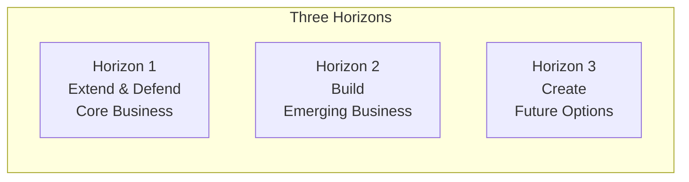
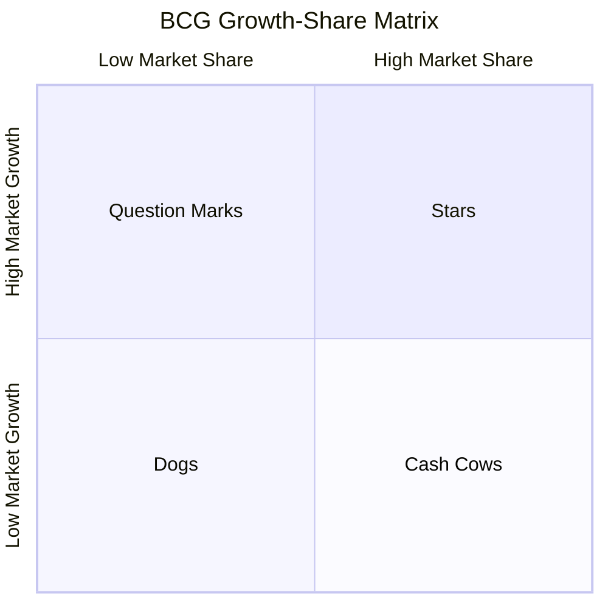

# Portfolio & Timing Frameworks

Frameworks for managing portfolios of initiatives and balancing time horizons.

## Frameworks in This Category

| Framework | Purpose | When to Use |
|-----------|---------|-------------|
| [Horizon Model (H1/H2/H3)](#horizon-model-h1h2h3) | Balance time horizons | Innovation portfolio, resource allocation |
| [BCG Matrix](#bcg-matrix) | Portfolio investment decisions | Product portfolio, resource allocation |
| [GE-McKinsey Matrix](#ge-mckinsey-matrix) | Multi-factor portfolio analysis | Complex portfolio decisions |

---

## Horizon Model (H1/H2/H3)

**Purpose**: Buckets work by near-, mid-, and long-term horizons.

**Strengths**:
- Protects long-term bets from short-term pressure
- Ensures balanced portfolio across time horizons
- Creates permission for different risk profiles by horizon

**When to use**:
- Portfolio management and resource allocation
- Balancing current revenue with future innovation
- Communicating innovation strategy to leadership
- Managing stakeholder expectations on timing

### The Three Horizons



### Horizon Definitions

| Horizon | Focus | Timeframe | Risk | Returns |
|---------|-------|-----------|------|---------|
| **H1** | Core business | 0-12 months | Low | Predictable |
| **H2** | Emerging opportunities | 1-3 years | Medium | Uncertain |
| **H3** | Future options | 3-5+ years | High | Unknown |

### Resource Allocation

Typical allocation (varies by industry/company):

| Profile | H1 | H2 | H3 |
|---------|----|----|-----|
| **Conservative** | 80% | 15% | 5% |
| **Balanced** | 70% | 20% | 10% |
| **Aggressive** | 50% | 30% | 20% |

### Managing Each Horizon

| Horizon | Management Approach | Metrics |
|---------|--------------------| --------|
| **H1** | Optimize, efficiency focus | Revenue, margin, growth |
| **H2** | Scale, prove model | Customer traction, unit economics |
| **H3** | Experiment, learn | Learning velocity, option value |

### Horizon Template

```
┌─────────────────────────────────────────────────────────────────────────────┐
│ THREE HORIZONS PORTFOLIO                                                     │
├─────────────────────────────────────────────────────────────────────────────┤
│ HORIZON 1: Core Business (Target: __% of resources)                          │
│                                                                              │
│ Focus: Optimize and defend current business                                  │
│ Timeframe: 0-12 months                                                       │
│                                                                              │
│ Initiatives:                                                                 │
│ • [Initiative 1]                                                             │
│ • [Initiative 2]                                                             │
│                                                                              │
│ Metrics: [Revenue growth, margin improvement]                                │
│                                                                              │
├─────────────────────────────────────────────────────────────────────────────┤
│ HORIZON 2: Emerging Business (Target: __% of resources)                      │
│                                                                              │
│ Focus: Scale emerging opportunities                                          │
│ Timeframe: 1-3 years                                                         │
│                                                                              │
│ Initiatives:                                                                 │
│ • [Initiative 1]                                                             │
│ • [Initiative 2]                                                             │
│                                                                              │
│ Metrics: [Customer traction, unit economics]                                 │
│                                                                              │
├─────────────────────────────────────────────────────────────────────────────┤
│ HORIZON 3: Future Options (Target: __% of resources)                         │
│                                                                              │
│ Focus: Explore and create options                                            │
│ Timeframe: 3-5+ years                                                        │
│                                                                              │
│ Initiatives:                                                                 │
│ • [Initiative 1]                                                             │
│ • [Initiative 2]                                                             │
│                                                                              │
│ Metrics: [Learning, option value]                                            │
│                                                                              │
└─────────────────────────────────────────────────────────────────────────────┘
```

**Output**: Three-horizon portfolio with initiatives categorized by timeframe

**See**: [references/horizon-model.md](../references/horizon-model.md) for allocation guidelines

**Related frameworks**: Hypothesis Tree (de-risks H2/H3), Wardley Map (evolution dimension)

---

## BCG Matrix

**Purpose**: Classifies products/business units by market growth and relative market share.

**Strengths**:
- Simple visual for portfolio-level investment decisions
- Clarifies cash flow dynamics across portfolio
- Forces explicit discussion of resource allocation

**When to use**:
- Portfolio strategy and resource allocation
- Product lifecycle planning
- M&A target evaluation
- Divestiture decisions

### Matrix Structure



### Quadrant Details

| Quadrant | Characteristics | Cash Flow | Strategy |
|----------|-----------------|-----------|----------|
| **Stars** | High growth, high share | Neutral (reinvest) | Invest to maintain leadership |
| **Question Marks** | High growth, low share | Negative (needs cash) | Invest selectively or divest |
| **Cash Cows** | Low growth, high share | Positive (generates cash) | Harvest cash, minimal investment |
| **Dogs** | Low growth, low share | Neutral to negative | Divest or manage for cash |

### BCG Matrix Template

```
┌─────────────────────────────────────────────────────────────────────────────┐
│ BCG MATRIX ANALYSIS                                                          │
├─────────────────────────────────────────────────────────────────────────────┤
│                                                                              │
│   High                                                                       │
│   Growth   ┌─────────────────────┬─────────────────────┐                    │
│            │    QUESTION MARKS   │       STARS         │                    │
│            │                     │                     │                    │
│            │    [Product A]      │    [Product B]      │                    │
│            │    [Product C]      │    [Product D]      │                    │
│            │                     │                     │                    │
│            ├─────────────────────┼─────────────────────┤                    │
│            │        DOGS         │     CASH COWS       │                    │
│            │                     │                     │                    │
│            │    [Product E]      │    [Product F]      │                    │
│            │    [Product G]      │    [Product H]      │                    │
│            │                     │                     │                    │
│   Low      └─────────────────────┴─────────────────────┘                    │
│   Growth         Low Share              High Share                           │
│                                                                              │
├─────────────────────────────────────────────────────────────────────────────┤
│ STRATEGIC ACTIONS                                                            │
│                                                                              │
│ Stars: [Investment strategy]                                                 │
│ Question Marks: [Invest or divest decision]                                  │
│ Cash Cows: [Harvest strategy]                                                │
│ Dogs: [Divest or manage strategy]                                            │
│                                                                              │
└─────────────────────────────────────────────────────────────────────────────┘
```

### Limitations

- Market growth isn't only measure of attractiveness
- Market share isn't only competitive advantage
- Binary high/low oversimplifies
- Cash flow assumptions may not hold

**Output**: Portfolio plot with investment strategy per quadrant

**See**: [references/bcg-matrix.md](../references/bcg-matrix.md) for calculation methodology

**Related frameworks**: GE-McKinsey Matrix (more nuanced), Horizon Model (timing dimension)

---

## GE-McKinsey Matrix

**Purpose**: Evaluates business units by industry attractiveness and competitive strength.

**Strengths**:
- More nuanced than BCG matrix (multi-factor analysis)
- Customizable to specific industry/company context
- Enables granular investment prioritization

**When to use**:
- Complex portfolio decisions
- When BCG matrix is too simplistic
- Strategic planning for diversified companies
- M&A prioritization

### Nine-Box Structure

```
┌─────────────────────────────────────────────────────────────────────────────┐
│                    COMPETITIVE STRENGTH                                      │
│                    Strong    Medium    Weak                                  │
├──────────┬─────────────────────────────────────────────────────────────────┤
│          │         │ INVEST/ │ INVEST/ │SELECTIVE│                          │
│   High   │         │  GROW   │  GROW   │ INVEST  │                          │
│          │         │         │         │         │                          │
├──────────┤         ├─────────┼─────────┼─────────┤                          │
│          │         │ INVEST/ │SELECTIVE│ HARVEST/│                          │
│  Medium  │ ATTRACT │  GROW   │ INVEST  │ DIVEST  │                          │
│          │         │         │         │         │                          │
├──────────┤         ├─────────┼─────────┼─────────┤                          │
│          │         │SELECTIVE│ HARVEST/│ HARVEST/│                          │
│   Low    │         │ INVEST  │ DIVEST  │ DIVEST  │                          │
│          │         │         │         │         │                          │
└──────────┴─────────┴─────────┴─────────┴─────────┘                          │
```

### Scoring Factors

**Industry Attractiveness** (Y-axis):

| Factor | Weight | Score (1-5) |
|--------|--------|-------------|
| Market size | | |
| Market growth | | |
| Industry profitability | | |
| Competitive intensity | | |
| Technology requirements | | |
| Environmental/regulatory | | |
| **Weighted Total** | 100% | |

**Competitive Strength** (X-axis):

| Factor | Weight | Score (1-5) |
|--------|--------|-------------|
| Market share | | |
| Brand strength | | |
| Production capacity | | |
| Profit margins | | |
| Technology capability | | |
| Management strength | | |
| **Weighted Total** | 100% | |

### Strategic Implications

| Position | Strategy | Resource Allocation |
|----------|----------|---------------------|
| **Invest/Grow** | Invest heavily, prioritize | High |
| **Selective Investment** | Invest selectively, support strengths | Medium |
| **Harvest/Divest** | Minimize investment, consider exit | Low to zero |

**Output**: Nine-box matrix with weighted scoring for each axis

**See**: [references/ge-mckinsey.md](../references/ge-mckinsey.md) for factor weighting methodology

**Related frameworks**: BCG Matrix (simpler variant), Porter's Five Forces (informs attractiveness)

---

## References

- [references/horizon-model.md](../references/horizon-model.md) - Portfolio management approach
- [references/bcg-matrix.md](../references/bcg-matrix.md) - Growth-share matrix methodology
- [references/ge-mckinsey.md](../references/ge-mckinsey.md) - Nine-box factor weighting
