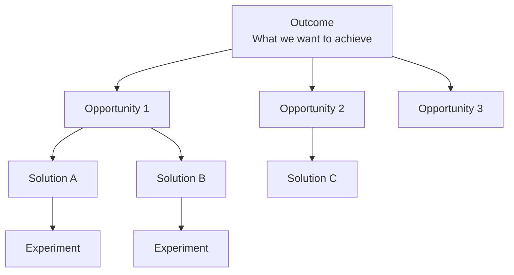
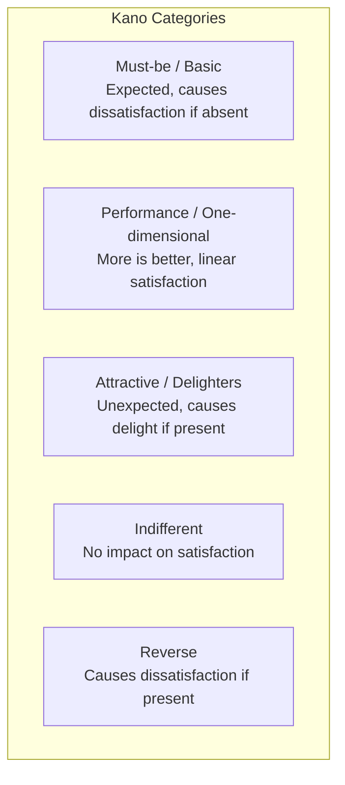

# Prioritization Frameworks

Frameworks for deciding what to build, in what order, and with what investment level.

## Frameworks in This Category

| Framework | Purpose | When to Use |
|-----------|---------|-------------|
| [Opportunity-Solution Tree (OST)](#opportunity-solution-tree-ost) | Connect outcomes to solutions | Product discovery, planning |
| [RICE Scoring](#rice-scoring) | Quantitative prioritization | Backlog ranking, roadmap decisions |
| [ICE Scoring](#ice-scoring) | Quick prioritization | Early screening, rapid ranking |
| [MoSCoW](#moscow) | Categorical prioritization | Release planning, scoping |
| [Kano Model](#kano-model) | Feature satisfaction analysis | Feature prioritization, positioning |

---

## Opportunity-Solution Tree (OST)

**Purpose**: Connects outcomes to opportunities, solutions, and experiments.

**Strengths**:
- Keeps teams outcome-oriented while exploring options
- Ensures solutions address real opportunities
- Makes explicit the link from desired outcome to experiment

**When to use**:
- Product discovery and planning
- Evaluating feature ideas against outcomes
- Prioritizing experiments and prototypes
- Maintaining outcome focus during execution

### OST Structure



### Building an OST

**Step 1: Define the Outcome**
What measurable result are you trying to achieve?

**Step 2: Discover Opportunities**
What customer needs, pain points, or desires could help achieve this outcome?

**Step 3: Generate Solutions**
For each opportunity, what solutions could address it?

**Step 4: Design Experiments**
How can you test each solution with minimal investment?

### OST Template

```
┌─────────────────────────────────────────────────────────────────────────────┐
│ OPPORTUNITY-SOLUTION TREE                                                    │
├─────────────────────────────────────────────────────────────────────────────┤
│ OUTCOME: [Measurable goal]                                                   │
│                                                                              │
│ ├── OPPORTUNITY 1: [Customer need/pain point]                                │
│ │   ├── Solution A: [Idea]                                                   │
│ │   │   └── Experiment: [How to test]                                        │
│ │   └── Solution B: [Idea]                                                   │
│ │       └── Experiment: [How to test]                                        │
│ │                                                                            │
│ ├── OPPORTUNITY 2: [Customer need/pain point]                                │
│ │   └── Solution C: [Idea]                                                   │
│ │       └── Experiment: [How to test]                                        │
│ │                                                                            │
│ └── OPPORTUNITY 3: [Customer need/pain point]                                │
│     └── Solution D: [Idea]                                                   │
│         └── Experiment: [How to test]                                        │
│                                                                              │
└─────────────────────────────────────────────────────────────────────────────┘
```

**Output**: Tree structure from outcome → opportunities → solutions → experiments

**See**: [references/ost.md](../references/ost.md) for detailed methodology

**Related frameworks**: Hypothesis Tree (tests assumptions), RICE (prioritizes solutions)

---

## RICE Scoring

**Purpose**: Prioritizes initiatives by Reach, Impact, Confidence, and Effort.

**Strengths**:
- Balances potential value against required investment
- Accounts for uncertainty through confidence scoring
- Creates comparable scores across diverse initiatives

**When to use**:
- Prioritizing product backlog or roadmap
- Comparing dissimilar initiatives objectively
- Making resource allocation decisions
- Building consensus on priorities

### Formula

```
RICE Score = (Reach × Impact × Confidence) / Effort
```

### Factor Definitions

| Factor | Definition | How to Measure |
|--------|------------|----------------|
| **Reach** | How many people/events in a time period? | Users, transactions, events per quarter |
| **Impact** | How much will it move the metric? | Scale: 0.25 (minimal) to 3 (massive) |
| **Confidence** | How sure are we of estimates? | Percentage: 100%, 80%, 50%, etc. |
| **Effort** | How much work is required? | Person-months or story points |

### Impact Scale

| Score | Meaning |
|-------|---------|
| 3 | Massive impact |
| 2 | High impact |
| 1 | Medium impact |
| 0.5 | Low impact |
| 0.25 | Minimal impact |

### RICE Template

```
┌─────────────────────────────────────────────────────────────────────────────┐
│ RICE SCORING                                                                 │
├────────────────┬────────┬────────┬────────┬────────┬───────────────────────┤
│ Initiative     │ Reach  │ Impact │ Confid │ Effort │ RICE Score            │
├────────────────┼────────┼────────┼────────┼────────┼───────────────────────┤
│ Feature A      │ 10,000 │ 2      │ 80%    │ 4 PM   │ (10K×2×0.8)/4 = 4,000 │
│ Feature B      │ 50,000 │ 0.5    │ 50%    │ 2 PM   │ (50K×.5×0.5)/2 = 6,250│
│ Feature C      │ 5,000  │ 3      │ 90%    │ 3 PM   │ (5K×3×0.9)/3 = 4,500  │
├────────────────┴────────┴────────┴────────┴────────┴───────────────────────┤
│ Priority Order: Feature B > Feature C > Feature A                           │
└─────────────────────────────────────────────────────────────────────────────┘
```

**Output**: Ranked list of initiatives by RICE score

**See**: [references/rice-scoring.md](../references/rice-scoring.md) for calibration guidelines

**Related frameworks**: ICE (simpler variant), OST (qualitative context)

---

## ICE Scoring

**Purpose**: Quick prioritization using Impact, Confidence, and Ease.

**Strengths**:
- Simpler and faster than RICE
- Good for early-stage idea screening
- Easy to explain and apply

**When to use**:
- Rapid prioritization of many ideas
- Early-stage screening before deeper analysis
- Teams new to scoring frameworks
- When reach data isn't available

### Formula

```
ICE Score = Impact × Confidence × Ease
```

### Factor Definitions

| Factor | Scale | Description |
|--------|-------|-------------|
| **Impact** | 1-10 | Potential impact on key metric |
| **Confidence** | 1-10 | Certainty in impact estimate |
| **Ease** | 1-10 | How easy to implement (inverse of effort) |

### ICE Template

```
┌─────────────────────────────────────────────────────────────────────────────┐
│ ICE SCORING                                                                  │
├────────────────┬────────┬────────┬────────┬─────────────────────────────────┤
│ Initiative     │ Impact │ Confid │ Ease   │ ICE Score                       │
├────────────────┼────────┼────────┼────────┼─────────────────────────────────┤
│ Idea A         │ 8      │ 6      │ 7      │ 8 × 6 × 7 = 336                 │
│ Idea B         │ 5      │ 9      │ 8      │ 5 × 9 × 8 = 360                 │
│ Idea C         │ 10     │ 4      │ 3      │ 10 × 4 × 3 = 120                │
├────────────────┴────────┴────────┴────────┴─────────────────────────────────┤
│ Priority Order: Idea B > Idea A > Idea C                                     │
└─────────────────────────────────────────────────────────────────────────────┘
```

**Output**: Ranked list of initiatives by ICE score

**See**: [references/ice-scoring.md](../references/ice-scoring.md) for scoring calibration

**Related frameworks**: RICE (more rigorous), MoSCoW (categorical)

---

## MoSCoW

**Purpose**: Categorizes requirements by Must have, Should have, Could have, Won't have.

**Strengths**:
- Clear, intuitive categories for stakeholder communication
- Forces hard decisions about what's truly required
- Works well for fixed-scope/fixed-timeline projects

**When to use**:
- Release planning with fixed deadlines
- Requirements gathering with stakeholders
- MVP scoping
- Contract negotiations

### Categories

| Category | Criteria | Typical % of Effort |
|----------|----------|---------------------|
| **Must** | Without this, delivery fails | ~60% |
| **Should** | Important, but workaround exists | ~20% |
| **Could** | Desirable, first to cut if needed | ~20% |
| **Won't** | Agreed out of scope for this release | 0% |

### MoSCoW Template

```
┌─────────────────────────────────────────────────────────────────────────────┐
│ MoSCoW PRIORITIZATION: [Release/Project]                                     │
├─────────────────────────────────────────────────────────────────────────────┤
│ MUST HAVE (Non-negotiable)                                                   │
│ □ [Requirement 1]                                                            │
│ □ [Requirement 2]                                                            │
│ □ [Requirement 3]                                                            │
│                                                          Effort: ___%        │
├─────────────────────────────────────────────────────────────────────────────┤
│ SHOULD HAVE (Important but not critical)                                     │
│ □ [Requirement 4]                                                            │
│ □ [Requirement 5]                                                            │
│                                                          Effort: ___%        │
├─────────────────────────────────────────────────────────────────────────────┤
│ COULD HAVE (Nice to have)                                                    │
│ □ [Requirement 6]                                                            │
│ □ [Requirement 7]                                                            │
│                                                          Effort: ___%        │
├─────────────────────────────────────────────────────────────────────────────┤
│ WON'T HAVE (Explicitly out of scope)                                         │
│ □ [Requirement 8]                                                            │
│ □ [Requirement 9]                                                            │
│                                                                              │
└─────────────────────────────────────────────────────────────────────────────┘
```

**Output**: Categorized requirement list with explicit "Won't have" items

**See**: [references/moscow.md](../references/moscow.md) for facilitation guide

**Related frameworks**: RICE/ICE (scoring approach), Kano (satisfaction impact)

---

## Kano Model

**Purpose**: Classifies features by how they affect customer satisfaction.

**Strengths**:
- Helps distinguish table stakes from differentiators
- Reveals where investment creates competitive advantage
- Prevents over-investment in basics or under-investment in delighters

**When to use**:
- Prioritizing features and capabilities
- Understanding competitive positioning
- Balancing innovation with foundational quality
- Making build vs. buy decisions

### Feature Categories



### Kano Analysis

| Category | If Present | If Absent | Strategic Implication |
|----------|------------|-----------|----------------------|
| **Must-be** | No increase in satisfaction | Strong dissatisfaction | Table stakes, must deliver |
| **Performance** | Satisfaction increases | Satisfaction decreases | Compete on these, more is better |
| **Attractive** | Strong satisfaction | No dissatisfaction | Differentiate, create delight |
| **Indifferent** | No effect | No effect | Don't invest |
| **Reverse** | Dissatisfaction | Satisfaction | Avoid or make optional |

### Feature Evolution

Features tend to evolve over time:
```
Attractive → Performance → Must-be
(Delight)   (Compete)     (Expected)
```

Example: GPS navigation was once an attractive feature, then performance, now must-be in phones.

### Kano Survey Method

Ask two questions per feature:
1. "If [feature] is present, how do you feel?" (Functional)
2. "If [feature] is absent, how do you feel?" (Dysfunctional)

Answers: Like it, Expect it, Neutral, Can tolerate, Dislike

Cross-reference to categorize.

**Output**: Classification of features into categories with satisfaction curves

**See**: [references/kano-model.md](../references/kano-model.md) for survey methodology

**Related frameworks**: OST (prioritizes opportunities), Customer Journey (feature context)

---

## References

- [references/ost.md](../references/ost.md) - Opportunity-Solution Tree methodology
- [references/rice-scoring.md](../references/rice-scoring.md) - RICE calibration guidelines
- [references/ice-scoring.md](../references/ice-scoring.md) - ICE scoring calibration
- [references/moscow.md](../references/moscow.md) - MoSCoW facilitation guide
- [references/kano-model.md](../references/kano-model.md) - Kano survey and classification
