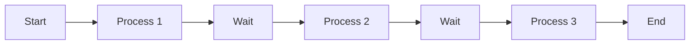
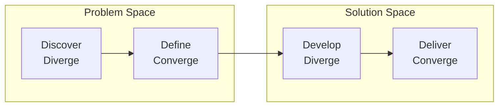

# Process & Efficiency Frameworks

Frameworks for analyzing and improving processes, workflows, and problem-solving approaches.

## Frameworks in This Category

| Framework | Purpose | When to Use |
|-----------|---------|-------------|
| [Value Stream Map](#value-stream-map) | Visualize and optimize workflow | Process improvement, bottleneck identification |
| [Design Thinking / Double Diamond](#design-thinking--double-diamond) | Structure problem-solving | Innovation, complex problem solving |

---

## Value Stream Map

**Purpose**: Visualizes flow of work from start to delivery.

**Strengths**:
- Exposes bottlenecks, delays, and waste
- Quantifies process time vs. wait time
- Identifies opportunities for flow improvement

**When to use**:
- Optimizing delivery processes
- Reducing cycle time and lead time
- Identifying waste in workflows
- Improving operational efficiency

### Core Concepts

| Term | Definition |
|------|------------|
| **Value Stream** | All activities required to deliver value |
| **Process Time** | Time actively working on the item |
| **Wait Time** | Time item sits waiting |
| **Lead Time** | Total time from start to finish |
| **Value-Add** | Activities customer would pay for |
| **Non-Value-Add** | Activities that don't add value |

### Basic Structure



### Value Stream Map Template

```
┌─────────────────────────────────────────────────────────────────────────────┐
│ VALUE STREAM MAP: [Process Name]                                             │
├─────────────────────────────────────────────────────────────────────────────┤
│                                                                              │
│  [Customer/     [Process 1]    [Process 2]    [Process 3]    [Customer/     │
│   Request]  →   ┌───────┐  →   ┌───────┐  →   ┌───────┐  →   Delivery]      │
│                 │       │      │       │      │       │                      │
│                 │ PT:   │      │ PT:   │      │ PT:   │                      │
│                 │ WT:   │      │ WT:   │      │ WT:   │                      │
│                 │ %C&A: │      │ %C&A: │      │ %C&A: │                      │
│                 └───────┘      └───────┘      └───────┘                      │
│                                                                              │
├─────────────────────────────────────────────────────────────────────────────┤
│ TIMELINE                                                                     │
│                                                                              │
│ Process Time: │ 2 hrs │        │ 4 hrs │        │ 1 hr  │  = 7 hrs total    │
│ Wait Time:    │       │ 3 days │       │ 2 days │       │  = 5 days total   │
│                                                                              │
│ Lead Time: 5 days 7 hrs                                                      │
│ Process Efficiency: 7 hrs / 127 hrs = 5.5%                                   │
│                                                                              │
├─────────────────────────────────────────────────────────────────────────────┤
│ IMPROVEMENT OPPORTUNITIES                                                    │
│ • [Bottleneck 1]                                                             │
│ • [Waste identified]                                                         │
│ • [Improvement idea]                                                         │
│                                                                              │
└─────────────────────────────────────────────────────────────────────────────┘

PT = Process Time, WT = Wait Time, %C&A = % Complete & Accurate
```

### Seven Wastes (Muda)

| Waste | Definition | Examples |
|-------|------------|----------|
| **Transport** | Unnecessary movement | Handoffs, file transfers |
| **Inventory** | Excess work in progress | Queued items, backlogs |
| **Motion** | Unnecessary actions | Context switching |
| **Waiting** | Idle time | Approvals, dependencies |
| **Overproduction** | Making more than needed | Unused features |
| **Over-processing** | More work than required | Gold plating |
| **Defects** | Errors requiring rework | Bugs, mistakes |

### Process Efficiency

```
Process Efficiency = Process Time / Lead Time × 100%
```

World-class: >25%
Good: 10-25%
Typical: <10%

**Output**: Process flow diagram with time, quality, and handoff metrics

**See**: [references/value-stream.md](../references/value-stream.md) for mapping methodology

**Related frameworks**: Service Blueprint (adds customer layer), Lean principles

---

## Design Thinking / Double Diamond

**Purpose**: Structures problem-solving through divergent exploration and convergent decision-making.

**Strengths**:
- Ensures problems are well-understood before solving
- Balances creative exploration with focused execution
- Provides shared process language across disciplines

**When to use**:
- Tackling ambiguous or complex problems
- Innovation and new product development
- Improving existing products or services
- Cross-functional collaboration on solutions

### Double Diamond Structure



### The Four Phases

| Phase | Mode | Purpose | Activities |
|-------|------|---------|------------|
| **Discover** | Diverge | Understand the problem space | Research, observation, interviews |
| **Define** | Converge | Frame the right problem | Synthesis, problem statements |
| **Develop** | Diverge | Explore solutions | Ideation, prototyping |
| **Deliver** | Converge | Ship the solution | Testing, refinement, launch |

### Phase Details

**Discover (Divergent)**:
- User research and interviews
- Observation and immersion
- Stakeholder interviews
- Data analysis
- Competitive analysis

**Define (Convergent)**:
- Synthesize research
- Create personas
- Map journeys
- Frame "How Might We" questions
- Define problem statement

**Develop (Divergent)**:
- Brainstorm solutions
- Create prototypes
- Test with users
- Iterate rapidly
- Explore multiple directions

**Deliver (Convergent)**:
- Refine solution
- Validate with users
- Plan implementation
- Launch and measure
- Learn and iterate

### Design Thinking Principles

| Principle | Description |
|-----------|-------------|
| **Human-centered** | Start with empathy for users |
| **Bias to action** | Prototype early and often |
| **Radical collaboration** | Diverse perspectives improve outcomes |
| **Embrace ambiguity** | Resist premature convergence |
| **Be optimistic** | Believe solutions are possible |

### Double Diamond Template

```
┌─────────────────────────────────────────────────────────────────────────────┐
│ DOUBLE DIAMOND: [Project Name]                                               │
├─────────────────────────────────────────────────────────────────────────────┤
│ DISCOVER (Diverge - Problem Space)                                           │
│                                                                              │
│ Research conducted:                                                          │
│ • [User interviews: X conducted]                                             │
│ • [Observations: X sessions]                                                 │
│ • [Data analyzed: X sources]                                                 │
│                                                                              │
│ Key insights:                                                                │
│ • [Insight 1]                                                                │
│ • [Insight 2]                                                                │
│                                                                              │
├─────────────────────────────────────────────────────────────────────────────┤
│ DEFINE (Converge - Problem Space)                                            │
│                                                                              │
│ Problem statement:                                                           │
│ [Clear articulation of the problem to solve]                                 │
│                                                                              │
│ How Might We questions:                                                      │
│ • HMW [question 1]?                                                          │
│ • HMW [question 2]?                                                          │
│                                                                              │
│ Success criteria:                                                            │
│ • [Criterion 1]                                                              │
│ • [Criterion 2]                                                              │
│                                                                              │
├─────────────────────────────────────────────────────────────────────────────┤
│ DEVELOP (Diverge - Solution Space)                                           │
│                                                                              │
│ Ideas generated: [X ideas]                                                   │
│                                                                              │
│ Prototypes created:                                                          │
│ • [Prototype 1]                                                              │
│ • [Prototype 2]                                                              │
│                                                                              │
│ User testing results:                                                        │
│ • [Finding 1]                                                                │
│ • [Finding 2]                                                                │
│                                                                              │
├─────────────────────────────────────────────────────────────────────────────┤
│ DELIVER (Converge - Solution Space)                                          │
│                                                                              │
│ Final solution:                                                              │
│ [Description of solution]                                                    │
│                                                                              │
│ Validation results:                                                          │
│ • [Result 1]                                                                 │
│ • [Result 2]                                                                 │
│                                                                              │
│ Launch plan:                                                                 │
│ • [Step 1]                                                                   │
│ • [Step 2]                                                                   │
│                                                                              │
└─────────────────────────────────────────────────────────────────────────────┘
```

**Output**: Structured process from problem discovery to solution delivery

**See**: [references/design-thinking.md](../references/design-thinking.md) for methods by phase

**Related frameworks**: Customer Journey (discover phase), OST (develop phase), Hypothesis Tree (validation)

---

## References

- [references/value-stream.md](../references/value-stream.md) - Value stream mapping process
- [references/design-thinking.md](../references/design-thinking.md) - Double Diamond methods by phase
