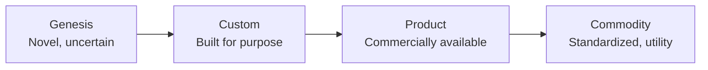

# Strategic Positioning Frameworks

Frameworks for understanding strategic context, evolution, and positioning.

## Frameworks in This Category

| Framework | Purpose | When to Use |
|-----------|---------|-------------|
| [Wardley Map](#wardley-map) | Map components by value and evolution | Technology strategy, build vs. buy |

---

## Wardley Map

**Purpose**: Maps components by user value and evolutionary stage.

**Strengths**:
- Reveals strategic context and misalignment
- Identifies build vs. buy vs. partner opportunities
- Shows how components evolve over time (genesis → commodity)

**When to use**:
- Technology strategy and architecture decisions
- Make vs. buy decisions
- Understanding competitive landscape evolution
- Planning platform strategies

### Core Concepts

A Wardley Map has two axes:
- **Y-axis (Value Chain)**: Visibility to user (top = visible, bottom = invisible)
- **X-axis (Evolution)**: Maturity from genesis to commodity

### Evolution Stages



| Stage | Characteristics | Examples |
|-------|-----------------|----------|
| **Genesis** | New, experimental, uncertain | R&D projects, novel tech |
| **Custom** | Purpose-built, bespoke | Custom software, processes |
| **Product** | Off-the-shelf, competing products | Enterprise software, SaaS |
| **Commodity** | Standardized, utility-like | Cloud compute, electricity |

### Map Structure

```
┌─────────────────────────────────────────────────────────────────────────────┐
│ WARDLEY MAP                                                                  │
│                                                                              │
│ Visible                                                                      │
│    │                                                                         │
│    │    ┌────────┐                                                           │
│    │    │ User   │                                                           │
│    │    │ Need   │                                                           │
│    │    └────┬───┘                                                           │
│    │         │                                                               │
│ V  │    ┌────┴───┐    ┌────────┐                                             │
│ a  │    │Component│───►│Component│                                            │
│ l  │    │   A    │    │   B    │                                             │
│ u  │    └────────┘    └────┬───┘                                             │
│ e  │                       │                                                 │
│    │              ┌────────┴───────┐                                         │
│ C  │              │                │                                         │
│ h  │         ┌────┴───┐       ┌────┴───┐                                     │
│ a  │         │Component│       │Component│                                    │
│ i  │         │   C    │       │   D    │                                     │
│ n  │         └────────┘       └────────┘                                     │
│    │                                                                         │
│ Invisible                                                                    │
│    └──────────────────────────────────────────────────────────────────────  │
│           Genesis      Custom       Product      Commodity                   │
│                                                                              │
│                         Evolution ─────────────────────────►                 │
│                                                                              │
└─────────────────────────────────────────────────────────────────────────────┘
```

### Building a Wardley Map

**Step 1: Identify the User Need**
What need are you serving? This goes at the top.

**Step 2: Map the Value Chain**
What components are needed to serve that need?
- Start from user need
- Ask "what does this need?" repeatedly
- Work down the value chain

**Step 3: Position on Evolution**
For each component, assess its evolutionary stage:
- How mature is the market?
- How standardized is it?
- How many suppliers exist?

**Step 4: Add Dependencies**
Draw lines showing what depends on what.

**Step 5: Analyze Movements**
Components evolve from left to right over time.
- What's evolving?
- What's becoming commodity?
- Where are you ahead/behind?

### Evolution Characteristics

| Aspect | Genesis | Custom | Product | Commodity |
|--------|---------|--------|---------|-----------|
| **Ubiquity** | Rare | Uncommon | Common | Everywhere |
| **Certainty** | Uncertain | Emerging | Understood | Known |
| **Market** | Undefined | Growing | Mature | Stable |
| **Focus** | Exploration | Learning | Features | Price |
| **Competition** | None | Few | Many | Utility |

### Strategic Plays

| Component Position | Strategic Options |
|--------------------|-------------------|
| **Genesis** | Explore, experiment, build if strategic |
| **Custom** | Build if differentiating, consider products |
| **Product** | Buy if not core, build if differentiating |
| **Commodity** | Consume as utility, minimize investment |

### Wardley Map Template

```
┌─────────────────────────────────────────────────────────────────────────────┐
│ WARDLEY MAP: [System/Strategy Name]                                          │
├─────────────────────────────────────────────────────────────────────────────┤
│                                                                              │
│ USER NEED: [What the user is trying to accomplish]                           │
│                                                                              │
│ COMPONENTS:                                                                  │
│                                                                              │
│ │ Component        │ Position    │ Evolution   │ Sourcing     │ Notes       │
│ ├──────────────────┼─────────────┼─────────────┼──────────────┼─────────────┤
│ │ [Component A]    │ High value  │ Custom      │ Build        │ Differentiator│
│ │ [Component B]    │ Mid value   │ Product     │ Buy          │ COTS available│
│ │ [Component C]    │ Low value   │ Commodity   │ Utility      │ Cloud service│
│ │ [Component D]    │ Low value   │ Genesis     │ Experiment   │ R&D project  │
│                                                                              │
├─────────────────────────────────────────────────────────────────────────────┤
│ KEY INSIGHTS                                                                 │
│                                                                              │
│ • [Movement or opportunity 1]                                                │
│ • [Movement or opportunity 2]                                                │
│ • [Potential disruption]                                                     │
│                                                                              │
├─────────────────────────────────────────────────────────────────────────────┤
│ STRATEGIC ACTIONS                                                            │
│                                                                              │
│ 1. [Action based on map]                                                     │
│ 2. [Action based on map]                                                     │
│ 3. [Action based on map]                                                     │
│                                                                              │
└─────────────────────────────────────────────────────────────────────────────┘
```

### Common Patterns

| Pattern | Description |
|---------|-------------|
| **ILC (Innovate-Leverage-Commoditize)** | Build differentiating components on commodity foundations |
| **Tower and Moat** | Differentiate in upper layers, commoditize lower |
| **Ecosystem Play** | Build platform others build on |
| **Fast Follower** | Let others bear genesis risk, enter at product stage |

### Common Mistakes

| Mistake | Problem | Solution |
|---------|---------|----------|
| Building commodity | Wasted investment | Buy or use utility |
| Buying genesis | Dependence on unstable vendor | Build or experiment yourself |
| Ignoring evolution | Strategy becomes outdated | Regularly update maps |
| Single map | Misses competitor perspective | Map competitors too |
| No action | Analysis without strategy | Drive decisions from map |

**Output**: Value chain map with evolution axis

**See**: [references/wardley-map.md](../references/wardley-map.md) for mapping methodology

**Related frameworks**: Capability Tree (identifies components), Horizon Model (timing of evolution)

---

## References

- [references/wardley-map.md](../references/wardley-map.md) - Wardley mapping methodology
