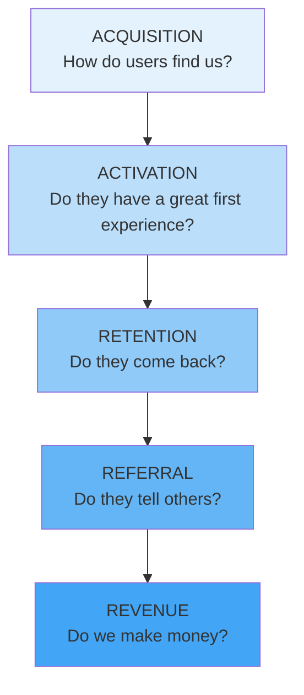
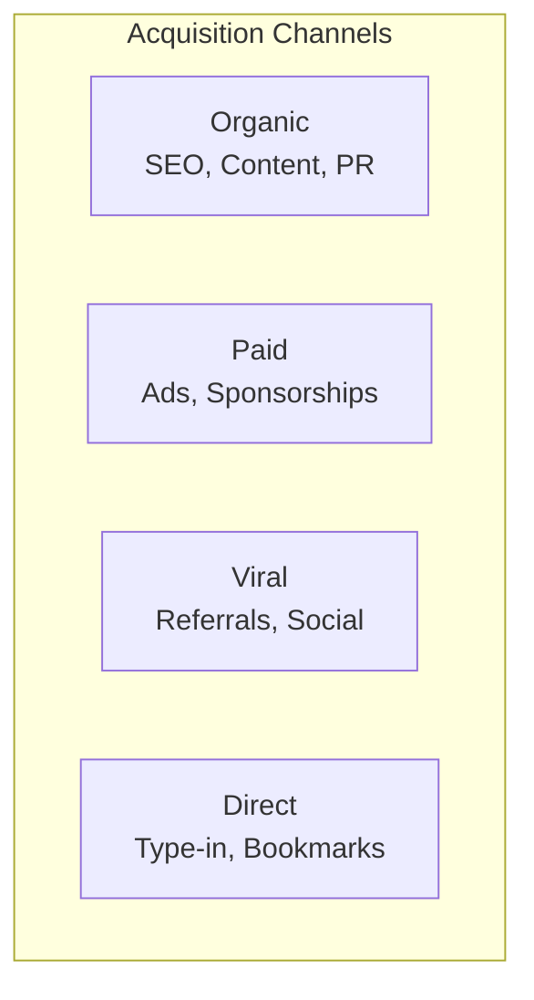

# AARRR / Pirate Metrics Reference

Detailed methodology for implementing and optimizing the AARRR framework.

## Overview

AARRR (pronounced "Arrr" like a pirate) was created by Dave McClure of 500 Startups. It provides a simple framework for measuring and optimizing the customer lifecycle, focusing on five key stages: Acquisition, Activation, Retention, Referral, and Revenue.

## The Five Stages

### Visual Overview



## Stage 1: Acquisition

### Definition
How users discover and arrive at your product.

### Key Questions
- Where do users come from?
- Which channels are most effective?
- What's the cost per acquisition by channel?

### Metrics

| Metric | Definition | Benchmark |
|--------|------------|-----------|
| **Traffic** | Total visits/visitors | Depends on stage |
| **Signups** | New account creations | 2-5% of visitors |
| **CAC** | Cost to acquire customer | < LTV/3 |
| **Traffic by source** | Channel attribution | Diversified |

### Channel Categories



### Best Practices
- Track attribution accurately
- Calculate CAC by channel
- Focus on highest-quality users, not just volume
- Build multiple acquisition channels

## Stage 2: Activation

### Definition
Users having a great first experience and realizing value.

### Key Questions
- What's the "aha moment"?
- How quickly do users reach value?
- What percentage complete onboarding?

### Metrics

| Metric | Definition | Benchmark |
|--------|------------|-----------|
| **Activation rate** | % completing key action | 20-40% |
| **Time to value** | Time to first success | As short as possible |
| **Onboarding completion** | % finishing onboarding | 40-60% |
| **Feature adoption** | % using core features | Varies by feature |

### Defining Your Activation Event

The activation event should:
- Strongly correlate with retention
- Represent real value delivery
- Be achievable quickly
- Be measurable

**Examples**:
| Product | Activation Event |
|---------|-----------------|
| Slack | Sent 2,000 team messages |
| Dropbox | Put one file in folder |
| Facebook | Added 7 friends in 10 days |
| Twitter | Followed 30 accounts |

### Optimization Tactics
- Simplify onboarding flow
- Remove friction from sign-up
- Guide users to activation event
- Personalize based on use case
- Send timely nudges

## Stage 3: Retention

### Definition
Users returning and engaging repeatedly over time.

### Key Questions
- Do users come back after first visit?
- What's usage frequency over time?
- Where do users churn?

### Metrics

| Metric | Definition | Benchmark |
|--------|------------|-----------|
| **DAU/MAU** | Daily active / Monthly active | 20-50% varies by type |
| **D1/D7/D30 retention** | Users returning after N days | D1: 40%, D7: 20%, D30: 10% |
| **Churn rate** | Users leaving per period | < 5% monthly |
| **Session frequency** | Visits per time period | Depends on product |

### Retention Curves

```
100% ┌──
     │  ╲
 50% │   ╲─────────────────  Good retention (flattens)
     │    ╲
     │     ╲________________  Poor retention (declines to zero)
  0% └────────────────────────
     D1    D7    D14   D30   D60   D90
```

### Cohort Analysis

Track retention by signup cohort:

```
┌─────────────────────────────────────────────────────────────────────────────┐
│ COHORT RETENTION ANALYSIS                                                    │
├────────────┬────────┬────────┬────────┬────────┬────────┬────────┬─────────┤
│ Cohort     │ Size   │ Week 1 │ Week 2 │ Week 3 │ Week 4 │ Week 5 │ Week 6  │
├────────────┼────────┼────────┼────────┼────────┼────────┼────────┼─────────┤
│ Jan Week 1 │ 1,000  │ 45%    │ 32%    │ 28%    │ 25%    │ 24%    │ 23%     │
│ Jan Week 2 │ 1,200  │ 48%    │ 35%    │ 30%    │ 27%    │ 26%    │ -       │
│ Jan Week 3 │ 1,100  │ 50%    │ 38%    │ 33%    │ 30%    │ -      │ -       │
│ Jan Week 4 │ 1,300  │ 52%    │ 40%    │ 35%    │ -      │ -      │ -       │
└────────────┴────────┴────────┴────────┴────────┴────────┴────────┴─────────┘
```

### Optimization Tactics
- Identify and fix churn points
- Re-engagement campaigns
- Feature adoption programs
- Habit-building design
- Community building

## Stage 4: Referral

### Definition
Users recommending the product to others.

### Key Questions
- Do users tell others?
- What triggers referrals?
- What's the viral coefficient?

### Metrics

| Metric | Definition | Benchmark |
|--------|------------|-----------|
| **NPS** | Net Promoter Score | > 50 excellent |
| **Referral rate** | % of users who refer | 2-5% |
| **Viral coefficient (K)** | Invites × conversion rate | K > 1 = viral |
| **Referral conversion** | Referred signups / invites | 10-25% |

### Viral Coefficient

```
K = i × c

Where:
i = invitations sent per user
c = conversion rate of invitations
```

| K Value | Meaning |
|---------|---------|
| K < 1 | Growth from referrals only, declines |
| K = 1 | Sustainable but not growing |
| K > 1 | True viral growth, exponential |

### Referral Triggers

| Trigger | Example |
|---------|---------|
| **Built-in virality** | Sharing required to use (e.g., collaborative docs) |
| **Incentivized** | Rewards for referrals (e.g., Dropbox storage) |
| **Word of mouth** | Organic sharing due to experience |
| **Social proof** | Public usage visible to others |

### Optimization Tactics
- Make sharing easy and natural
- Incentivize referrals
- Time referral asks appropriately
- Personalize referral messaging
- Track and reward referrers

## Stage 5: Revenue

### Definition
Monetizing users through various revenue models.

### Key Questions
- What's the revenue per user?
- What drives monetization?
- Is the unit economics healthy?

### Metrics

| Metric | Definition | Benchmark |
|--------|------------|-----------|
| **MRR/ARR** | Monthly/Annual recurring revenue | Growth trajectory |
| **LTV** | Lifetime value per customer | LTV > 3× CAC |
| **ARPU** | Average revenue per user | Trending up |
| **Conversion rate** | Free to paid | 2-5% for freemium |
| **Expansion revenue** | Upsell/cross-sell revenue | Growing % of total |

### LTV Calculation

Simple formula:
```
LTV = ARPU × Customer Lifetime

Where:
Customer Lifetime = 1 / Churn Rate
```

Example:
```
ARPU = $50/month
Churn = 5%/month
Lifetime = 1/0.05 = 20 months
LTV = $50 × 20 = $1,000
```

### Unit Economics

```
LTV:CAC Ratio

> 3:1 = Healthy
< 1:1 = Losing money
```

### Optimization Tactics
- Optimize pricing strategy
- Improve free-to-paid conversion
- Expand revenue from existing customers
- Reduce churn (extends LTV)
- Reduce CAC

## Implementation Guide

### Step 1: Define Metrics for Each Stage

```
┌─────────────────────────────────────────────────────────────────────────────┐
│ AARRR METRICS DEFINITION                                                     │
├─────────────────────────────────────────────────────────────────────────────┤
│ ACQUISITION                                                                  │
│ Primary: [e.g., New signups]                                                │
│ Secondary: [e.g., Traffic by channel, CAC]                                  │
│ Target: [Number]                                                            │
├─────────────────────────────────────────────────────────────────────────────┤
│ ACTIVATION                                                                   │
│ Primary: [e.g., Completed first project]                                    │
│ Secondary: [e.g., Onboarding completion, Time to value]                     │
│ Target: [Number]                                                            │
├─────────────────────────────────────────────────────────────────────────────┤
│ RETENTION                                                                    │
│ Primary: [e.g., Weekly active users]                                        │
│ Secondary: [e.g., D7 retention, Churn rate]                                 │
│ Target: [Number]                                                            │
├─────────────────────────────────────────────────────────────────────────────┤
│ REFERRAL                                                                     │
│ Primary: [e.g., Referral rate]                                              │
│ Secondary: [e.g., NPS, Viral coefficient]                                   │
│ Target: [Number]                                                            │
├─────────────────────────────────────────────────────────────────────────────┤
│ REVENUE                                                                      │
│ Primary: [e.g., MRR]                                                        │
│ Secondary: [e.g., LTV, ARPU, Conversion rate]                               │
│ Target: [Number]                                                            │
└─────────────────────────────────────────────────────────────────────────────┘
```

### Step 2: Build Tracking

Ensure you can measure:
- Funnel conversion between stages
- Metrics within each stage
- Cohort-based analysis
- Attribution by source

### Step 3: Identify the Bottleneck

Find where the biggest drop-off occurs:
- Which stage has lowest conversion?
- Where is the most leverage?
- What's fixable?

### Step 4: Prioritize Experiments

Focus experiments on:
1. Biggest bottleneck
2. Highest-impact metrics
3. Fastest to test

## Common Mistakes

| Mistake | Problem | Solution |
|---------|---------|----------|
| Measuring everything | No focus | Pick 1-2 metrics per stage |
| Vanity metrics | Misleading | Focus on actionable metrics |
| No cohort analysis | Masks trends | Always analyze by cohort |
| Ignoring retention | Leaky bucket | Fix retention before growth |
| Wrong stage focus | Wasted effort | Start with retention |

## Sources

- McClure, D. (2007). "Startup Metrics for Pirates" presentation
- 500 Startups resources
- Growth hacking community best practices
