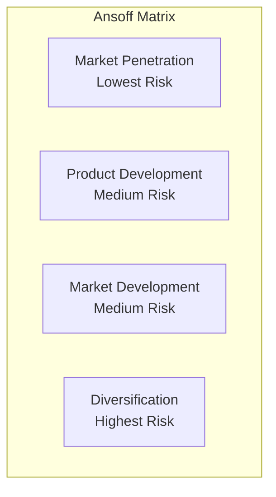
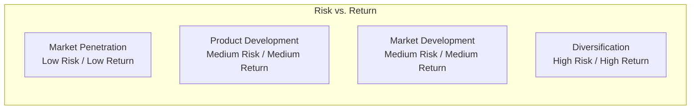

# Ansoff Matrix Reference

Detailed methodology for using the Ansoff Growth Matrix in strategic planning.

## Overview

The Ansoff Matrix (also called the Product/Market Expansion Grid) is a strategic planning tool that provides a framework for devising growth strategies. Created by Igor Ansoff in 1957, it remains one of the most widely used frameworks for strategic planning.

## The Four Strategies

### Matrix Structure



### Strategy Definitions

| Strategy | Products | Markets | Description |
|----------|----------|---------|-------------|
| Market Penetration | Existing | Existing | Grow share in current markets |
| Product Development | New | Existing | New offerings for current customers |
| Market Development | Existing | New | Current offerings to new markets |
| Diversification | New | New | New offerings in new markets |

## Market Penetration

### Definition
Growing market share in existing markets with existing products.

### Tactics

| Tactic | Description |
|--------|-------------|
| **Price adjustments** | Competitive pricing, promotions, bundling |
| **Increased promotion** | Advertising, marketing intensity |
| **Distribution expansion** | More outlets, better placement |
| **Product improvements** | Quality, features, service |
| **Customer retention** | Loyalty programs, improved service |
| **Competitive displacement** | Win competitor customers |
| **Usage stimulation** | Increase purchase frequency/quantity |

### When to Pursue

- Market is growing
- Significant share gap to leader
- Competitors are weak
- Strong brand and customer loyalty
- Economies of scale available

### Risks

- May trigger competitive response
- Market saturation limits upside
- Price wars can erode margins
- Customer acquisition becomes expensive

### Metrics

| Metric | What It Measures |
|--------|------------------|
| Market share | Relative position |
| Customer acquisition cost | Efficiency of growth |
| Customer retention rate | Defensive strength |
| Share of wallet | Depth of relationship |

## Product Development

### Definition
Creating new products or services for existing customers and markets.

### Tactics

| Tactic | Description |
|--------|-------------|
| **Product extensions** | Variations, sizes, flavors |
| **New features** | Enhanced functionality |
| **New products** | Related offerings |
| **Technology upgrades** | Next-generation products |
| **Acquisitions** | Buy product capabilities |
| **Partnerships** | License or co-develop |

### When to Pursue

- Strong customer relationships
- Product development capabilities
- Technology advantages
- Customer needs are evolving
- Product lifecycle is short

### Risks

- Development costs and time
- Cannibalization of existing products
- Execution challenges
- Technology risk
- Customer adoption uncertainty

### Metrics

| Metric | What It Measures |
|--------|------------------|
| R&D investment | Innovation commitment |
| New product revenue % | Innovation success |
| Time to market | Development efficiency |
| Product success rate | Hit rate |

## Market Development

### Definition
Taking existing products to new markets or customer segments.

### Types of New Markets

| Type | Examples |
|------|----------|
| **Geographic** | New regions, countries |
| **Segment** | New customer demographics |
| **Channel** | New distribution methods |
| **Use case** | New applications for product |

### Tactics

| Tactic | Description |
|--------|-------------|
| **Geographic expansion** | Enter new territories |
| **New segments** | Target different customer types |
| **New channels** | Online, wholesale, direct |
| **Repositioning** | New use cases, new positioning |
| **Partnerships** | Joint ventures, distributors |

### When to Pursue

- Core market is saturated
- Product has broad appeal
- Transferable competitive advantage
- Accessible new markets exist
- Strong execution capability

### Risks

- Market understanding gaps
- Cultural/regulatory challenges
- Competitive response
- Operational complexity
- Brand translation issues

### Metrics

| Metric | What It Measures |
|--------|------------------|
| Market penetration by segment | Growth progress |
| Geographic revenue mix | Diversification |
| Channel performance | Distribution effectiveness |
| Customer acquisition by segment | Targeting efficiency |

## Diversification

### Definition
Entering new markets with new products—the highest-risk strategy.

### Types of Diversification

| Type | Description | Example |
|------|-------------|---------|
| **Related/Concentric** | Leverages existing capabilities | Disney: films → theme parks |
| **Horizontal** | New products for similar customers | Amazon: books → electronics |
| **Vertical** | Up or down the value chain | Netflix: distribution → production |
| **Conglomerate** | Unrelated businesses | Berkshire Hathaway |

### When to Pursue

- Core markets are declining
- Synergies with new business
- Risk diversification needed
- Unique capabilities are transferable
- Attractive opportunities exist

### Risks

- Highest failure rate
- Management distraction
- Capital intensity
- Execution complexity
- Integration challenges

### Metrics

| Metric | What It Measures |
|--------|------------------|
| Synergy realization | Integration success |
| Return on investment | Value creation |
| Management attention | Focus allocation |
| Risk correlation | Portfolio balance |

## Strategy Selection

### Risk-Return Tradeoff



### Selection Criteria

| Factor | Questions to Ask |
|--------|------------------|
| **Market saturation** | How much room for growth exists in current market? |
| **Product maturity** | Is the product lifecycle ending? |
| **Competitive position** | Can we defend/grow in current markets? |
| **Capability gaps** | What new skills/assets are needed? |
| **Risk tolerance** | How much risk can we absorb? |
| **Resource availability** | What investment is possible? |

### Decision Framework

```
┌─────────────────────────────────────────────────────────────────────────────┐
│ ANSOFF STRATEGY SELECTION                                                    │
├─────────────────────────────────────────────────────────────────────────────┤
│ Current Market Assessment:                                                   │
│ □ Growing  □ Stable  □ Declining                                            │
│ Market share position: □ Leader  □ Challenger  □ Follower  □ Niche          │
│                                                                              │
│ Product Assessment:                                                          │
│ Lifecycle stage: □ Growth  □ Maturity  □ Decline                            │
│ Competitive advantage: □ Strong  □ Moderate  □ Weak                         │
│                                                                              │
│ Capability Assessment:                                                       │
│ Product development capability: □ Strong  □ Moderate  □ Weak                │
│ Market development capability: □ Strong  □ Moderate  □ Weak                 │
│                                                                              │
│ Resource Assessment:                                                         │
│ Financial resources: □ Abundant  □ Adequate  □ Constrained                  │
│ Risk tolerance: □ High  □ Moderate  □ Low                                   │
│                                                                              │
│ Recommended Strategy Mix:                                                    │
│ Market Penetration: ___% allocation                                          │
│ Product Development: ___% allocation                                         │
│ Market Development: ___% allocation                                          │
│ Diversification: ___% allocation                                             │
└─────────────────────────────────────────────────────────────────────────────┘
```

## Portfolio Approach

Most companies pursue multiple strategies simultaneously:

### Balanced Portfolio

| Strategy | Allocation | Focus |
|----------|------------|-------|
| Market Penetration | 50% | Defend and grow core |
| Product Development | 25% | Evolve offerings |
| Market Development | 20% | Expand addressable market |
| Diversification | 5% | Strategic options |

### Sequencing Strategies


## Common Mistakes

| Mistake | Problem | Solution |
|---------|---------|----------|
| Ignoring core business | Neglects foundation | Prioritize penetration |
| Premature diversification | Overreach | Build capabilities first |
| All eggs in one basket | No risk diversification | Balanced portfolio |
| No synergy analysis | Wasted resources | Assess capability leverage |
| Underestimating execution | Strategy fails | Plan implementation |

## Sources

- Ansoff, H.I. (1957). "Strategies for Diversification." Harvard Business Review.
- Ansoff, H.I. (1988). The New Corporate Strategy. Wiley.
- Various strategic management textbooks and practice guides
