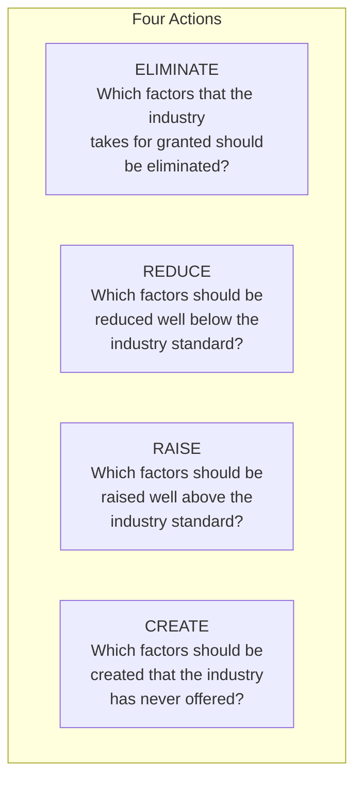
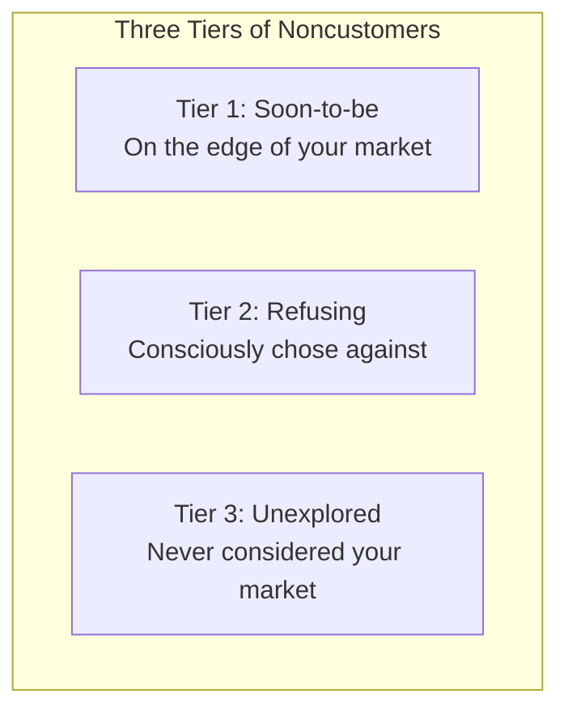
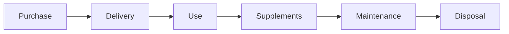
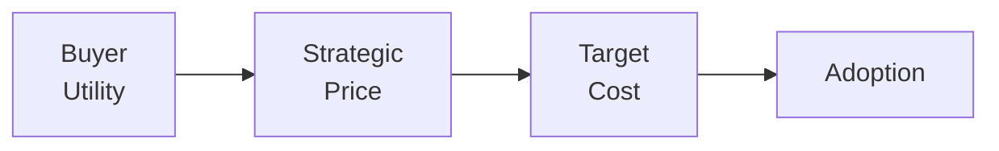

# Blue Ocean Strategy Reference

Detailed methodology for creating uncontested market space.

## Overview

Blue Ocean Strategy, developed by W. Chan Kim and Renée Mauborgne, provides a systematic approach to creating uncontested market space and making competition irrelevant. Rather than fighting over existing demand in "red oceans" of bloody competition, blue ocean strategy focuses on creating new demand.

## Red Ocean vs. Blue Ocean

| Red Ocean | Blue Ocean |
|-----------|------------|
| Compete in existing market space | Create uncontested market space |
| Beat the competition | Make competition irrelevant |
| Exploit existing demand | Create and capture new demand |
| Make value-cost trade-off | Break value-cost trade-off |
| Align whole system with differentiation OR low cost | Align whole system with differentiation AND low cost |

## Key Frameworks

### Strategy Canvas

The strategy canvas is the central diagnostic and action framework.

**Components**:
- **Horizontal axis**: Competition factors the industry competes on
- **Vertical axis**: Level of offering for each factor
- **Value curve**: Line connecting the offering levels

**Purpose**:
- Visualize current competitive landscape
- Show where industry currently invests
- Reveal opportunities for differentiation

### Creating a Strategy Canvas

**Step 1: Identify Competition Factors**
- What factors does the industry compete on?
- What factors do customers compare when buying?
- What factors influence purchasing decisions?

**Step 2: Rate Current Offerings**
- How do you rate on each factor? (scale 1-10)
- How do competitors rate?
- Plot the industry average

**Step 3: Analyze the Canvas**
- Where are value curves similar?
- Where do you differ from industry?
- What factors receive overinvestment?
- What factors are neglected?

### Strategy Canvas Template

```
┌─────────────────────────────────────────────────────────────────────────────┐
│ STRATEGY CANVAS                                                              │
├─────────────────────────────────────────────────────────────────────────────┤
│                                                                              │
│  10 |                           ╱╲                                           │
│   9 |                          ╱  ╲                                          │
│   8 |      ╱╲                 ╱    ╲         ╱                               │
│   7 |     ╱  ╲               ╱      ╲       ╱                                │
│   6 | ╲  ╱    ╲    ─────────╱        ╲─────╱                                 │
│   5 |  ╲╱      ────                                    Industry Average ──── │
│   4 |                                                  Our Company      ───  │
│   3 |                                                  Blue Ocean Move ╱╲╱   │
│   2 |                                                                        │
│   1 |                                                                        │
│     └───────┬───────┬───────┬───────┬───────┬───────┬───────────────────────│
│           Factor  Factor  Factor  Factor  Factor  Factor                     │
│             A       B       C       D       E       F                        │
│                                                                              │
└─────────────────────────────────────────────────────────────────────────────┘
```

## Four Actions Framework

The four actions framework helps reconstruct buyer value elements:



### Eliminate

**Questions to ask**:
- Which factors have we competed on that are no longer valuable?
- What do we offer that customers don't really care about?
- What are we doing because "that's how it's always been done"?

**Purpose**: Reduce cost and complexity

### Reduce

**Questions to ask**:
- Which factors are we overdelivering on?
- Where are we exceeding customer expectations unnecessarily?
- What could be good enough instead of best-in-class?

**Purpose**: Free resources for reallocation

### Raise

**Questions to ask**:
- Which factors do customers truly value that we underdeliver on?
- What compromises does the industry force customers to make?
- Where could we exceed expectations to create breakthroughs?

**Purpose**: Create differentiation

### Create

**Questions to ask**:
- What factors could we offer that the industry has never provided?
- What unmet needs do customers have?
- What would fundamentally change the customer experience?

**Purpose**: Open new value space

## Eliminate-Reduce-Raise-Create Grid

```
┌─────────────────────────────────────────────────────────────────────────────┐
│ ELIMINATE-REDUCE-RAISE-CREATE GRID                                           │
├───────────────────────────────────┬─────────────────────────────────────────┤
│ ELIMINATE                         │ RAISE                                   │
│                                   │                                         │
│ Factors to eliminate entirely:    │ Factors to raise above standard:        │
│                                   │                                         │
│ •                                 │ •                                       │
│ •                                 │ •                                       │
│ •                                 │ •                                       │
│ •                                 │ •                                       │
│                                   │                                         │
│ Why eliminate?                    │ Why raise?                              │
│ [Rationale]                       │ [Rationale]                             │
│                                   │                                         │
├───────────────────────────────────┼─────────────────────────────────────────┤
│ REDUCE                            │ CREATE                                  │
│                                   │                                         │
│ Factors to reduce below standard: │ Factors never offered by industry:      │
│                                   │                                         │
│ •                                 │ •                                       │
│ •                                 │ •                                       │
│ •                                 │ •                                       │
│ •                                 │ •                                       │
│                                   │                                         │
│ Why reduce?                       │ Why create?                             │
│ [Rationale]                       │ [Rationale]                             │
│                                   │                                         │
└───────────────────────────────────┴─────────────────────────────────────────┘
```

## Classic Blue Ocean Examples

### Cirque du Soleil

| Eliminated | Reduced | Raised | Created |
|------------|---------|--------|---------|
| Star performers | Fun and humor | Unique venue | Theme |
| Animal shows | Thrill and danger | | Refined environment |
| Aisle concession sales | | | Artistic music and dance |
| Multiple show arenas | | | Multiple productions |

### Southwest Airlines

| Eliminated | Reduced | Raised | Created |
|------------|---------|--------|---------|
| Meals | Number of destinations | Friendly service | Point-to-point routes |
| Lounges | Fare complexity | Speed/frequency | |
| Seat selection | | | |
| Hub system | | | |

### Yellow Tail Wine

| Eliminated | Reduced | Raised | Created |
|------------|---------|--------|---------|
| Wine complexity | Wine range | Price vs. budget wines | Easy drinking |
| Aging quality | Vineyard prestige | Retail store involvement | Easy selection |
| Above-the-line marketing | Enological terminology | | Fun and adventure |

## Three Tiers of Noncustomers

Look beyond current customers to find new demand:



| Tier | Description | Opportunity |
|------|-------------|-------------|
| **Tier 1** | Minimally use your offering, ready to jump ship | Convert to full customers |
| **Tier 2** | Actively chose alternatives or non-consumption | Understand and overcome objections |
| **Tier 3** | Never considered your market as an option | Unlock entirely new demand |

## Buyer Experience Cycle

Analyze the full customer experience for innovation opportunities:



For each stage, consider:
- Buyer productivity
- Simplicity
- Convenience
- Risk reduction
- Fun and image
- Environmental friendliness

## Testing Your Blue Ocean Idea

### Blue Ocean Idea Index

| Criterion | Test Question | Assessment |
|-----------|---------------|------------|
| **Buyer utility** | Is there exceptional buyer utility? | □ Strong □ Moderate □ Weak |
| **Price** | Is the price accessible to mass buyers? | □ Strong □ Moderate □ Weak |
| **Cost** | Can you meet cost target at strategic price? | □ Strong □ Moderate □ Weak |
| **Adoption** | Have you addressed adoption hurdles? | □ Strong □ Moderate □ Weak |

### Sequence of Strategic Validation



Test in sequence—fail at any point means rethink.

## Implementation Considerations

### Execution Hurdles

| Hurdle | Description | Response |
|--------|-------------|----------|
| **Cognitive** | Employees don't see need for change | Make case for change compelling |
| **Resource** | Limited resources for new strategy | Reallocate from low-value areas |
| **Motivational** | Employees resist new direction | Engage key influencers |
| **Political** | Internal opposition | Build coalition, manage politics |

### Tipping Point Leadership

Focus on extremes, not averages:
- Find **kingpin** factors that disproportionately influence outcomes
- Identify **hot spots** where change creates biggest impact
- Use **amplification** to spread change quickly

## Common Mistakes

| Mistake | Problem | Solution |
|---------|---------|----------|
| Technology-focused | Solution looking for problem | Start with buyer utility |
| Ignoring current customers | Lose base while chasing new | Balance existing and new demand |
| Analysis paralysis | Never launch | Test and iterate quickly |
| No cost discipline | Blue ocean becomes red again | Maintain cost advantage |
| Competition creep | Slowly copy competitors | Regularly revisit strategy canvas |

## Sources

- Kim, W.C. & Mauborgne, R. (2005). Blue Ocean Strategy. Harvard Business Review Press.
- Kim, W.C. & Mauborgne, R. (2017). Blue Ocean Shift. Hachette Books.
- Blue Ocean Strategy Institute resources
