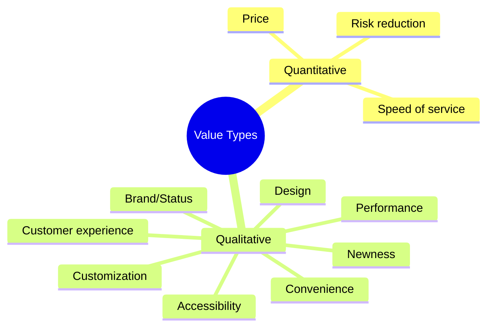
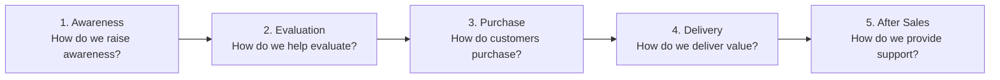
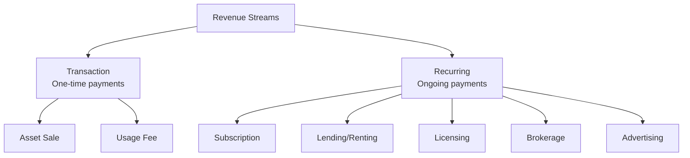
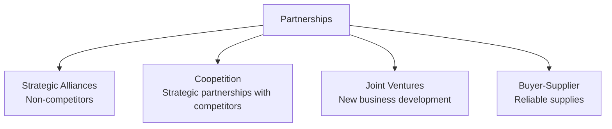
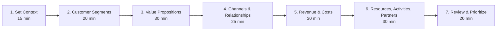

# Business Model Canvas Reference

Detailed methodology for using the Business Model Canvas framework.

## Overview

The Business Model Canvas is a strategic management template for developing new or documenting existing business models. Created by Alexander Osterwalder and Yves Pigneur, it provides a visual chart with nine building blocks describing a company's value proposition, infrastructure, customers, and finances.

## The Nine Building Blocks

### 1. Customer Segments

**Definition**: The different groups of people or organizations an enterprise aims to reach and serve.

**Key Questions**:
- For whom are we creating value?
- Who are our most important customers?

**Segment Types**:

| Type | Description | Example |
|------|-------------|---------|
| **Mass Market** | No distinction between segments | Consumer electronics |
| **Niche Market** | Specialized for specific requirements | Luxury goods |
| **Segmented** | Slightly different needs/problems | Bank products by income |
| **Diversified** | Unrelated segments | Amazon: retail + AWS |
| **Multi-sided** | Interdependent segments | Credit cards: merchants + cardholders |

### 2. Value Propositions

**Definition**: The bundle of products and services that create value for a specific Customer Segment.

**Key Questions**:
- What value do we deliver to the customer?
- Which customer needs are we satisfying?
- Which customer problems are we helping to solve?
- What bundles of products and services are we offering to each segment?

**Value Types**:



### 3. Channels

**Definition**: How a company communicates with and reaches its Customer Segments to deliver a Value Proposition.

**Channel Phases**:



**Channel Types**:

| Type | Examples | Pros | Cons |
|------|----------|------|------|
| **Direct/Own** | Sales force, web sales, own stores | Higher margins, control | Higher cost to build |
| **Indirect/Partner** | Partner stores, wholesaler | Reach, partner expertise | Lower margins, less control |

### 4. Customer Relationships

**Definition**: The types of relationships a company establishes with specific Customer Segments.

**Relationship Types**:

| Type | Description | Example |
|------|-------------|---------|
| **Personal Assistance** | Human interaction | Bank relationship manager |
| **Dedicated Personal** | Deep, exclusive relationship | Wealth management |
| **Self-Service** | No direct relationship | Vending machines |
| **Automated Services** | Automated but personalized | Netflix recommendations |
| **Communities** | User communities | Apple support forums |
| **Co-creation** | Customer creates value | YouTube, reviews |

### 5. Revenue Streams

**Definition**: The cash a company generates from each Customer Segment.

**Pricing Mechanisms**:

| Fixed Pricing | Dynamic Pricing |
|--------------|-----------------|
| List price | Negotiation |
| Product feature dependent | Yield management |
| Customer segment dependent | Real-time market |
| Volume dependent | Auctions |

**Revenue Types**:



### 6. Key Resources

**Definition**: The most important assets required to make a business model work.

**Resource Categories**:

| Category | Examples |
|----------|----------|
| **Physical** | Manufacturing facilities, buildings, vehicles, machines, distribution networks |
| **Intellectual** | Brands, patents, copyrights, partnerships, customer databases |
| **Human** | Scientists, engineers, salespeople |
| **Financial** | Cash, credit lines, stock option pool |

### 7. Key Activities

**Definition**: The most important things a company must do to make its business model work.

**Activity Categories**:

| Category | Description | Examples |
|----------|-------------|----------|
| **Production** | Designing, making, delivering | Manufacturing, software development |
| **Problem Solving** | Finding solutions for individual customers | Consulting, hospitals |
| **Platform/Network** | Platform management, service provisioning | Networks, marketplaces |

### 8. Key Partners

**Definition**: The network of suppliers and partners that make the business model work.

**Partnership Types**:



**Motivations for Partnerships**:
- Optimization and economies of scale
- Reduction of risk and uncertainty
- Acquisition of resources and activities

### 9. Cost Structure

**Definition**: All costs incurred to operate a business model.

**Cost-Driven vs. Value-Driven**:

| Cost-Driven | Value-Driven |
|-------------|--------------|
| Minimize costs wherever possible | Focus on value creation |
| Low price value propositions | Premium value propositions |
| Maximum automation | High personalization |
| Extensive outsourcing | Luxury experiences |

**Cost Characteristics**:
- **Fixed costs**: Remain same regardless of volume (salaries, rent)
- **Variable costs**: Vary proportionally with volume (materials)
- **Economies of scale**: Cost advantages from increased output
- **Economies of scope**: Cost advantages from broader scope

## Facilitation Guide

### Workshop Setup

**Materials needed**:
- Large printed canvas (A0 or larger)
- Sticky notes (multiple colors)
- Markers
- Timer
- Voting dots

**Participants**: 4-8 people, cross-functional team

**Duration**: 2-4 hours

### Process



### Tips

1. **Start with customers** - Everything flows from understanding who you serve
2. **One idea per sticky note** - Enables rearranging and prioritizing
3. **Be specific** - "Small businesses" is too vague; "Restaurants with 10-50 employees" is better
4. **Capture alternatives** - Document options you considered but didn't choose
5. **Iterate** - First pass is rarely final; refine as you learn

## Business Model Patterns

### Freemium

```
┌──────────────────────────────────────────────────────────────┐
│  FREEMIUM PATTERN                                             │
├──────────────────────────────────────────────────────────────┤
│  Customer Segments: Free users + Premium subscribers          │
│  Value Proposition: Basic free / Advanced paid                │
│  Revenue Streams: Subscription from small % of users          │
│  Key Metrics: Conversion rate, CAC, LTV                       │
├──────────────────────────────────────────────────────────────┤
│  Examples: Spotify, Dropbox, LinkedIn                         │
└──────────────────────────────────────────────────────────────┘
```

### Platform/Multi-sided

```
┌──────────────────────────────────────────────────────────────┐
│  PLATFORM PATTERN                                             │
├──────────────────────────────────────────────────────────────┤
│  Customer Segments: Two or more interdependent groups         │
│  Value Proposition: Different for each side                   │
│  Key Activity: Platform development & management              │
│  Key Challenge: Chicken-and-egg problem                       │
├──────────────────────────────────────────────────────────────┤
│  Examples: Uber, Airbnb, App stores, Credit cards             │
└──────────────────────────────────────────────────────────────┘
```

### Subscription

```
┌──────────────────────────────────────────────────────────────┐
│  SUBSCRIPTION PATTERN                                         │
├──────────────────────────────────────────────────────────────┤
│  Revenue Streams: Recurring payments                          │
│  Key Metrics: MRR, churn, LTV, CAC                           │
│  Key Activity: Continuous value delivery                      │
│  Key Challenge: Retention                                     │
├──────────────────────────────────────────────────────────────┤
│  Examples: Netflix, SaaS products, Gyms                       │
└──────────────────────────────────────────────────────────────┘
```

## Testing Your Business Model

### Key Questions for Each Block

| Block | Validation Questions |
|-------|---------------------|
| Customer Segments | Have you talked to real customers? Can you access them? |
| Value Propositions | Does evidence show customers want this? Will they pay? |
| Channels | Are channels cost-effective? Do they reach customers? |
| Customer Relationships | Can you build relationships profitably? |
| Revenue Streams | Will customers actually pay? Is pricing validated? |
| Key Resources | Do you have or can you acquire necessary resources? |
| Key Activities | Can you execute the critical activities? |
| Key Partnerships | Are partnerships viable and sustainable? |
| Cost Structure | Is the model economically viable? |

### Assumption Mapping

Rank assumptions by:
1. **Criticality**: How important is this assumption to the model?
2. **Evidence**: How much evidence do you have?

Focus testing on high-criticality, low-evidence assumptions first.

## Sources

- Osterwalder, A. & Pigneur, Y. (2010). Business Model Generation. Wiley.
- Strategyzer.com - Official Business Model Canvas resources
