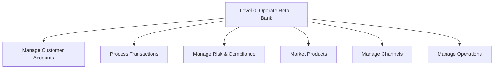
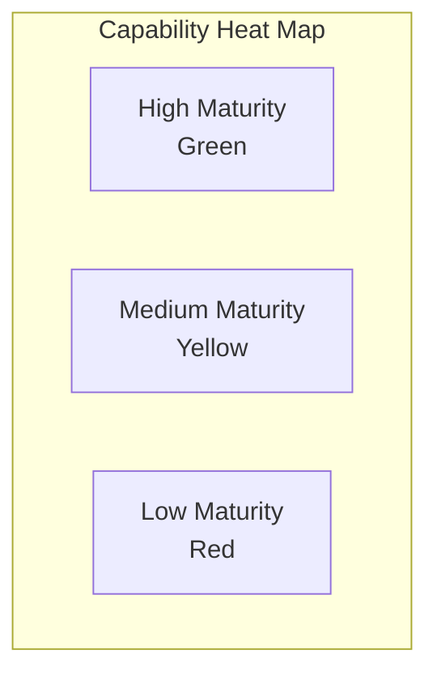
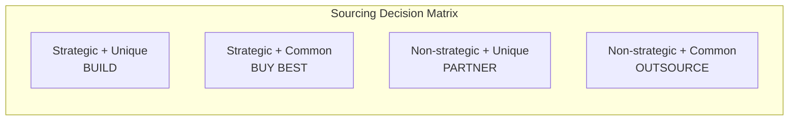

# Capability Tree Reference

Detailed methodology for building and using capability trees.

## Overview

A capability tree (also called a capability map or capability model) is a hierarchical decomposition of what an organization, product, or platform must be able to do. It provides a solution-agnostic view of requirements that remains stable even as technologies and implementations change.

## Why Use Capability Trees?

### Benefits

| Benefit | Description |
|---------|-------------|
| **Stability** | Capabilities change slowly; solutions change rapidly |
| **Clarity** | Shared vocabulary across business and technology |
| **Completeness** | MECE structure reveals gaps |
| **Strategic Alignment** | Links strategy to execution |
| **Sourcing Decisions** | Guides build/buy/partner choices |

### When to Use

- Enterprise architecture and IT strategy
- Product/platform strategy and roadmapping
- Organizational design and transformation
- M&A due diligence (capability gap analysis)
- Technology investment decisions

## Building a Capability Tree

### Step 1: Define Scope and Purpose

Before building, clarify:

| Question | Why It Matters |
|----------|---------------|
| What entity are we mapping? | Organization, business unit, product, platform |
| What's the purpose? | Strategy, investment, gap analysis, transformation |
| Who's the audience? | Executives, architects, product teams |
| What level of detail? | Strategic (L0-L2) or detailed (L0-L4) |

### Step 2: Identify Level 0

The Level 0 capability is the overarching purpose:

**Patterns**:
- "Operate [business/product name]"
- "Deliver [value] to [customer]"
- "[Action verb] + [scope]"

**Examples**:
- "Operate Retail Banking"
- "Deliver Healthcare Services"
- "Enable Software Development"

### Step 3: Decompose to Level 1

Break Level 0 into 4-8 major capability areas using a decomposition pattern:



**Common Decomposition Patterns**:

| Pattern | Description | Example |
|---------|-------------|---------|
| **Value Chain** | Stages of value creation | Acquire → Engage → Fulfill → Support |
| **Business Functions** | Organizational functions | Marketing, Sales, Operations, Finance |
| **Customer Lifecycle** | Customer relationship stages | Attract → Onboard → Serve → Retain |
| **Object-based** | Key business objects | Customers, Products, Orders, Partners |
| **Process-based** | Core processes | Plan → Source → Make → Deliver |

### Step 4: Continue Decomposition

For each Level 1, identify Level 2 capabilities. Continue until you reach actionable capabilities.

**Decomposition Heuristics**:

| Test | Guidance |
|------|----------|
| **Actionable** | Can someone implement or acquire this? |
| **Assignable** | Can one team own this? |
| **Measurable** | Can you assess maturity/quality? |
| **Stable** | Will this remain valid for 3-5 years? |

### Step 5: Apply MECE Principle

Ensure each level is:
- **Mutually Exclusive**: No overlaps between siblings
- **Collectively Exhaustive**: All aspects covered

**MECE Check Questions**:
- Does anything fall between these categories?
- Is there duplication across categories?
- Is anything missing?

### Step 6: Validate

Validate the capability tree with stakeholders:

| Stakeholder | Validation Focus |
|-------------|-----------------|
| Business leaders | Strategic completeness |
| Subject matter experts | Accuracy and coverage |
| Architects | Technical feasibility |
| Operations | Implementability |

## Capability Assessment

### Maturity Model

Assess each capability's maturity:

| Level | Name | Description |
|-------|------|-------------|
| 0 | Non-existent | Capability doesn't exist |
| 1 | Initial | Ad-hoc, unpredictable |
| 2 | Developing | Basic processes, some consistency |
| 3 | Defined | Standardized, documented |
| 4 | Managed | Measured, controlled |
| 5 | Optimized | Continuously improving |

### Heat Map Visualization



Color-code capabilities by maturity to quickly identify gaps.

### Gap Analysis

For each capability:

```
Gap = Target Maturity - Current Maturity
```

Prioritize gaps by:
1. Strategic importance
2. Size of gap
3. Dependencies on other capabilities

## Strategic Sourcing Matrix

### Framework



### Decision Criteria

| Criterion | Build | Buy | Partner | Outsource |
|-----------|-------|-----|---------|-----------|
| Strategic importance | High | High | Low | Low |
| Uniqueness | High | Low | High | Low |
| Speed needed | Low | High | Medium | Medium |
| Control needed | High | Medium | Medium | Low |
| In-house expertise | Yes | No | No | No |

### Detailed Sourcing Assessment

```
┌─────────────────────────────────────────────────────────────────────────────┐
│ CAPABILITY SOURCING ASSESSMENT                                               │
├────────────────────────┬────────────────────────────────────────────────────┤
│ Capability:            │ [Name]                                              │
├────────────────────────┼────────────────────────────────────────────────────┤
│ Strategic Importance   │ □ High    □ Medium    □ Low                        │
│ Competitive Advantage  │ □ High    □ Medium    □ Low                        │
│ Market Availability    │ □ Commodity  □ Available  □ Unique                 │
│ In-house Expertise     │ □ Strong  □ Moderate  □ Weak                       │
│ Time to Value          │ □ Urgent  □ Normal    □ Flexible                   │
├────────────────────────┼────────────────────────────────────────────────────┤
│ Recommended Strategy   │ □ Build  □ Buy  □ Partner  □ Outsource             │
├────────────────────────┼────────────────────────────────────────────────────┤
│ Rationale:             │                                                     │
│                        │                                                     │
└────────────────────────┴────────────────────────────────────────────────────┘
```

## Integration with Other Frameworks

### With Wardley Mapping

Add evolutionary stage to each capability:

| Stage | Description | Sourcing Implication |
|-------|-------------|---------------------|
| Genesis | Novel, uncertain | Build/experiment |
| Custom | Understood but bespoke | Build for advantage |
| Product | Productized, feature competition | Buy/license |
| Commodity | Standardized, utility | Outsource/utility |

### With Business Model Canvas

Map capabilities to Business Model Canvas blocks:

| Canvas Block | Capability Examples |
|--------------|---------------------|
| Value Propositions | Deliver [value], Create [product] |
| Customer Relationships | Manage customer interactions |
| Channels | Operate sales channels |
| Key Activities | Core capabilities |
| Key Resources | Enable capabilities |

### With OST (Opportunity-Solution Tree)

Connect capability gaps to:
- Opportunities (what capability gap creates what problem?)
- Solutions (what solutions could fill the gap?)

## Templates

### Capability Definition Template

```markdown
## Capability: [Name]

**ID**: [Unique identifier]
**Level**: [L1, L2, L3, etc.]
**Parent**: [Parent capability]

### Description
[2-3 sentences describing what this capability enables]

### Sub-capabilities
- [Child 1]
- [Child 2]
- [Child 3]

### Assessment
| Attribute | Value |
|-----------|-------|
| Strategic Importance | High / Medium / Low |
| Current Maturity | 0-5 |
| Target Maturity | 0-5 |
| Gap Priority | High / Medium / Low |

### Sourcing
| Attribute | Value |
|-----------|-------|
| Current Source | [In-house / Vendor / Partner / None] |
| Recommended Source | [Build / Buy / Partner / Outsource] |
| Rationale | [Why this approach] |

### Dependencies
- [Capability this depends on]
- [Capability this depends on]

### Owner
[Team or role responsible]
```

### Gap Analysis Template

```
┌─────────────────────────────────────────────────────────────────────────────┐
│ CAPABILITY GAP ANALYSIS                                                      │
├────────────────────┬──────────┬──────────┬──────┬───────────────────────────┤
│ Capability         │ Current  │ Target   │ Gap  │ Priority / Action         │
├────────────────────┼──────────┼──────────┼──────┼───────────────────────────┤
│ [Capability 1]     │ 2        │ 4        │ 2    │ High - Build in Q2        │
│ [Capability 2]     │ 3        │ 3        │ 0    │ None - Maintain           │
│ [Capability 3]     │ 0        │ 3        │ 3    │ High - Buy solution       │
│ [Capability 4]     │ 1        │ 4        │ 3    │ Medium - Partner          │
└────────────────────┴──────────┴──────────┴──────┴───────────────────────────┘
```

## Best Practices

### Do

- Use verb phrases (capabilities describe abilities)
- Keep descriptions solution-agnostic
- Validate with multiple stakeholder groups
- Review and update regularly
- Connect to strategy and investment decisions

### Don't

- Describe solutions instead of capabilities
- Go too deep too fast
- Create without stakeholder input
- Let the model become stale
- Use as a one-time exercise

## Common Mistakes

| Mistake | Impact | Solution |
|---------|--------|----------|
| Solution language | Limits thinking, dates quickly | Use verb phrases |
| Too many levels | Overwhelming, loses strategic view | 3-4 levels typically sufficient |
| No ownership | Becomes shelfware | Assign capability owners |
| No metrics | Can't track progress | Define maturity criteria |
| Missing dependencies | Unrealistic planning | Map capability dependencies |

## Sources

- TOGAF (The Open Group Architecture Framework)
- Business Architecture Guild - BIZBOK Guide
- Zachman Framework
- Enterprise Architecture best practices
