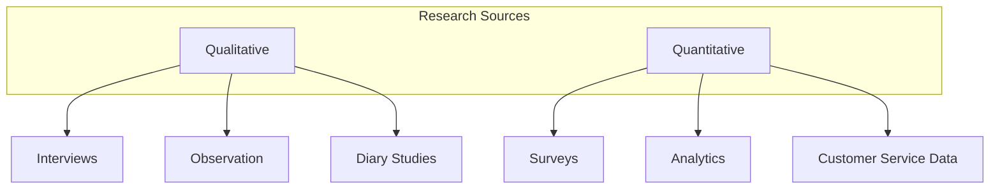
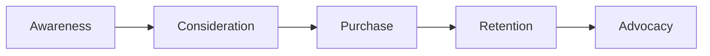
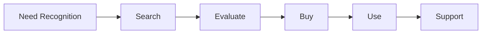
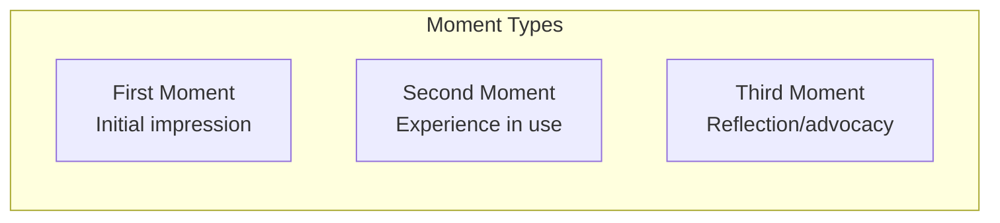
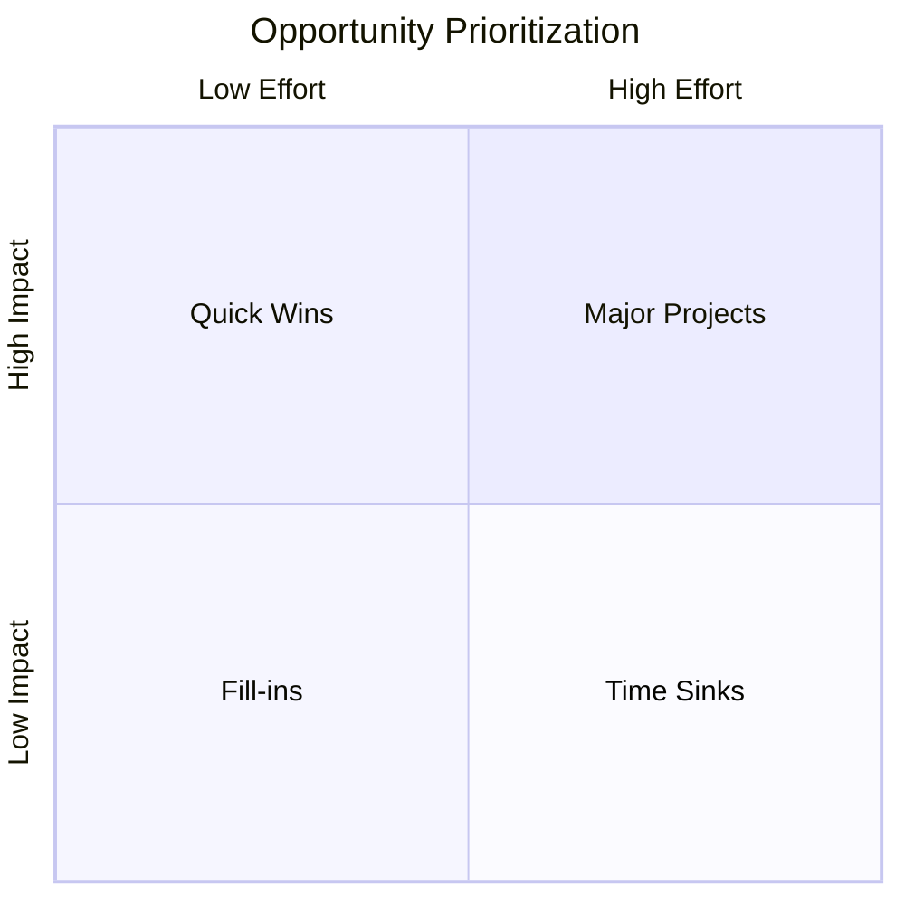

# Customer Journey Map Reference

Detailed methodology for creating effective customer journey maps.

## Overview

A customer journey map is a visual representation of the process a customer goes through to achieve a goal with your organization. It tells the story of the customer's experience from initial awareness through engagement, purchase, and beyond.

## Types of Journey Maps

| Type | Focus | Best For |
|------|-------|----------|
| **Current State** | How customers experience today | Identifying pain points |
| **Future State** | Desired future experience | Designing improvements |
| **Day in the Life** | Broader context of customer's day | Understanding context |
| **Service Blueprint** | Operations behind the experience | Operational alignment |

## Building a Journey Map

### Step 1: Define Objectives

| Question | Why It Matters |
|----------|---------------|
| What journey are we mapping? | Scope the effort |
| Who is the customer? | Ensure relevance |
| What are we trying to learn? | Focus the analysis |
| How will this be used? | Guide level of detail |

### Step 2: Gather Customer Research

**Research Methods**:



| Method | What It Reveals | Sample Size |
|--------|-----------------|-------------|
| Interviews | Deep understanding, emotions | 5-20 customers |
| Observation | Actual behavior vs. stated | 5-10 sessions |
| Surveys | Patterns across segments | 100+ respondents |
| Analytics | Digital behavior | All users |
| Support data | Pain points, issues | Historical data |

### Step 3: Define Personas

Create or select personas that represent your key customer segments:

```
┌─────────────────────────────────────────────────────────────────────────────┐
│ PERSONA: [Name]                                                              │
├─────────────────────────────────────────────────────────────────────────────┤
│ Demographics:                                                                │
│ - Age: [Range]                                                              │
│ - Role: [Job/situation]                                                     │
│ - Context: [Relevant background]                                            │
│                                                                              │
│ Goals:                                                                       │
│ - [Primary goal]                                                            │
│ - [Secondary goal]                                                          │
│                                                                              │
│ Pain Points:                                                                 │
│ - [Key frustration 1]                                                       │
│ - [Key frustration 2]                                                       │
│                                                                              │
│ Quote:                                                                       │
│ "[Representative statement]"                                                 │
└─────────────────────────────────────────────────────────────────────────────┘
```

### Step 4: Map Journey Stages

Common stage frameworks:

**Generic Customer Lifecycle**:


**Specific Journey Example (E-commerce)**:


### Step 5: Document Each Stage

For each stage, capture:

**Customer Actions**
- What specific steps does the customer take?
- What sequence do they follow?
- What tools or channels do they use?

**Touchpoints**
- Where does interaction occur?
- Who/what does the customer interact with?
- What channels are involved?

**Thoughts**
- What questions does the customer have?
- What information are they seeking?
- What concerns do they have?

**Emotions**
- How does the customer feel?
- What causes positive emotions?
- What causes negative emotions?

**Pain Points**
- What frustrates the customer?
- Where do they struggle?
- What takes too long?

**Opportunities**
- How could experience improve?
- What's missing?
- What could delight?

### Step 6: Visualize the Journey

#### Emotional Journey Line

Plot emotional highs and lows:

```
     😊 ++  |              ╭──╮
        +   |    ╭───╮    ╱    ╲
     😐  0  |───╱     ╲──╱      ╲╭──
        -   |  ╱                 ╲
     😡 --  | ╱                   ╲
            └─────────────────────────
              Stage 1  Stage 2  Stage 3
```

#### Journey Map Canvas

```
┌─────────────────────────────────────────────────────────────────────────────────────────────┐
│ CUSTOMER JOURNEY MAP                                                                         │
│ Persona: [Name]    Journey: [Name]    Date: [Date]                                          │
├─────────────┬─────────────┬─────────────┬─────────────┬─────────────┬─────────────┬─────────┤
│ STAGE       │ [Stage 1]   │ [Stage 2]   │ [Stage 3]   │ [Stage 4]   │ [Stage 5]   │[Stage 6]│
│ Duration    │ [Time]      │ [Time]      │ [Time]      │ [Time]      │ [Time]      │ [Time]  │
├─────────────┼─────────────┼─────────────┼─────────────┼─────────────┼─────────────┼─────────┤
│ GOALS       │ •           │ •           │ •           │ •           │ •           │ •       │
│             │ •           │ •           │ •           │ •           │ •           │ •       │
├─────────────┼─────────────┼─────────────┼─────────────┼─────────────┼─────────────┼─────────┤
│ ACTIONS     │ •           │ •           │ •           │ •           │ •           │ •       │
│             │ •           │ •           │ •           │ •           │ •           │ •       │
├─────────────┼─────────────┼─────────────┼─────────────┼─────────────┼─────────────┼─────────┤
│ TOUCHPOINTS │ •           │ •           │ •           │ •           │ •           │ •       │
│             │ •           │ •           │ •           │ •           │ •           │ •       │
├─────────────┼─────────────┼─────────────┼─────────────┼─────────────┼─────────────┼─────────┤
│ THOUGHTS    │ "..."       │ "..."       │ "..."       │ "..."       │ "..."       │ "..."   │
│             │             │             │             │             │             │         │
├─────────────┼─────────────┼─────────────┼─────────────┼─────────────┼─────────────┼─────────┤
│ EMOTIONS    │     ++      │     +       │     --      │     +       │     0       │    ++   │
│             │  ───────────────────────────────────────────────────────────────────────────  │
├─────────────┼─────────────┼─────────────┼─────────────┼─────────────┼─────────────┼─────────┤
│ PAIN POINTS │ ⚠️           │ ⚠️           │ ⚠️ ⚠️         │             │ ⚠️           │         │
│             │ [Issue]     │ [Issue]     │ [Issues]    │             │ [Issue]     │         │
├─────────────┼─────────────┼─────────────┼─────────────┼─────────────┼─────────────┼─────────┤
│OPPORTUNITIES│ 💡           │             │ 💡 💡         │ 💡           │             │ 💡       │
│             │ [Idea]      │             │ [Ideas]     │ [Idea]      │             │ [Idea]  │
├─────────────┴─────────────┴─────────────┴─────────────┴─────────────┴─────────────┴─────────┤
│ KEY INSIGHTS                                                                                 │
│ 1.                                                                                           │
│ 2.                                                                                           │
│ 3.                                                                                           │
├─────────────────────────────────────────────────────────────────────────────────────────────┤
│ PRIORITY ACTIONS                                                                             │
│ 1.                                                                                           │
│ 2.                                                                                           │
│ 3.                                                                                           │
└─────────────────────────────────────────────────────────────────────────────────────────────┘
```

## Facilitation Guide

### Workshop Setup

**Materials**:
- Large wall or whiteboard
- Journey map template (poster-sized)
- Sticky notes (multiple colors)
- Markers
- Customer research summaries
- Persona descriptions

**Participants**: 5-10 cross-functional team members

**Duration**: 3-4 hours

### Agenda

| Phase | Time | Activity |
|-------|------|----------|
| Introduction | 15 min | Objectives, persona review |
| Stage mapping | 30 min | Define journey stages |
| Research review | 20 min | Share customer insights |
| Action/touchpoint mapping | 45 min | Detail each stage |
| Emotion mapping | 30 min | Plot emotional journey |
| Pain point identification | 30 min | Mark issues and gaps |
| Opportunity generation | 30 min | Brainstorm improvements |
| Prioritization | 20 min | Vote on key actions |
| Next steps | 10 min | Assign follow-ups |

### Facilitation Tips

1. **Ground in research** - Base map on data, not assumptions
2. **Take customer's perspective** - Use "I" language for actions/thoughts
3. **Be specific** - Avoid generic descriptions
4. **Capture emotions** - They reveal what matters most
5. **Identify moments of truth** - Mark critical experiences
6. **Include failures** - Don't sanitize the journey
7. **Keep it manageable** - Focus on one persona/journey per session

## Moments of Truth

Identify and prioritize critical moments:



| Moment Type | Impact | Focus |
|-------------|--------|-------|
| **First Moment** | Sets expectations | Marketing, onboarding |
| **Second Moment** | Validates or breaks expectations | Product, service delivery |
| **Third Moment** | Determines loyalty | Support, relationship |

## From Map to Action

### Prioritization Matrix



### Action Planning Template

```
┌─────────────────────────────────────────────────────────────────────────────┐
│ IMPROVEMENT OPPORTUNITY                                                      │
├─────────────────────────────────────────────────────────────────────────────┤
│ Stage: [Which stage]                                                         │
│ Pain Point: [What's the issue]                                               │
│                                                                              │
│ Proposed Improvement:                                                        │
│ [Description of solution]                                                    │
│                                                                              │
│ Expected Impact:                                                             │
│ □ Customer satisfaction  □ Conversion  □ Retention  □ Efficiency            │
│                                                                              │
│ Effort Required:                                                             │
│ □ Low (< 2 weeks)  □ Medium (< quarter)  □ High (> quarter)                 │
│                                                                              │
│ Priority: □ Quick Win  □ Major Project  □ Fill-in  □ Defer                  │
│                                                                              │
│ Owner: [Name]                  Target Date: [Date]                           │
└─────────────────────────────────────────────────────────────────────────────┘
```

## Common Mistakes

| Mistake | Problem | Solution |
|---------|---------|----------|
| Inside-out perspective | Reflects company view, not customer | Ground in customer research |
| Too many personas | Loses focus | Pick 1-2 key personas |
| Too granular | Overwhelms with detail | Stay at meaningful steps |
| Emotion-free | Misses what matters | Always include emotional layer |
| No prioritization | Everything looks important | Force-rank improvements |
| Static artifact | Becomes outdated | Review and update regularly |
| No action | Analysis without change | Assign owners and deadlines |

## Sources

- Kalbach, J. (2016). Mapping Experiences. O'Reilly Media.
- Stickdorn, M., et al. (2018). This Is Service Design Doing. O'Reilly Media.
- Nielsen Norman Group journey mapping resources
