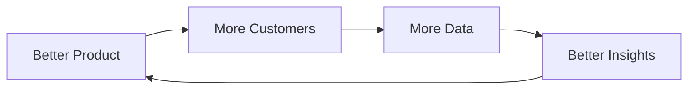
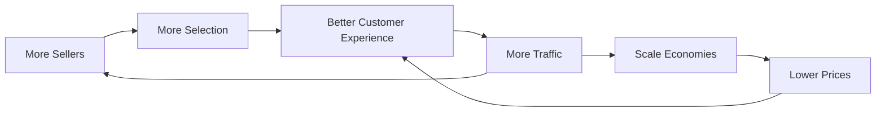
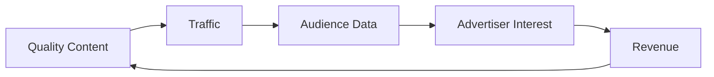
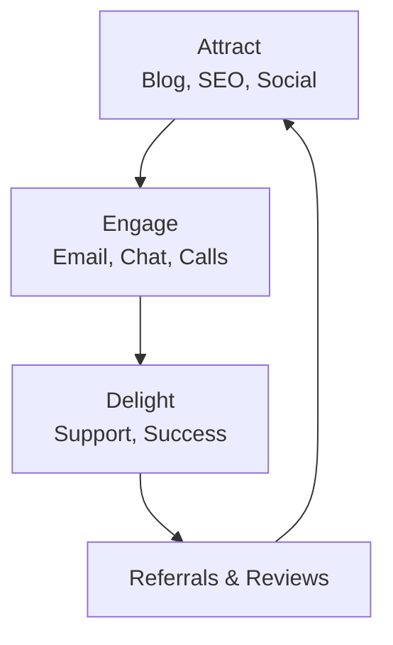
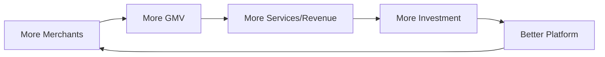

# Flywheel Reference

Detailed methodology for designing and applying flywheel strategy.

## Overview

The flywheel concept, popularized by Jim Collins and exemplified by Amazon, describes a self-reinforcing system where each component feeds the next, creating momentum that compounds over time. Unlike one-time initiatives, flywheels build durable competitive advantage.

## Core Concept

### The Physics Metaphor

A flywheel is a heavy wheel that requires significant effort to start but, once spinning, builds momentum and becomes hard to stop. Business flywheels work similarly:

- **Initial effort**: Getting started requires significant push
- **Building momentum**: Each turn makes the next easier
- **Compounding effect**: Small improvements multiply
- **Defensive moat**: Hard for competitors to replicate

### Flywheel vs. Linear Model

| Linear Model | Flywheel Model |
|--------------|----------------|
| Campaign-driven | System-driven |
| Returns diminish | Returns compound |
| Start over each time | Build on previous momentum |
| Easier to replicate | Creates defensive moat |

## Designing Your Flywheel

### Step 1: Identify Core Value Creation

**Key Questions**:
- What value do we deliver that customers truly care about?
- What would customers miss most if we disappeared?
- What are we better at than anyone else?

### Step 2: Map the Reinforcing Loop

For each activity, ask:
- What happens as a result of this activity?
- How does that result enable the next activity?
- Where do we see compounding effects?

### Step 3: Identify Components

Each flywheel component should be:
- **Measurable**: Can track progress
- **Actionable**: Can influence directly
- **Connected**: Feeds the next component
- **Reinforcing**: Benefits from previous components

### Step 4: Find the Starting Point

Not all entry points are equal:
- Where is initial effort most productive?
- Where do we already have advantage?
- What's the smallest push for maximum momentum?

## Flywheel Templates

### Simple Four-Component Flywheel



### Platform Flywheel



### Content Flywheel



## Famous Flywheel Examples

### Amazon's Original Flywheel

Jim Collins helped Amazon articulate their flywheel:

```
┌─────────────────────────────────────────────────────────────────────────────┐
│ AMAZON FLYWHEEL                                                              │
├─────────────────────────────────────────────────────────────────────────────┤
│                                                                              │
│                         ┌──────────────┐                                     │
│            ┌───────────►│   SELLERS    │◄───────────┐                       │
│            │            └──────┬───────┘            │                       │
│            │                   │                    │                       │
│            │                   ▼                    │                       │
│     ┌──────┴───────┐    ┌──────────────┐    ┌──────┴───────┐               │
│     │   TRAFFIC    │    │  SELECTION   │    │LOWER PRICES  │               │
│     └──────────────┘    └──────┬───────┘    └──────────────┘               │
│            ▲                   │                    ▲                       │
│            │                   ▼                    │                       │
│            │            ┌──────────────┐            │                       │
│            └────────────│  CUSTOMER    │────────────┘                       │
│                         │  EXPERIENCE  │                                    │
│                         └──────┬───────┘                                    │
│                                │                                            │
│                                ▼                                            │
│                         ┌──────────────┐                                    │
│                         │    GROWTH    │────► Lower Cost Structure          │
│                         └──────────────┘                                    │
│                                                                              │
└─────────────────────────────────────────────────────────────────────────────┘
```

### HubSpot's Marketing Flywheel



### Shopify's Merchant Success Flywheel



## Flywheel Analysis

### Identifying Accelerators

What speeds up the flywheel?

| Type | Examples |
|------|----------|
| **Product improvements** | Features that increase core value |
| **Network effects** | More users = more value per user |
| **Data advantages** | Better data = better decisions |
| **Brand strength** | Recognition reduces acquisition cost |
| **Switching costs** | Integration creates lock-in |

### Identifying Friction

What slows down the flywheel?

| Type | Examples |
|------|----------|
| **Poor experience** | Quality issues, bugs |
| **Operational bottlenecks** | Capacity constraints |
| **Coordination failures** | Teams not aligned |
| **External dependencies** | Supplier or partner issues |
| **Competitive pressure** | Undercutting on key factors |

### Measurement Framework

For each flywheel component, track:

| Metric Type | What to Measure |
|-------------|-----------------|
| **Volume** | Quantity at each stage |
| **Velocity** | Speed through the loop |
| **Conversion** | Efficiency between stages |
| **Quality** | Value delivered at each stage |

## Building Flywheel Momentum

### Phase 1: Push (0-1)

Early stage requires concentrated effort:
- Focus on one entry point
- Accept inefficiency while building
- Measure early indicators, not final outcomes
- Build capability before scaling

### Phase 2: Build (1-10)

Momentum begins to show:
- Optimize each component
- Reduce friction between stages
- Add resources to accelerators
- Document and systematize

### Phase 3: Spin (10-100)

Self-reinforcing effects dominate:
- System largely self-sustaining
- Focus shifts to defense
- Look for adjacent flywheels
- Compound the advantage

## Common Mistakes

| Mistake | Problem | Solution |
|---------|---------|----------|
| Too many components | Dilutes focus | Keep to 4-6 core elements |
| No clear connection | Components don't reinforce | Map cause-effect explicitly |
| Ignoring friction | Momentum bleeds away | Address friction actively |
| Expecting quick results | Gives up too early | Commit to long-term push |
| No measurement | Can't see progress | Track each component |
| Static thinking | Flywheel becomes stale | Evolve as market changes |

## Integration with Strategy

### Flywheel and Competitive Moats

Flywheels create moats through:
- **Time advantage**: Head start compounds
- **Complexity**: Hard to replicate interconnected system
- **Network effects**: Value increases with scale
- **Learning curve**: Get better faster than competitors

### Flywheel and Strategic Choices

Use flywheel to evaluate:
- **Initiative prioritization**: Does it strengthen the flywheel?
- **Resource allocation**: Invest in accelerators, fix friction
- **Partnership decisions**: Does partner strengthen the loop?
- **Acquisition targets**: Do they add flywheel components?

## Sources

- Collins, J. (2001). Good to Great. HarperBusiness.
- Amazon shareholder letters and public strategy discussions
- HubSpot's marketing and product documentation
