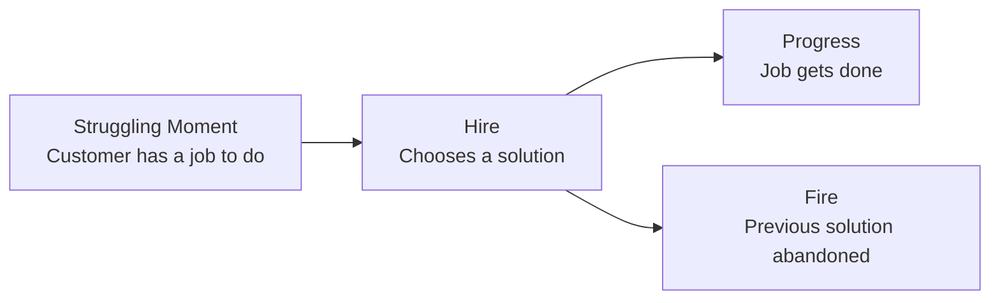
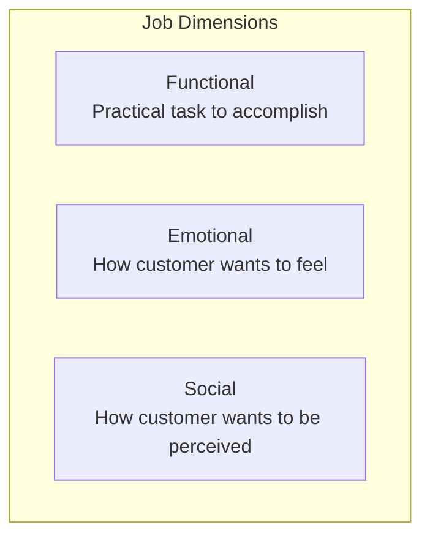
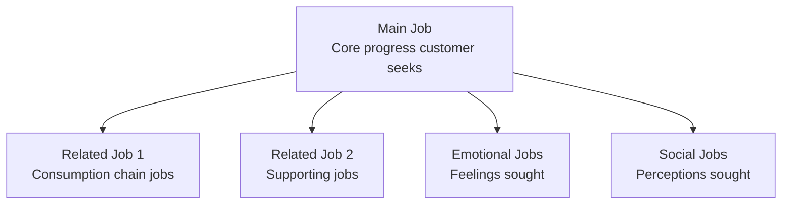
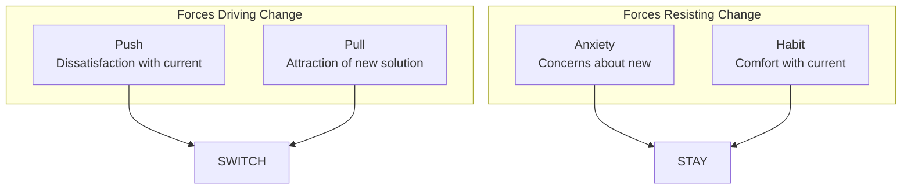
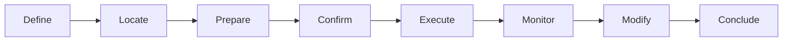
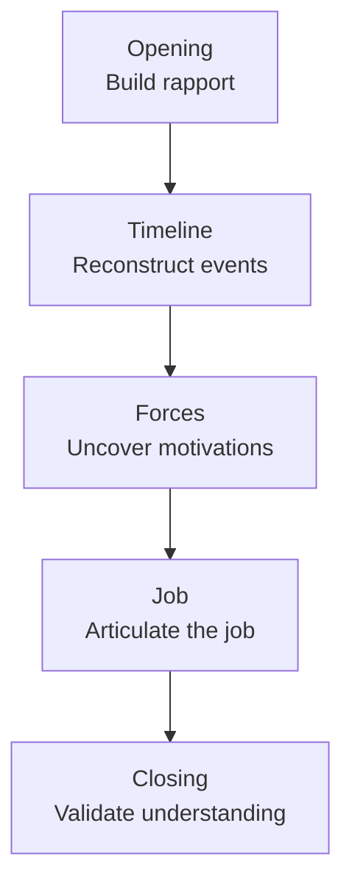
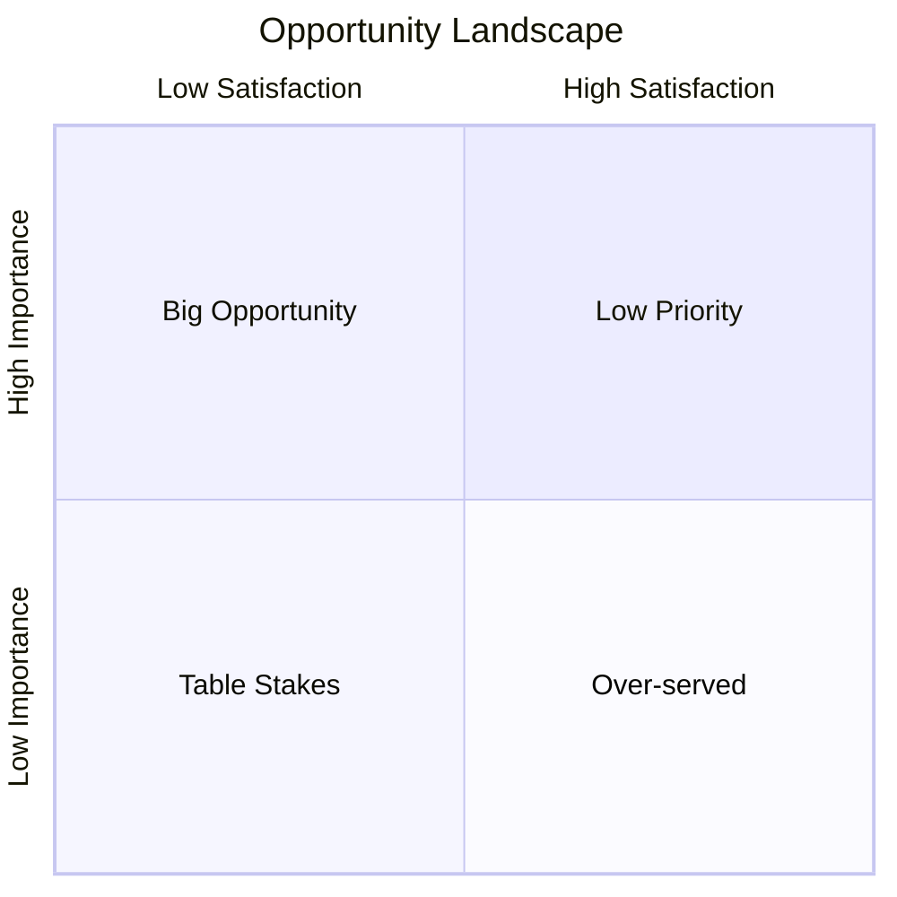

# Jobs-to-be-Done (JTBD) Reference

Detailed methodology for understanding customer jobs and applying JTBD insights.

## Overview

Jobs-to-be-Done is a theory about consumer behavior that helps explain why people "hire" products and services. Rather than focusing on customer demographics or product features, JTBD focuses on the progress customers are trying to make in specific circumstances.

## Core Principles

### The Hiring Metaphor

Customers don't buy products—they "hire" them to make progress:



### Jobs Are Stable

| What Changes Quickly | What Remains Stable |
|---------------------|---------------------|
| Technology | The job to be done |
| Products | Desired outcomes |
| Features | Progress needed |
| Channels | Circumstances |

**Example**: The job "be entertained during a commute" has existed forever. Solutions have evolved from newspapers to radio to podcasts to TikTok.

## Job Types

### Three Dimensions of Jobs



| Dimension | Definition | Example (Buying a Watch) |
|-----------|------------|--------------------------|
| **Functional** | The practical outcome | Tell time, track activity |
| **Emotional** | Personal feeling sought | Feel confident, feel organized |
| **Social** | Perception by others | Appear successful, fit in |

### Main Jobs vs. Related Jobs



## Job Statements

### Structure

```
When I [situation/circumstance]
I want to [motivation/what I want to do]
So I can [outcome/desired progress]
```

### Good vs. Bad Job Statements

| Bad Statement | Problem | Good Statement |
|---------------|---------|----------------|
| "I want a faster horse" | Solution, not job | "I want to get places faster" |
| "I need CRM software" | Product, not job | "I need to track customer interactions" |
| "Users want notifications" | Feature, not job | "I want to stay informed without effort" |

### Writing Strong Job Statements

**Guidelines**:
1. **Solution-agnostic** - No products or features
2. **Specific circumstance** - When does this job arise?
3. **Meaningful outcome** - Why does this matter?
4. **Customer language** - How would they say it?

**Examples**:

```
When I'm preparing for an important meeting
I want to quickly understand the other party's background
So I can build rapport and credibility

When I'm stuck in traffic
I want to use my time productively
So I can feel like I'm making progress on my goals

When I receive a gift
I want to send a thank-you quickly
So I can maintain the relationship
```

## Forces of Progress

### The Four Forces

Understanding why customers switch (or don't):



### Force Details

| Force | Questions to Uncover |
|-------|---------------------|
| **Push** | What's frustrating about current solution? What triggered looking for alternatives? What's not working? |
| **Pull** | What attracted you to the new solution? What did you hope it would do? What made it compelling? |
| **Anxiety** | What concerns did you have? What worried you? What might go wrong? |
| **Habit** | What was comfortable about the old way? What did you give up? What was hard to change? |

### Force Diagram

```
                    PUSH ─────────────►
    Current         (Problems with         ─────────────►    New
    Solution        current state)          PULL              Solution
                                    (Attraction to new)

                    ◄───────────── HABIT
                    (Comfort with current)
                    ◄───────────── ANXIETY
                    (Concerns about new)
```

## Job Mapping

### The Universal Job Map

Every job can be broken into steps:



| Step | Definition | Example (Plan a Trip) |
|------|------------|----------------------|
| **Define** | Determine objectives | Decide where to go, when, budget |
| **Locate** | Find required inputs | Find flights, hotels, activities |
| **Prepare** | Set up for execution | Book, pack, get documents |
| **Confirm** | Verify readiness | Confirm reservations, check lists |
| **Execute** | Perform the core job | Take the trip |
| **Monitor** | Track progress | Check flight status, time |
| **Modify** | Make adjustments | Change plans as needed |
| **Conclude** | Finish the job | Return home, unpack, share photos |

### Outcome Statements

For each job step, identify desired outcomes:

```
[Direction of improvement] + [unit of measure] + [object of control] + [context]
```

**Examples**:
- Minimize the time it takes to find relevant flights
- Increase the likelihood of getting the best price
- Reduce the effort required to compare options

## JTBD Interviews

### Interview Flow



### Opening Questions

| Purpose | Questions |
|---------|-----------|
| Context | "Tell me about the last time you [purchased/used X]" |
| Timeline | "Take me back to when you first started thinking about this" |
| Trigger | "What was happening that made you look for a solution?" |

### Timeline Questions

| Purpose | Questions |
|---------|-----------|
| First thought | "When did you first realize you needed something?" |
| Exploration | "What did you do next? Where did you look?" |
| Consideration | "What options did you consider?" |
| Decision | "How did you decide? What tipped the scale?" |
| Adoption | "What happened after you decided?" |

### Force-Uncovering Questions

| Force | Questions |
|-------|-----------|
| **Push** | "What wasn't working about your old way?" "What frustrated you?" |
| **Pull** | "What attracted you to this solution?" "What did you hope it would do?" |
| **Anxiety** | "What concerns did you have?" "What almost stopped you?" |
| **Habit** | "What was good about your old way?" "What did you give up?" |

### Probing Techniques

| Technique | Purpose | Example |
|-----------|---------|---------|
| "Tell me more" | Depth | "Tell me more about that..." |
| "Why" (gentle) | Motivation | "What made that important?" |
| Specifics | Clarity | "What exactly do you mean by...?" |
| Contrast | Comparison | "How was that different from...?" |
| Emotion | Feelings | "How did that make you feel?" |

## Opportunity Identification

### Importance vs. Satisfaction

Survey customers on each outcome:
- **Importance**: How important is this outcome? (1-10)
- **Satisfaction**: How satisfied are you with current solutions? (1-10)

### Opportunity Score

```
Opportunity = Importance + (Importance - Satisfaction)
```

Interpretation:
- Score > 10: Underserved (big opportunity)
- Score 7-10: Appropriately served
- Score < 7: Overserved (potential to simplify/lower cost)

### Opportunity Landscape



## Applying JTBD Insights

### Product Development

| JTBD Insight | Product Application |
|--------------|---------------------|
| Main job | Core value proposition |
| Related jobs | Feature prioritization |
| Outcome statements | Success metrics |
| Forces | Messaging and positioning |
| Job steps | User flow design |

### Marketing & Messaging

| JTBD Insight | Marketing Application |
|--------------|----------------------|
| Job statement | Headline messaging |
| Push forces | Problem-focused copy |
| Pull forces | Solution-focused copy |
| Anxiety | Objection handling |
| Outcomes | Benefit statements |

### Competitive Analysis

View competitors through jobs lens:
- What jobs are they hired for?
- Which outcomes do they serve well?
- Where are they weak?
- Who else is hired for the same job?

## Common Mistakes

| Mistake | Problem | Solution |
|---------|---------|----------|
| Solution in job statement | Limits thinking | Keep solution-agnostic |
| Too high level | Not actionable | Get specific about circumstance |
| Too low level | Miss the point | Focus on meaningful progress |
| Ignoring emotions | Miss true motivation | Always explore how they want to feel |
| Assuming vs. asking | Wrong insights | Ground in actual interviews |
| One interview | Limited perspective | Talk to many customers |

## Sources

- Christensen, C.M. (2016). Competing Against Luck. Harper Business.
- Ulwick, A. (2016). Jobs to be Done: Theory to Practice. IDEA BITE PRESS.
- Klement, A. (2016). When Coffee and Kale Compete. NYC Press.
- Bob Moesta and Chris Spiek - Switch Interviews methodology
