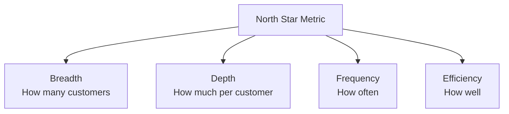
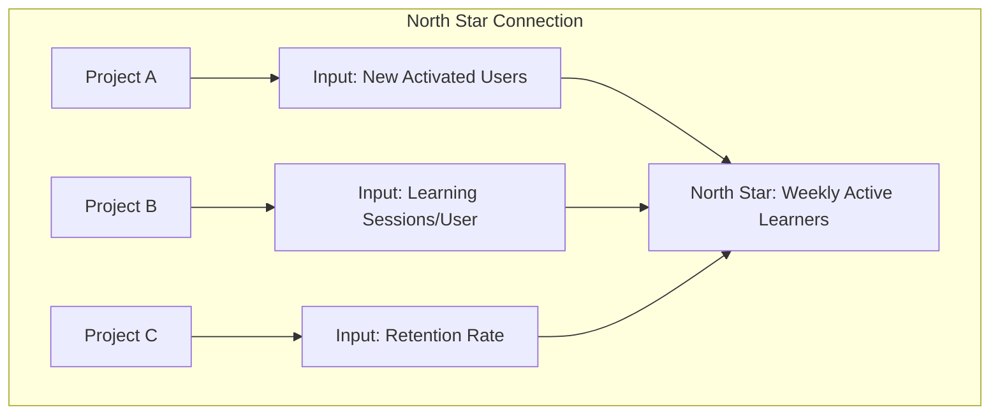

# North Star Framework Reference

Detailed methodology for defining and using North Star metrics.

## Overview

The North Star Framework helps product teams identify a single metric that best captures the core value delivered to customers. This "North Star Metric" serves as a unifying goal that aligns teams and guides decision-making.

## Core Concept

### What is a North Star Metric?

A North Star Metric is:
- The single metric that best captures the value you deliver to customers
- A leading indicator of sustainable growth
- A unifying goal that aligns cross-functional teams

### Why It Matters

| Without North Star | With North Star |
|-------------------|-----------------|
| Teams optimize different metrics | Unified direction |
| Short-term thinking dominates | Long-term value focus |
| Conflicting priorities | Clear trade-off framework |
| Feature factory mentality | Outcome orientation |

## North Star Examples

### Consumer Products

| Company | North Star Metric | Why It Works |
|---------|------------------|---------------|
| **Spotify** | Time spent listening | Captures value delivery |
| **Facebook** | Daily active users | Measures engagement habit |
| **Airbnb** | Nights booked | Core value exchange |
| **Netflix** | Viewing hours | Content value consumption |
| **Uber** | Trips completed | Service delivery |

### B2B Products

| Company | North Star Metric | Why It Works |
|---------|------------------|---------------|
| **Slack** | Messages sent | Team engagement |
| **Salesforce** | Accounts with data | Platform stickiness |
| **HubSpot** | Weekly active teams | Value realization |
| **Zoom** | Meeting minutes | Collaboration value |
| **Amplitude** | Weekly learning users | Product usage |

### Marketplaces

| Company | North Star Metric | Why It Works |
|---------|------------------|---------------|
| **eBay** | GMV (Gross Merchandise Value) | Transaction value |
| **Etsy** | Units sold | Seller success |
| **DoorDash** | Orders delivered | Service completion |

## Characteristics of Good North Star Metrics

### The Six Tests

| Test | Question | Good Example | Bad Example |
|------|----------|--------------|-------------|
| **Value** | Does it measure value to customers? | Songs listened | App downloads |
| **Leading** | Does it predict future success? | Activated users | Revenue |
| **Actionable** | Can teams influence it? | Feature adoption | Stock price |
| **Understandable** | Can everyone explain it? | Trips completed | Engagement score |
| **Measurable** | Can you track it reliably? | Messages sent | Customer happiness |
| **Sensitive** | Does it respond to product changes? | Daily active users | Annual contracts |

### Common Anti-Patterns

| Anti-Pattern | Problem | Better Alternative |
|--------------|---------|-------------------|
| **Revenue** | Lagging indicator | Value-delivering action |
| **Vanity metrics** | Don't predict success | Meaningful engagement |
| **Composite scores** | Hard to understand | Simple, clear metric |
| **Easy metrics** | Don't capture value | Customer-centric metric |

## Building Your North Star Framework

### Step 1: Identify Your Core Value

**Questions to answer**:
- What value do you deliver to customers?
- What would customers miss most if you disappeared?
- What does customer success look like?
- What behavior indicates value received?

### Step 2: Define the Metric

**Criteria for the metric**:
- Measures value delivered, not value captured
- Is a leading indicator of revenue
- Teams can directly influence it
- Easy to understand and communicate

### Step 3: Identify Input Metrics

Input metrics are the levers that drive the North Star:



### Step 4: Connect to Work

Map initiatives to inputs:



## North Star Framework Template

```
┌─────────────────────────────────────────────────────────────────────────────┐
│ NORTH STAR FRAMEWORK                                                         │
├─────────────────────────────────────────────────────────────────────────────┤
│ CORE VALUE PROPOSITION                                                       │
│ What value do we deliver? [Description]                                      │
│                                                                              │
├─────────────────────────────────────────────────────────────────────────────┤
│ NORTH STAR METRIC                                                            │
│                                                                              │
│ Metric: [Name of metric]                                                     │
│ Definition: [Precise definition]                                             │
│ Why this metric: [Rationale]                                                 │
│                                                                              │
│ Current: [Value]    Target: [Value]    Timeframe: [Period]                   │
│                                                                              │
├─────────────────────────────────────────────────────────────────────────────┤
│ INPUT METRICS                                                                │
├────────────────────────┬────────────┬────────────┬─────────────────────────┤
│ Input Metric           │ Current    │ Target     │ Owner                   │
├────────────────────────┼────────────┼────────────┼─────────────────────────┤
│ [Input 1: Breadth]     │            │            │ [Team]                  │
│ [Input 2: Depth]       │            │            │ [Team]                  │
│ [Input 3: Frequency]   │            │            │ [Team]                  │
│ [Input 4: Efficiency]  │            │            │ [Team]                  │
├────────────────────────┴────────────┴────────────┴─────────────────────────┤
│ KEY INITIATIVES (mapped to inputs)                                           │
│                                                                              │
│ Initiative 1: [Name] → Impacts [Input X]                                     │
│ Initiative 2: [Name] → Impacts [Input Y]                                     │
│ Initiative 3: [Name] → Impacts [Input Z]                                     │
│                                                                              │
└─────────────────────────────────────────────────────────────────────────────┘
```

## Input Metric Categories

### Breadth
How many customers experience value?

| Examples | Measures |
|----------|----------|
| Active users | Reach |
| Paying customers | Conversion |
| Markets served | Expansion |

### Depth
How much value per customer?

| Examples | Measures |
|----------|----------|
| Features used | Adoption |
| Time spent | Engagement |
| Value captured | Revenue per user |

### Frequency
How often do customers experience value?

| Examples | Measures |
|----------|----------|
| Sessions per week | Engagement frequency |
| Purchase frequency | Transaction cadence |
| Daily vs. monthly active | Usage pattern |

### Efficiency
How well is value delivered?

| Examples | Measures |
|----------|----------|
| Time to value | Onboarding speed |
| Success rate | Quality |
| Customer effort | Friction |

## Using the North Star

### For Prioritization

Ask of any initiative:
1. Which input does this improve?
2. How much impact on the North Star?
3. Is this the best use of resources?

### For Alignment

Share the North Star:
- Include in dashboards and reports
- Reference in planning discussions
- Connect OKRs to input metrics
- Celebrate wins in North Star terms

### For Trade-offs

When facing conflicts:
- "Which option better serves the North Star?"
- Short-term vs. long-term: North Star is long-term
- Feature scope: What's minimum to move North Star?

## Common Mistakes

| Mistake | Problem | Solution |
|---------|---------|----------|
| **Choosing revenue** | Lagging, not customer-centric | Choose value-delivery metric |
| **Too many metrics** | Dilutes focus | One North Star, few inputs |
| **Not measurable** | Can't track progress | Ensure data availability |
| **Not actionable** | Teams can't influence | Choose influenceable metric |
| **No input metrics** | No connection to work | Define 3-5 input metrics |
| **Set and forget** | Becomes stale | Review quarterly |
| **Ignoring guardrails** | North Star at any cost | Add constraint metrics |

## Guardrail Metrics

Metrics that ensure you don't optimize North Star at expense of something important:

| North Star | Potential Risk | Guardrail |
|------------|----------------|-----------|
| Active users | Acquisition at any cost | Customer acquisition cost |
| Engagement time | Addictive design | User satisfaction |
| Transactions | Quality sacrifice | Refund rate |

## Evolution Over Time

The North Star may need to evolve:

| Stage | Typical Focus |
|-------|---------------|
| **Early (0-1)** | Activation, proving value |
| **Growth (1-10)** | Acquisition, scale |
| **Scale (10-100)** | Retention, efficiency |
| **Mature (100+)** | Monetization, expansion |

## Integration with Other Frameworks

### With OKRs

- Company OKR: Improve North Star by X%
- Team OKRs: Improve assigned input metric
- Initiatives: Connected to OKRs

### With AARRR

| AARRR Stage | Related Input Metrics |
|-------------|----------------------|
| Acquisition | Breadth metrics |
| Activation | Efficiency metrics |
| Retention | Frequency metrics |
| Referral | Breadth (viral growth) |
| Revenue | Depth metrics |

## Sources

- Cutler, J. & Olson, S. - Amplitude's North Star framework
- Ellis, S. - Growth metrics and North Star concept
- Cagan, M. - Product management best practices
