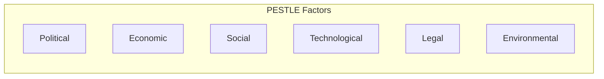
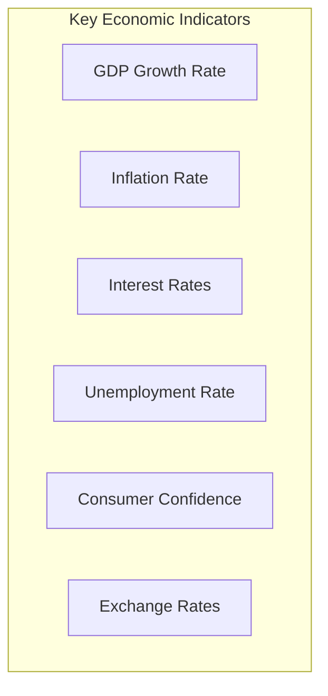
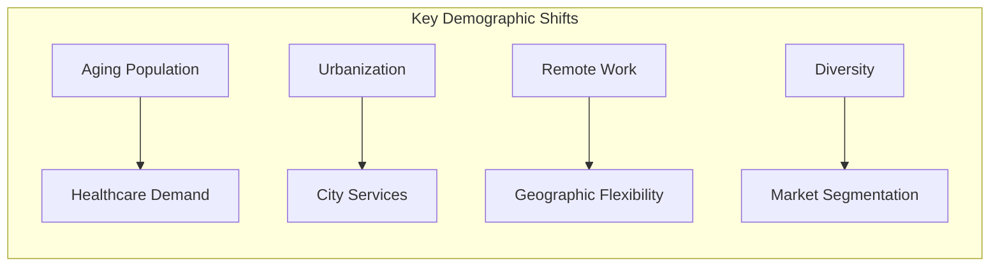
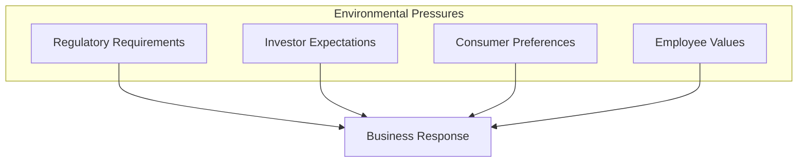

# PESTLE Analysis Reference

Detailed methodology for conducting macro-environmental analysis.

## Overview

PESTLE analysis is a strategic framework for analyzing the macro-environmental factors that affect an organization. The acronym stands for Political, Economic, Social, Technological, Legal, and Environmental factors. It's also known as PEST (without Legal and Environmental) or STEEP (Social, Technological, Economic, Environmental, Political).

## The Framework

### The Six Factors



### Factor Definitions

| Factor | Focus | Time Horizon |
|--------|-------|--------------|
| **Political** | Government, policy, stability | Variable |
| **Economic** | Economic conditions, trends | Short to medium |
| **Social** | Demographics, culture, attitudes | Medium to long |
| **Technological** | Innovation, adoption, disruption | Medium |
| **Legal** | Laws, regulations, compliance | Variable |
| **Environmental** | Ecology, sustainability, climate | Long |

## Factor Deep Dives

### Political Factors

Government actions and political conditions that affect business.

**Key Areas**:

| Area | Considerations |
|------|----------------|
| Government stability | Political stability, regime changes, elections |
| Policy direction | Pro-business, regulatory, interventionist |
| Trade policy | Tariffs, trade agreements, import/export rules |
| Taxation | Corporate taxes, incentives, changes |
| Government spending | Infrastructure, healthcare, defense |
| Political relationships | International relations, sanctions |
| Corruption | Transparency, bribery risk |

**Questions to Ask**:
- What is the current political climate?
- Are elections expected? What might change?
- How stable is the regulatory environment?
- What is the government's stance on our industry?
- Are there trade barriers or opportunities?

### Economic Factors

Economic conditions that affect business performance.

**Key Areas**:

| Area | Considerations |
|------|----------------|
| Economic growth | GDP trends, recession/expansion |
| Interest rates | Cost of capital, investment climate |
| Inflation | Input costs, pricing power, purchasing power |
| Exchange rates | Import/export costs, currency risk |
| Employment | Labor availability, wage pressure |
| Consumer confidence | Spending patterns, demand |
| Income distribution | Market segments, purchasing power |

**Economic Indicators to Track**:



**Questions to Ask**:
- What is the current economic cycle stage?
- How are interest rates trending?
- What is the inflation outlook?
- How do exchange rates affect our costs/revenues?
- What is consumer/business spending sentiment?

### Social Factors

Demographic and cultural trends that shape markets.

**Key Areas**:

| Area | Considerations |
|------|----------------|
| Demographics | Age distribution, population growth, migration |
| Lifestyle | Work-life balance, health consciousness |
| Education | Skill levels, educational attainment |
| Culture | Values, beliefs, attitudes |
| Social mobility | Class structure, opportunity |
| Consumer behavior | Preferences, buying habits |
| Health awareness | Wellness trends, healthcare |

**Demographic Trends**:



**Questions to Ask**:
- How is the population changing?
- What lifestyle trends are emerging?
- How are consumer attitudes shifting?
- What social values are becoming more important?
- How is the workforce changing?

### Technological Factors

Technology developments affecting business and industry.

**Key Areas**:

| Area | Considerations |
|------|----------------|
| R&D activity | Innovation rate, research investment |
| Automation | AI, robotics, process automation |
| Digital transformation | Digital adoption, connectivity |
| Disruption | Emerging technologies, new platforms |
| Infrastructure | Digital infrastructure, networks |
| Intellectual property | Patents, technology protection |
| Technology lifecycle | Maturity, obsolescence |

**Technology Waves**:

| Wave | Examples | Business Impact |
|------|----------|-----------------|
| Current mature | Cloud, mobile, social | Optimize operations |
| Currently emerging | AI/ML, IoT, blockchain | New capabilities |
| Near-horizon | Quantum, AR/VR, biotech | Future disruption |

**Questions to Ask**:
- What technologies are disrupting our industry?
- How quickly is technology adoption happening?
- What R&D investments are competitors making?
- What infrastructure changes affect us?
- When will key technologies reach maturity?

### Legal Factors

Laws and regulations that affect operations.

**Key Areas**:

| Area | Considerations |
|------|----------------|
| Employment law | Labor rights, working conditions, contracts |
| Consumer protection | Product safety, warranties, privacy |
| Industry regulation | Licensing, standards, compliance |
| Intellectual property | Patents, trademarks, copyrights |
| Health and safety | Workplace requirements, liability |
| Data protection | Privacy laws, data handling |
| Competition law | Antitrust, fair competition |

**Regulatory Trend Tracking**:

```
┌─────────────────────────────────────────────────────────────────────────────┐
│ REGULATORY TRACKER                                                           │
├──────────────────┬────────────────┬────────────────┬────────────────────────┤
│ Regulation       │ Status         │ Effective Date │ Impact on Business     │
├──────────────────┼────────────────┼────────────────┼────────────────────────┤
│ [Regulation 1]   │ Proposed       │ TBD            │ [Description]          │
│ [Regulation 2]   │ Final          │ [Date]         │ [Description]          │
│ [Regulation 3]   │ In effect      │ [Date]         │ [Description]          │
└──────────────────┴────────────────┴────────────────┴────────────────────────┘
```

**Questions to Ask**:
- What regulations affect our operations?
- What regulatory changes are expected?
- How do regulations differ across markets?
- What is the cost of compliance?
- What risks exist from non-compliance?

### Environmental Factors

Ecological and sustainability considerations.

**Key Areas**:

| Area | Considerations |
|------|----------------|
| Climate change | Weather patterns, carbon policy |
| Sustainability | Consumer expectations, ESG |
| Resource scarcity | Raw materials, water, energy |
| Waste management | Disposal, recycling, circular economy |
| Environmental regulations | Emissions, pollution, protection |
| Natural disasters | Climate-related risks, supply chain |
| Biodiversity | Ecosystem impacts, conservation |

**Sustainability Trends**:



**Questions to Ask**:
- How does climate change affect our operations?
- What sustainability expectations do stakeholders have?
- How are resources we depend on changing?
- What environmental regulations apply?
- How can we reduce environmental impact?

## Conducting the Analysis

### Step 1: Define Scope

| Element | Definition |
|---------|------------|
| Subject | What are we analyzing? (Company, product, market entry) |
| Geography | Which markets or regions? |
| Time horizon | Short-term, medium-term, long-term? |
| Purpose | Strategic planning, risk assessment, investment? |

### Step 2: Research Each Factor

**Research Sources**:

| Factor | Typical Sources |
|--------|-----------------|
| Political | Government websites, political analysis, news |
| Economic | Central banks, IMF, World Bank, economic forecasts |
| Social | Census data, surveys, trend reports, academics |
| Technological | Tech publications, patents, R&D reports |
| Legal | Government gazettes, legal databases, law firms |
| Environmental | Environmental agencies, NGOs, scientific journals |

### Step 3: Analyze and Prioritize

For each factor identified:

1. **Describe** - What is the factor?
2. **Assess impact** - How does it affect us? (High/Medium/Low)
3. **Determine direction** - Is it positive or negative?
4. **Estimate timeframe** - When will it affect us?
5. **Identify uncertainty** - How confident are we?

### Step 4: Synthesize and Integrate

- Feed high-impact factors into SWOT (as O/T)
- Identify factor interactions
- Develop scenarios for key uncertainties
- Determine strategic implications

## Analysis Template

```
┌─────────────────────────────────────────────────────────────────────────────┐
│ PESTLE ANALYSIS                                                              │
│ Subject: ___________________  Date: ___________  Time Horizon: _______       │
├─────────────────────────────────────────────────────────────────────────────┤
│ POLITICAL                                                     Importance: ○○○ │
├─────────────────┬──────────┬───────────┬──────────────────────────────────┤
│ Factor          │ Impact   │ Direction │ Timeframe │ Implications          │
├─────────────────┼──────────┼───────────┼──────────┼───────────────────────┤
│ [Factor 1]      │ H/M/L    │ +/-       │ S/M/L    │                       │
│ [Factor 2]      │ H/M/L    │ +/-       │ S/M/L    │                       │
├─────────────────────────────────────────────────────────────────────────────┤
│ ECONOMIC                                                      Importance: ○○○ │
├─────────────────┬──────────┬───────────┬──────────────────────────────────┤
│ [Factor 1]      │ H/M/L    │ +/-       │ S/M/L    │                       │
│ [Factor 2]      │ H/M/L    │ +/-       │ S/M/L    │                       │
├─────────────────────────────────────────────────────────────────────────────┤
│ SOCIAL                                                        Importance: ○○○ │
├─────────────────┬──────────┬───────────┬──────────────────────────────────┤
│ [Factor 1]      │ H/M/L    │ +/-       │ S/M/L    │                       │
│ [Factor 2]      │ H/M/L    │ +/-       │ S/M/L    │                       │
├─────────────────────────────────────────────────────────────────────────────┤
│ TECHNOLOGICAL                                                 Importance: ○○○ │
├─────────────────┬──────────┬───────────┬──────────────────────────────────┤
│ [Factor 1]      │ H/M/L    │ +/-       │ S/M/L    │                       │
│ [Factor 2]      │ H/M/L    │ +/-       │ S/M/L    │                       │
├─────────────────────────────────────────────────────────────────────────────┤
│ LEGAL                                                         Importance: ○○○ │
├─────────────────┬──────────┬───────────┬──────────────────────────────────┤
│ [Factor 1]      │ H/M/L    │ +/-       │ S/M/L    │                       │
│ [Factor 2]      │ H/M/L    │ +/-       │ S/M/L    │                       │
├─────────────────────────────────────────────────────────────────────────────┤
│ ENVIRONMENTAL                                                 Importance: ○○○ │
├─────────────────┬──────────┬───────────┬──────────────────────────────────┤
│ [Factor 1]      │ H/M/L    │ +/-       │ S/M/L    │                       │
│ [Factor 2]      │ H/M/L    │ +/-       │ S/M/L    │                       │
├─────────────────────────────────────────────────────────────────────────────┤
│ KEY INSIGHTS                                                                 │
│ 1.                                                                           │
│ 2.                                                                           │
│ 3.                                                                           │
├─────────────────────────────────────────────────────────────────────────────┤
│ STRATEGIC IMPLICATIONS                                                       │
│ 1.                                                                           │
│ 2.                                                                           │
└─────────────────────────────────────────────────────────────────────────────┘

Impact: H=High, M=Medium, L=Low
Direction: +=Positive opportunity, -=Negative threat
Timeframe: S=Short-term (<1yr), M=Medium-term (1-3yr), L=Long-term (>3yr)
```

## Integration with Scenario Planning

For high-uncertainty factors, develop scenarios:

### Scenario Matrix

```mermaid
quadrantChart
    title Scenario Planning Matrix
    x-axis Factor A: Low --> High
    y-axis Factor B: Low --> High
    quadrant-1 Scenario 1
    quadrant-2 Scenario 2
    quadrant-3 Scenario 3
    quadrant-4 Scenario 4
```

Select 2-3 highest-impact, highest-uncertainty factors and explore how different outcomes would affect strategy.

## Common Mistakes

| Mistake | Problem | Solution |
|---------|---------|----------|
| Too many factors | Analysis paralysis | Prioritize ruthlessly |
| Too vague | Can't act on findings | Be specific |
| One-time exercise | Becomes outdated | Review regularly |
| Ignoring interactions | Misses compound effects | Consider factor relationships |
| All negative | Misses opportunities | Balance threats with opportunities |
| No action | Analysis without strategy | Connect to decisions |

## Sources

- Aguilar, F.J. (1967). Scanning the Business Environment. Macmillan.
- Various strategic management and scenario planning resources
- Government and international organization data sources
