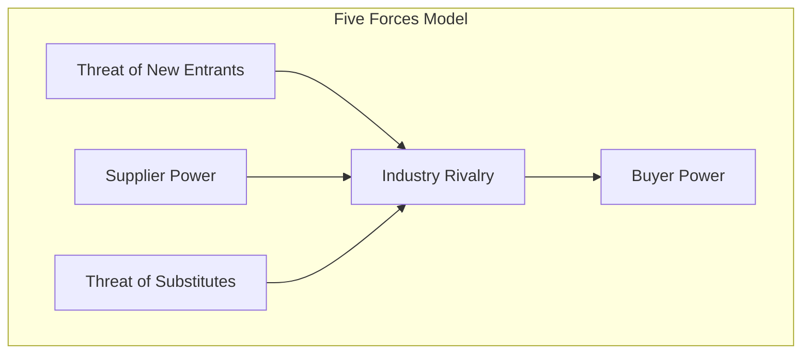
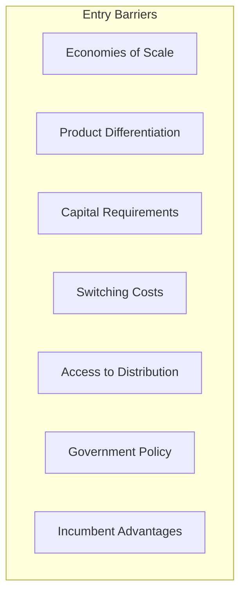

# Porter's Five Forces Reference

Detailed methodology for conducting Five Forces industry analysis.

## Overview

Porter's Five Forces is a framework for analyzing the competitive intensity and attractiveness of an industry. Developed by Michael Porter at Harvard Business School in 1979, it remains one of the most widely used tools in strategic planning.

## The Framework

### Core Principle

Industry profitability is determined by five competitive forces. When these forces are intense, few companies earn attractive returns. When forces are weak, the industry can support high profitability.



## Force-by-Force Analysis

### 1. Industry Rivalry

The intensity of competition among existing competitors.

**Drivers of High Rivalry**:

| Factor | Why It Increases Rivalry |
|--------|-------------------------|
| Numerous competitors | More players competing for same customers |
| Similar-sized competitors | No clear leader, everyone fights for position |
| Slow industry growth | Market share gains come at competitors' expense |
| High fixed costs | Pressure to fill capacity, price competition |
| Low differentiation | Customers see products as interchangeable |
| High exit barriers | Competitors stay even when unprofitable |
| Diverse competitors | Different strategies, unpredictable behavior |

**Assessment Questions**:
- How many competitors exist? What's the market share distribution?
- Is the industry growing, stable, or declining?
- Are products differentiated or commoditized?
- What are the exit barriers (specialized assets, labor agreements)?
- How aggressive are competitive moves?

### 2. Threat of New Entrants

The ease with which new competitors can enter the industry.

**Barriers to Entry**:



| Barrier | Description |
|---------|-------------|
| **Economies of scale** | Incumbents' cost advantages from volume |
| **Product differentiation** | Brand loyalty, customer relationships |
| **Capital requirements** | Investment needed to compete |
| **Switching costs** | Customer cost to change suppliers |
| **Access to distribution** | Difficulty getting shelf space, channels |
| **Government policy** | Licenses, regulations, subsidies |
| **Incumbent advantages** | Learning curve, proprietary tech, best locations |

**Expected Retaliation**:
- History of vigorous response to new entrants
- Incumbents with resources to fight back
- Slow industry growth makes incumbents defensive
- Incumbents with high stakes in the industry

### 3. Threat of Substitutes

Products from other industries that can satisfy the same customer need.

**Key Considerations**:

| Factor | Impact |
|--------|--------|
| Substitute performance | If improving, threat increases |
| Price-performance ratio | If substitute offers better value |
| Switching costs | Lower costs mean easier substitution |
| Buyer propensity | Willingness to consider alternatives |

**Identifying Substitutes**:
- What job is the customer trying to get done?
- What other ways can that job be accomplished?
- What would customers do if your product didn't exist?

**Examples**:
- Video conferencing substitutes for business travel
- Streaming substitutes for cable TV
- Email substitutes for postal mail
- Ride-sharing substitutes for car ownership

### 4. Bargaining Power of Buyers

The ability of customers to pressure prices down or demand better quality/service.

**High Buyer Power When**:

| Condition | Why It Increases Power |
|-----------|----------------------|
| Concentrated buyers | Few buyers, each matters a lot |
| Large purchase volumes | Big orders give leverage |
| Undifferentiated products | Easy to switch suppliers |
| Low switching costs | No penalty for changing |
| Low profits | Price sensitivity is high |
| Backward integration | Buyers can make it themselves |
| Full information | Buyers know costs and alternatives |

**Buyer Segments Analysis**:
Different buyer segments may have different power levels. Segment the market and analyze each.

### 5. Bargaining Power of Suppliers

The ability of suppliers to raise prices or reduce quality.

**High Supplier Power When**:

| Condition | Why It Increases Power |
|-----------|----------------------|
| Concentrated suppliers | Few alternatives available |
| No substitutes | Must use this input |
| High switching costs | Expensive to change suppliers |
| Forward integration | Suppliers can bypass you |
| Industry not important | Suppliers don't depend on you |
| Differentiated inputs | Unique supplier capabilities |

## Conducting the Analysis

### Step 1: Define the Industry

Be precise about industry boundaries:
- What products/services are included?
- What geographic scope?
- What customer segments?

### Step 2: Gather Information

| Source | Information Type |
|--------|-----------------|
| Industry reports | Market size, growth, key players |
| Company filings | Competitor strategies, financials |
| Trade publications | Trends, competitive moves |
| Interviews | Customer and supplier perspectives |
| Public data | Pricing, market share |

### Step 3: Analyze Each Force

For each force:
1. List all relevant factors
2. Assess the strength of each factor
3. Determine overall force intensity
4. Identify trends (increasing or decreasing?)

### Step 4: Synthesize

- Which forces are strongest?
- How do forces interact?
- What's the overall industry attractiveness?
- What are the strategic implications?

## Analysis Template

```
┌─────────────────────────────────────────────────────────────────────────────┐
│ FIVE FORCES ANALYSIS                                                         │
│ Industry: _______________________  Date: ___________                         │
├─────────────────────────────────────────────────────────────────────────────┤
│                                                                              │
│                         THREAT OF NEW ENTRANTS                               │
│                         Intensity: ○ ○ ○ ○ ○                                 │
│                                                                              │
│   Barriers:                        Retaliation:                              │
│   • [Barrier 1]                    • [Factor 1]                              │
│   • [Barrier 2]                    • [Factor 2]                              │
│                                                                              │
├─────────────────────────────────────────────────────────────────────────────┤
│                                                                              │
│  SUPPLIER POWER              RIVALRY              BUYER POWER                │
│  ○ ○ ○ ○ ○                  ○ ○ ○ ○ ○            ○ ○ ○ ○ ○                  │
│                                                                              │
│  • [Factor 1]               • [Factor 1]         • [Factor 1]                │
│  • [Factor 2]               • [Factor 2]         • [Factor 2]                │
│  • [Factor 3]               • [Factor 3]         • [Factor 3]                │
│                                                                              │
├─────────────────────────────────────────────────────────────────────────────┤
│                                                                              │
│                         THREAT OF SUBSTITUTES                                │
│                         Intensity: ○ ○ ○ ○ ○                                 │
│                                                                              │
│   Substitutes:                     Trends:                                   │
│   • [Substitute 1]                 • [Trend 1]                               │
│   • [Substitute 2]                 • [Trend 2]                               │
│                                                                              │
├─────────────────────────────────────────────────────────────────────────────┤
│ OVERALL ASSESSMENT                                                           │
│                                                                              │
│ Industry Attractiveness: □ Low  □ Medium  □ High                             │
│                                                                              │
│ Key Insights:                                                                │
│ 1.                                                                           │
│ 2.                                                                           │
│ 3.                                                                           │
│                                                                              │
│ Strategic Implications:                                                      │
│ 1.                                                                           │
│ 2.                                                                           │
│                                                                              │
└─────────────────────────────────────────────────────────────────────────────┘
```

## Strategic Responses

### Force-Specific Strategies

| Force | Strategic Options |
|-------|-------------------|
| **High rivalry** | Differentiate, focus on niche, compete on value not price, consolidate through M&A |
| **New entrant threat** | Build barriers (scale, brand, patents), develop switching costs, signal willingness to retaliate |
| **Substitute threat** | Improve value proposition, increase switching costs, co-opt substitute (offer it yourself) |
| **Buyer power** | Differentiate, create switching costs, serve less powerful segments, integrate forward |
| **Supplier power** | Diversify sources, create substitutes, integrate backward, partner with suppliers |

### Reshaping Industry Structure

Beyond responding to forces, consider how to reshape them:
- Can you raise entry barriers for others?
- Can you reduce substitute attractiveness?
- Can you shift buyer or supplier power?
- Can you reduce rivalry through differentiation?

## Common Mistakes

| Mistake | Problem | Solution |
|---------|---------|----------|
| Defining industry too broadly | Misses competitive dynamics | Be specific about boundaries |
| Ignoring substitutes | Underestimates competitive pressure | Think about customer jobs |
| Static analysis | Misses trends | Consider how forces are changing |
| Ignoring complements | Misses value creation opportunities | Consider complementary products |
| Assuming forces are fixed | Limits strategic thinking | Consider reshaping forces |

## Limitations

- Assumes relatively stable industry structure
- May underweight disruptive innovation
- Doesn't address complementary products
- Doesn't directly address internal capabilities
- Best suited to single-industry businesses

## Sources

- Porter, M.E. (1979). "How Competitive Forces Shape Strategy." Harvard Business Review.
- Porter, M.E. (1980). Competitive Strategy. Free Press.
- Porter, M.E. (2008). "The Five Competitive Forces That Shape Strategy." Harvard Business Review.
