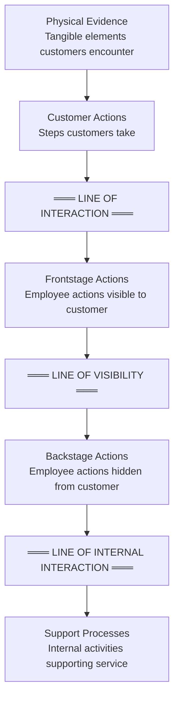
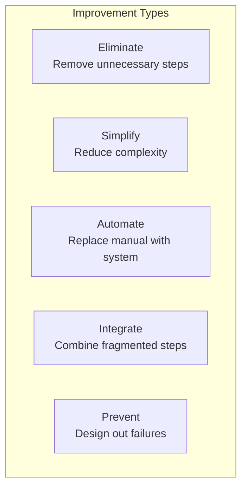

# Service Blueprint Reference

Detailed methodology for creating and using service blueprints.

## Overview

A service blueprint is a diagram that visualizes the relationships between different service components—people, props, and processes—that are directly tied to touchpoints in a specific customer journey. It extends the customer journey map by adding operational detail.

## Structure

### The Layers



### Layer Definitions

| Layer | What It Shows | Examples |
|-------|--------------|----------|
| **Physical Evidence** | What customers see, touch, experience | Website, store, uniforms, packaging |
| **Customer Actions** | Steps the customer takes | Browse, order, pay, use |
| **Frontstage Actions** | Employee activities customers witness | Greeting, explaining, delivering |
| **Backstage Actions** | Employee activities out of sight | Preparing, processing, analyzing |
| **Support Processes** | Systems and activities enabling service | IT systems, training, inventory |

### The Lines

| Line | Purpose | Implications |
|------|---------|--------------|
| **Line of Interaction** | Where customer and organization meet | Touchpoint design matters |
| **Line of Visibility** | What customer sees vs. doesn't see | Manage visible vs. hidden |
| **Line of Internal Interaction** | Handoffs between departments | Coordination requirements |

## Building a Blueprint

### Step 1: Identify the Service

Be specific about what you're blueprinting:
- Which service or journey?
- Which customer segment?
- Start and end points?
- Current state or future state?

### Step 2: Build Customer Actions First

Start with the customer journey:

1. What is the customer trying to accomplish?
2. What steps do they take?
3. What triggers each step?
4. What is the sequence?

### Step 3: Add Physical Evidence

For each customer action, identify:
- What tangible elements are present?
- What does the customer see/touch/use?
- What artifacts are created?

### Step 4: Map Frontstage Actions

For each customer action requiring employee interaction:
- What does the employee do?
- What does the customer see?
- What tools/systems does the employee use visibly?

### Step 5: Map Backstage Actions

For each frontstage action:
- What preparation is required?
- What processing happens out of sight?
- What follow-up occurs?

### Step 6: Identify Support Processes

For all actions:
- What systems enable this?
- What training is required?
- What policies govern this?
- What departments are involved?

### Step 7: Add Annotations

Mark important elements:

| Symbol | Meaning |
|--------|---------|
| ⏱️ | Wait time / delay |
| ⚠️ | Failure point |
| 💰 | Cost-intensive |
| 📊 | Metrics needed |
| 🔄 | Rework / repeat |
| ❓ | Decision point |

## Blueprint Template

```
┌─────────────────────────────────────────────────────────────────────────────────────────────┐
│ SERVICE BLUEPRINT: [Service Name]                                                            │
│ Customer Segment: [Segment]           Date: [Date]           Version: [#]                   │
├─────────────────┬───────────────┬───────────────┬───────────────┬───────────────────────────┤
│ Stage           │ [Stage 1]     │ [Stage 2]     │ [Stage 3]     │ [Stage 4]                 │
├─────────────────┼───────────────┼───────────────┼───────────────┼───────────────────────────┤
│ PHYSICAL        │               │               │               │                           │
│ EVIDENCE        │ Website       │ Email         │ Package       │ Support portal           │
│                 │ Ad            │ Confirmation  │ Invoice       │ FAQ                       │
├─────────────────┼───────────────┼───────────────┼───────────────┼───────────────────────────┤
│ CUSTOMER        │ Searches      │ Places order  │ Receives      │ Contacts                  │
│ ACTIONS         │ Compares      │ Makes payment │ Opens/uses    │ support                   │
│                 │ Selects       │               │               │                           │
├─────────────────┴───────────────┴───────────────┴───────────────┴───────────────────────────┤
│ ════════════════════════════════════ LINE OF INTERACTION ═══════════════════════════════════ │
├─────────────────┬───────────────┬───────────────┬───────────────┬───────────────────────────┤
│ FRONTSTAGE      │ Website       │ Order         │ Delivery      │ Support agent             │
│ ACTIONS         │ displays      │ confirmation  │ notification  │ responds                  │
│                 │ results       │ sent          │ sent          │                           │
│ Time: [Xmin]    │ ⏱️ 2 sec       │ ⏱️ instant     │ ⏱️ real-time   │ ⏱️ 4 hrs ⚠️               │
├─────────────────┴───────────────┴───────────────┴───────────────┴───────────────────────────┤
│ ════════════════════════════════════ LINE OF VISIBILITY ════════════════════════════════════ │
├─────────────────┬───────────────┬───────────────┬───────────────┬───────────────────────────┤
│ BACKSTAGE       │ Search algo   │ Order         │ Pick/pack     │ Ticket created            │
│ ACTIONS         │ runs          │ validation    │ ship          │ Routed to agent           │
│                 │ Inventory     │ Payment       │               │ Research issue            │
│                 │ checked       │ processed     │               │                           │
│ Time: [Xmin]    │ ⏱️ 1 sec       │ ⏱️ 5 sec       │ ⏱️ 2 hrs       │ ⏱️ 2 hrs                  │
├─────────────────┴───────────────┴───────────────┴───────────────┴───────────────────────────┤
│ ═══════════════════════════════ LINE OF INTERNAL INTERACTION ═══════════════════════════════ │
├─────────────────┬───────────────┬───────────────┬───────────────┬───────────────────────────┤
│ SUPPORT         │ Product DB    │ Payment       │ Warehouse     │ CRM System                │
│ PROCESSES       │ Search        │ gateway       │ management    │ Knowledge base            │
│                 │ engine        │ Fraud check   │ Shipping      │ Training                  │
│                 │ CDN           │ Inventory     │ carrier       │ Escalation                │
│                 │               │ system        │               │ process                   │
└─────────────────┴───────────────┴───────────────┴───────────────┴───────────────────────────┘
```

## Metrics Layer

Add a metrics row to track service performance:

| Metric Type | Examples |
|-------------|----------|
| **Time** | Wait time, process time, total time |
| **Quality** | Error rate, satisfaction score |
| **Cost** | Cost per transaction, labor cost |
| **Volume** | Transactions per period |

## Failure Point Analysis

### Identifying Failure Points

For each step, ask:
- What could go wrong?
- What causes failures?
- What's the impact of failure?
- How often does it occur?

### Failure Point Template

```
┌─────────────────────────────────────────────────────────────────────────────┐
│ FAILURE POINT ANALYSIS                                                       │
├─────────────────────────────────────────────────────────────────────────────┤
│ Step: [Which step in blueprint]                                              │
│ Layer: [Customer / Frontstage / Backstage / Support]                         │
│                                                                              │
│ Failure Mode: [What can go wrong]                                            │
│ Root Cause: [Why it happens]                                                 │
│                                                                              │
│ Frequency: □ Rare  □ Occasional  □ Frequent                                  │
│ Impact: □ Minor  □ Moderate  □ Major                                         │
│                                                                              │
│ Current Handling: [What happens when it fails]                               │
│ Customer Impact: [How customer experiences the failure]                      │
│                                                                              │
│ Prevention Strategy: [How to reduce occurrence]                              │
│ Recovery Strategy: [How to handle when it occurs]                            │
└─────────────────────────────────────────────────────────────────────────────┘
```

## Using Blueprints for Design

### Current State vs. Future State

| Current State Blueprint | Future State Blueprint |
|------------------------|------------------------|
| Documents what exists | Designs what could be |
| Identifies problems | Proposes solutions |
| Grounds in reality | Inspires possibility |
| Basis for improvement | Vision for change |

### Service Design Improvements

Use the blueprint to identify:



## Facilitation Guide

### Workshop Setup

**Materials**:
- Large wall or table
- Printed template (A0 size or larger)
- Sticky notes (multiple colors for layers)
- Markers
- Customer journey map (as input)
- Process documentation

**Participants**:
- Customer-facing staff (frontstage insight)
- Operations staff (backstage insight)
- IT/systems (support process insight)
- Management (decision authority)

**Duration**: 4-6 hours

### Agenda

| Phase | Time | Activity |
|-------|------|----------|
| Introduction | 20 min | Purpose, scope, process |
| Customer journey review | 30 min | Align on customer actions |
| Physical evidence | 20 min | Map tangible elements |
| Frontstage actions | 45 min | Detail visible interactions |
| Backstage actions | 45 min | Map hidden processes |
| Support processes | 45 min | Identify systems/activities |
| Failure points | 30 min | Mark risks and issues |
| Metrics | 20 min | Add performance data |
| Analysis | 30 min | Identify improvements |
| Prioritization | 20 min | Agree on actions |

### Tips

1. **Start with customer actions** - Everything else flows from there
2. **Include frontline staff** - They know what really happens
3. **Challenge the line of visibility** - Should anything move?
4. **Add time to every step** - Exposes delays
5. **Mark handoffs explicitly** - These are failure points
6. **Use color coding** - Different colors for different layers
7. **Keep it readable** - Don't overcrowd with detail

## Common Mistakes

| Mistake | Problem | Solution |
|---------|---------|----------|
| Starting with systems | Loses customer focus | Start with customer actions |
| Too detailed | Unreadable, unmaintainable | Stay at meaningful level |
| Missing time data | Can't identify delays | Add duration to every step |
| Ignoring failures | Misses improvement opportunities | Explicitly mark failure points |
| One-time exercise | Becomes stale | Review and update regularly |
| No ownership | Nobody maintains it | Assign owner per service |

## Integration with Other Tools

### From Customer Journey Map

The journey map provides:
- Customer actions
- Touchpoints
- Pain points
- Emotional context

### To Value Stream Map

Blueprint informs:
- Process steps
- Wait times
- Value-add vs. non-value-add
- Improvement opportunities

## Sources

- Shostack, G.L. (1984). "Designing Services That Deliver." Harvard Business Review.
- Bitner, M.J., et al. (2008). "Service Blueprinting: A Practical Technique for Service Innovation."
- Service Design Network resources
