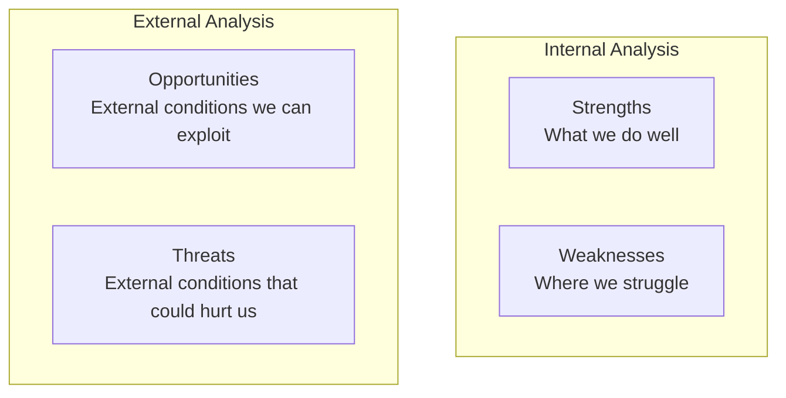
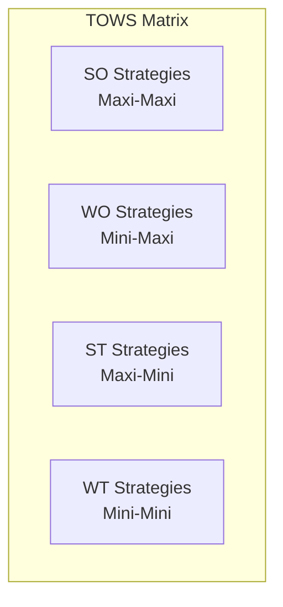

# SWOT Analysis Reference

Detailed methodology for conducting SWOT analysis and developing strategic options.

## Overview

SWOT analysis is a strategic planning technique used to identify Strengths, Weaknesses, Opportunities, and Threats. While simple in concept, effective SWOT analysis requires rigor in gathering inputs and translating findings into strategy.

## The Framework

### Structure



### Definitions

| Element | Definition | Source |
|---------|------------|--------|
| **Strengths** | Internal capabilities that provide advantage | Internal analysis |
| **Weaknesses** | Internal limitations that create disadvantage | Internal analysis |
| **Opportunities** | External conditions that could be exploited | External analysis |
| **Threats** | External conditions that could cause harm | External analysis |

## Conducting the Analysis

### Phase 1: Preparation

**Clarify the objective**:
- What decision or strategy are we developing?
- What's the scope (company, business unit, product)?
- What time horizon are we considering?

**Gather participants**:
- Cross-functional representation
- Mix of perspectives and levels
- Include skeptics, not just champions

### Phase 2: Internal Analysis (S & W)

**Strengths Assessment**:

| Category | Questions |
|----------|-----------|
| Resources | What resources do we have that others don't? |
| Capabilities | What do we do better than competitors? |
| Competitive advantages | What makes customers choose us? |
| Assets | What valuable assets do we control? |
| Brand | What reputation/recognition do we have? |
| Relationships | What partnerships or relationships are valuable? |

**Weaknesses Assessment**:

| Category | Questions |
|----------|-----------|
| Resource gaps | What resources do we lack? |
| Capability gaps | What do competitors do better? |
| Vulnerabilities | Where are we exposed? |
| Underperformance | What could we improve? |
| Complaints | What do customers complain about? |
| Dependencies | What critical dependencies exist? |

**Sources of Internal Insight**:
- Employee surveys and feedback
- Customer feedback and complaints
- Operational metrics
- Competitive benchmarking
- Capability assessments
- Financial analysis

### Phase 3: External Analysis (O & T)

**Opportunities Assessment**:

| Category | Questions |
|----------|-----------|
| Market trends | What trends could benefit us? |
| Customer needs | What unmet needs are emerging? |
| Technology | What new technologies could we exploit? |
| Regulatory | What regulatory changes could help? |
| Competitive | What competitor weaknesses exist? |
| Economic | What economic conditions favor us? |

**Threats Assessment**:

| Category | Questions |
|----------|-----------|
| Market trends | What trends could hurt us? |
| Competitive | What are competitors doing? |
| Substitutes | What alternatives threaten us? |
| Regulatory | What regulations could harm us? |
| Economic | What economic risks exist? |
| Technology | What technology could disrupt us? |

**Sources of External Insight**:
- PESTLE analysis
- Porter's Five Forces
- Industry reports
- Competitor analysis
- Customer research
- Market data

### Phase 4: Synthesis and Prioritization

**Consolidate items**:
- Combine similar items
- Remove duplicates
- Clarify vague items

**Prioritize**:
- Rank by importance/impact
- Limit to 5-7 items per quadrant
- Focus on what's most significant

**Validate**:
- Is this truly internal or external?
- Is there evidence to support this?
- Would others agree with this assessment?

## SWOT Template

```
┌─────────────────────────────────────────────────────────────────────────────┐
│                              SWOT ANALYSIS                                   │
│ Subject: _______________________  Date: ___________                          │
├─────────────────────────────────┬───────────────────────────────────────────┤
│          STRENGTHS              │            WEAKNESSES                      │
│       (Internal, Helpful)       │          (Internal, Harmful)               │
│                                 │                                            │
│  1.                             │  1.                                        │
│  2.                             │  2.                                        │
│  3.                             │  3.                                        │
│  4.                             │  4.                                        │
│  5.                             │  5.                                        │
│                                 │                                            │
├─────────────────────────────────┼───────────────────────────────────────────┤
│         OPPORTUNITIES           │              THREATS                       │
│       (External, Helpful)       │          (External, Harmful)               │
│                                 │                                            │
│  1.                             │  1.                                        │
│  2.                             │  2.                                        │
│  3.                             │  3.                                        │
│  4.                             │  4.                                        │
│  5.                             │  5.                                        │
│                                 │                                            │
└─────────────────────────────────┴───────────────────────────────────────────┘
```

## TOWS Matrix: From Analysis to Strategy

The TOWS matrix converts SWOT findings into strategic options.

### Structure



### Strategy Types

| Strategy | Combination | Approach | Question |
|----------|-------------|----------|----------|
| **SO** | Strengths + Opportunities | Pursue aggressively | How can we use strengths to capture opportunities? |
| **WO** | Weaknesses + Opportunities | Develop and improve | How can we overcome weaknesses to capture opportunities? |
| **ST** | Strengths + Threats | Monitor and defend | How can we use strengths to reduce threats? |
| **WT** | Weaknesses + Threats | Avoid or exit | How can we minimize weaknesses and avoid threats? |

### TOWS Template

```
┌─────────────────────────────────────────────────────────────────────────────┐
│                              TOWS MATRIX                                     │
├─────────────────────────────────┬───────────────────────────────────────────┤
│                                 │            STRENGTHS                       │
│                                 │  S1: [Strength 1]                          │
│                                 │  S2: [Strength 2]                          │
│                                 │  S3: [Strength 3]                          │
├─────────────────────────────────┼───────────────────────────────────────────┤
│        OPPORTUNITIES            │         SO STRATEGIES                      │
│                                 │                                            │
│  O1: [Opportunity 1]            │  • Use S1 to capture O1                    │
│  O2: [Opportunity 2]            │  • Leverage S2 + S3 for O2                 │
│  O3: [Opportunity 3]            │  •                                         │
│                                 │                                            │
├─────────────────────────────────┼───────────────────────────────────────────┤
│           THREATS               │         ST STRATEGIES                      │
│                                 │                                            │
│  T1: [Threat 1]                 │  • Use S1 to mitigate T1                   │
│  T2: [Threat 2]                 │  • Apply S3 to defend against T2           │
│  T3: [Threat 3]                 │  •                                         │
│                                 │                                            │
└─────────────────────────────────┴───────────────────────────────────────────┘

┌─────────────────────────────────────────────────────────────────────────────┐
│                                 │            WEAKNESSES                      │
│                                 │  W1: [Weakness 1]                          │
│                                 │  W2: [Weakness 2]                          │
│                                 │  W3: [Weakness 3]                          │
├─────────────────────────────────┼───────────────────────────────────────────┤
│        OPPORTUNITIES            │         WO STRATEGIES                      │
│                                 │                                            │
│  O1: [Opportunity 1]            │  • Address W1 to capture O1                │
│  O2: [Opportunity 2]            │  • Partner to overcome W2 for O3           │
│  O3: [Opportunity 3]            │  •                                         │
│                                 │                                            │
├─────────────────────────────────┼───────────────────────────────────────────┤
│           THREATS               │         WT STRATEGIES                      │
│                                 │                                            │
│  T1: [Threat 1]                 │  • Minimize exposure where W1 meets T1     │
│  T2: [Threat 2]                 │  • Consider exit from areas of W2 + T2     │
│  T3: [Threat 3]                 │  •                                         │
│                                 │                                            │
└─────────────────────────────────┴───────────────────────────────────────────┘
```

## Facilitation Guide

### Workshop Setup

**Materials**:
- Large SWOT matrix (poster or whiteboard)
- Sticky notes (4 colors, one per quadrant)
- Markers
- Voting dots
- Timer

**Duration**: 2-3 hours

### Agenda

| Phase | Time | Activity |
|-------|------|----------|
| Introduction | 10 min | Purpose, scope, process |
| Individual brainstorm | 15 min | Each person writes items on sticky notes |
| Strengths | 20 min | Share, cluster, discuss, prioritize |
| Weaknesses | 20 min | Share, cluster, discuss, prioritize |
| Opportunities | 20 min | Share, cluster, discuss, prioritize |
| Threats | 20 min | Share, cluster, discuss, prioritize |
| Voting | 15 min | Vote on most important items |
| TOWS strategies | 30 min | Generate strategic options |
| Next steps | 10 min | Assign actions |

### Facilitation Tips

1. **Start positive** - Begin with strengths to build confidence
2. **Encourage honesty** - Create safe space for discussing weaknesses
3. **Push for specificity** - "Good service" → "24/7 support with <2hr response time"
4. **Challenge assumptions** - Ask "how do we know this?"
5. **Balance input** - Ensure all voices are heard
6. **Time-box** - Keep discussions focused

## Common Mistakes

| Mistake | Problem | Solution |
|---------|---------|----------|
| **Too many items** | Loses focus, nothing prioritized | Limit to 5-7 per quadrant |
| **Vague statements** | Can't act on them | Be specific and concrete |
| **Internal/external confusion** | Misclassifies factors | Test: can we control it? |
| **Strengths ≠ Weaknesses** | Lists aren't related | Ensure comprehensive view |
| **No prioritization** | Everything seems equal | Vote or rank |
| **Stopping at SWOT** | Analysis without action | Always do TOWS |
| **Group think** | Missing critical items | Include diverse perspectives |
| **Confirmation bias** | See what we want to see | Bring in external views |

## Quality Checklist

Before finalizing, verify:

- [ ] Items are specific and actionable
- [ ] S/W are truly internal; O/T are truly external
- [ ] Each quadrant is prioritized
- [ ] Evidence supports each item
- [ ] TOWS strategies are developed
- [ ] Key stakeholders have validated
- [ ] Actions are assigned

## Integration with Other Frameworks

| Framework | Integration |
|-----------|-------------|
| **PESTLE** | Informs O/T from macro-environment |
| **Porter's Five Forces** | Informs O/T from industry dynamics |
| **Capability Tree** | Informs S/W from capability assessment |
| **Competitor Analysis** | Informs all quadrants through comparison |

## Sources

- Humphrey, A.S. - Stanford Research Institute (1960s)
- Weihrich, H. (1982). "The TOWS Matrix." Long Range Planning.
- Various strategic management textbooks and practice guides
