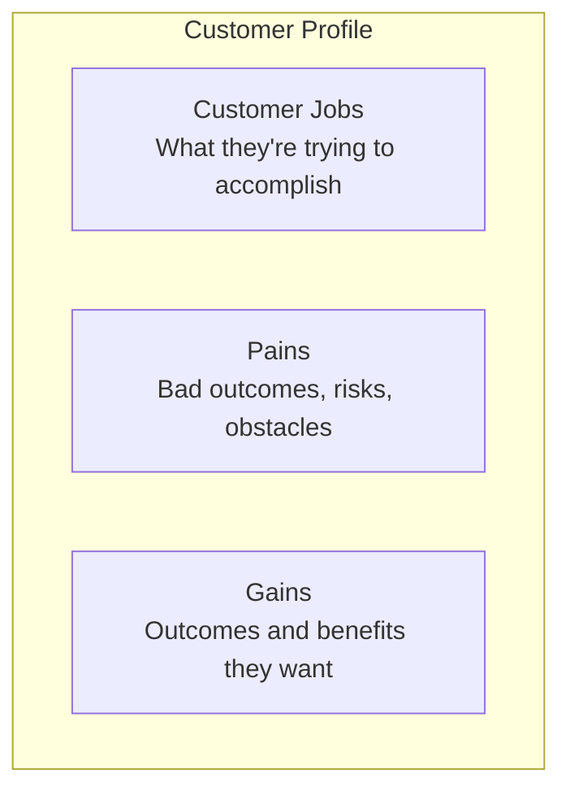
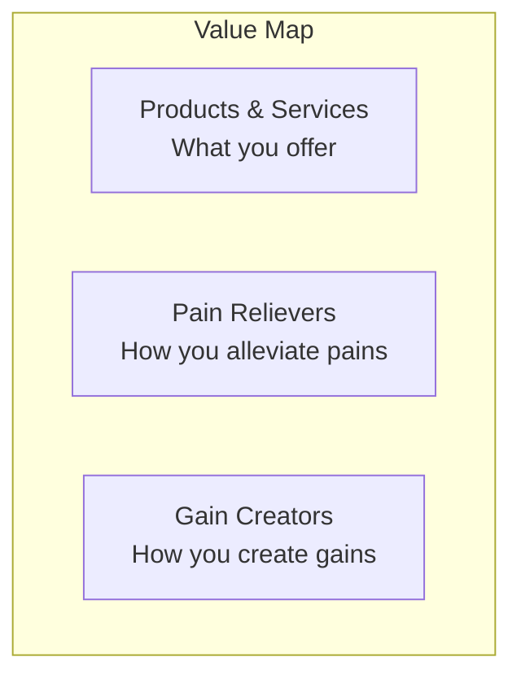
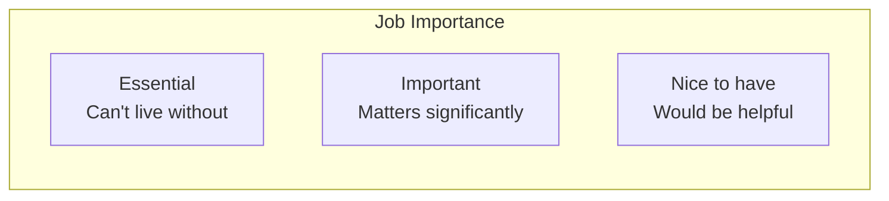
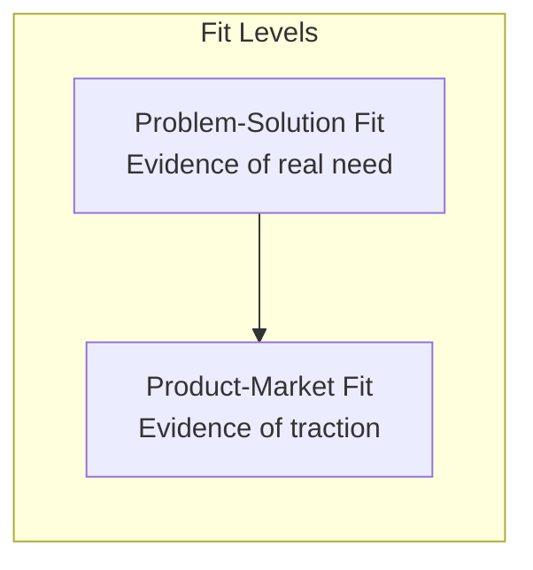
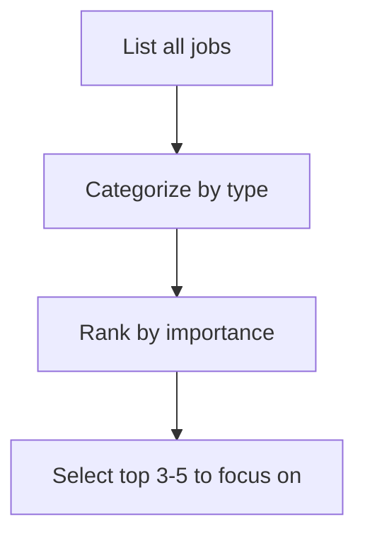

# Value Proposition Canvas Reference

Detailed methodology for using the Value Proposition Canvas framework.

## Overview

The Value Proposition Canvas is a tool to ensure that a product or service is positioned around what the customer values and needs. Created by Alexander Osterwalder, it's a detailed look at the relationship between two blocks of the Business Model Canvas: Customer Segments and Value Propositions.

## The Two Sides

### Customer Profile (Circle)

Maps what you know about your customer:



### Value Map (Square)

Describes how you intend to create value:



## Customer Profile Deep Dive

### Customer Jobs

Jobs are things customers are trying to get done in their work or life.

**Job Types**:

| Type | Description | Example |
|------|-------------|---------|
| **Functional** | Specific task or problem to solve | "File my taxes" |
| **Social** | How customers want to be perceived | "Look professional" |
| **Emotional** | Specific emotional state sought | "Feel secure" |
| **Supporting** | Jobs in context of purchasing/consuming | "Compare options" |

**Job Context Questions**:
- In what context does the customer perform this job?
- What triggers the need to get this job done?
- What does "done" look like for this job?

**Mapping Jobs**:



### Pains

Pains describe anything that annoys customers before, during, or after getting a job done.

**Pain Types**:

| Type | Description | Examples |
|------|-------------|----------|
| **Undesired Outcomes** | Functional, social, emotional problems | "Solution doesn't work well" |
| **Obstacles** | Things preventing job start/completion | "Lack of time", "Too expensive" |
| **Risks** | Potential negative outcomes | "Might lose credibility", "Security breach" |

**Pain Severity Scale**:

```
Extreme ─────────────────────────────────────── Moderate
   │                                                │
   └── Blocks job completely                        └── Annoying but manageable
```

**Pain Questions**:
- What does your customer find too costly? (time, money, effort)
- What makes your customer feel bad?
- What common mistakes does your customer make?
- What barriers keep your customer from adopting solutions?
- What risks does your customer fear?

### Gains

Gains describe outcomes and benefits customers want.

**Gain Types**:

| Type | Description | Priority |
|------|-------------|----------|
| **Required** | Essential for solution to work | Must have |
| **Expected** | Basic gains we expect | Should have |
| **Desired** | Beyond expectations | Nice to have |
| **Unexpected** | Delightful surprises | Differentiation |

**Gain Questions**:
- What savings would make your customer happy? (time, money, effort)
- What quality levels do they expect?
- What would make your customer's job easier?
- What positive social consequences does your customer desire?
- What are customers looking for most?
- How do customers measure success or failure?

## Value Map Deep Dive

### Products & Services

A list of all products and services your value proposition is built around.

**Product/Service Types**:
- **Physical/Tangible**: Manufactured goods
- **Intangible**: Services, copyrights, licenses
- **Digital**: Downloads, online services
- **Financial**: Investment funds, financing

**Relevance Scale**:

```
Essential ────────────────────────────────────── Nice to have
    │                                                  │
    └── Core to value proposition                      └── Supports but not critical
```

### Pain Relievers

How your products and services alleviate customer pains.

**Pain Reliever Questions**:
- Do they produce savings? (time, money, effort)
- Do they make customers feel better?
- Do they fix underperforming solutions?
- Do they eliminate risks customers fear?
- Do they eliminate barriers?

**Mapping Pain Relievers**:

| Customer Pain | Pain Reliever | How It Helps |
|---------------|---------------|--------------|
| [Specific pain] | [Your feature/service] | [Mechanism] |

### Gain Creators

How your products and services create customer gains.

**Gain Creator Questions**:
- Do they create savings that delight?
- Do they produce outcomes customers expect or exceed them?
- Do they make customer's life/job easier?
- Do they create positive social consequences?
- Do they do something customers are looking for?

**Mapping Gain Creators**:

| Customer Gain | Gain Creator | How It Delivers |
|---------------|--------------|-----------------|
| [Specific gain] | [Your feature/service] | [Mechanism] |

## Achieving Fit

### What is Fit?

Fit is achieved when customers get excited about your value proposition.



### Problem-Solution Fit

**Indicators**:
- Identified jobs, pains, gains that matter to customers
- Designed value proposition that addresses them
- Evidence customers care about your value proposition

**Testing Methods**:
- Customer interviews
- Surveys
- Landing page tests
- Prototype feedback

### Product-Market Fit

**Indicators**:
- Customers are buying/using your solution
- Measurable traction (growth, retention)
- Sustainable unit economics

**Testing Methods**:
- Sales and revenue data
- Usage metrics
- Retention and churn
- Customer acquisition cost vs. lifetime value

## Fit Assessment Matrix

```
┌─────────────────────────────────────────────────────────────────────────┐
│                          FIT ASSESSMENT                                  │
├──────────────────────┬──────────────────────┬───────────────────────────┤
│ Customer Need        │ Your Solution        │ Fit Quality               │
├──────────────────────┼──────────────────────┼───────────────────────────┤
│ Job: [Description]   │ Product: [Feature]   │ ○ Strong  ○ Weak  ○ None  │
│ Pain: [Description]  │ Reliever: [Feature]  │ ○ Strong  ○ Weak  ○ None  │
│ Gain: [Description]  │ Creator: [Feature]   │ ○ Strong  ○ Weak  ○ None  │
└──────────────────────┴──────────────────────┴───────────────────────────┘
```

## Process

### Step 1: Select a Customer Segment

Choose one specific segment from your Business Model Canvas. Be specific:
- Not "small businesses" but "retail stores with 5-20 employees in urban areas"
- Not "developers" but "backend engineers at startups building APIs"

### Step 2: Map Customer Jobs



### Step 3: Map Pains and Gains

For each important job:
1. What pains occur before, during, or after the job?
2. What gains would delight the customer?
3. Rank each by severity/relevance

### Step 4: Design Your Value Map

For each pain/gain:
1. What product or service addresses this?
2. How specifically does it relieve the pain or create the gain?
3. What's the evidence this will work?

### Step 5: Evaluate Fit

| Check | Question |
|-------|----------|
| Relevance | Are you addressing jobs/pains/gains that matter? |
| Coverage | Are you addressing enough of the important ones? |
| Differentiation | Are you better than alternatives on what matters? |
| Evidence | Do you have proof beyond assumptions? |

## Facilitation Guide

### Workshop Setup

**Materials**:
- Printed Value Proposition Canvas (A0 or larger)
- Sticky notes (2 colors: one for customer profile, one for value map)
- Markers
- Voting dots

**Duration**: 2-3 hours

### Agenda

| Phase | Time | Activity |
|-------|------|----------|
| Context | 10 min | Review customer segment, share research |
| Customer Profile | 45 min | Map jobs, pains, gains |
| Ranking | 15 min | Prioritize by importance |
| Value Map | 45 min | Map products, pain relievers, gain creators |
| Fit Check | 20 min | Draw connections, assess fit |
| Actions | 15 min | Identify gaps, plan validation |

### Tips

1. **Observe, don't assume** - Base the customer profile on research, not guesses
2. **Be specific** - "Saves time" is weak; "Reduces reporting from 4 hours to 30 minutes" is strong
3. **Separate customer profile from value map** - Complete customer profile before designing solutions
4. **Prioritize ruthlessly** - You can't address everything; focus on what matters most
5. **Test fit, don't assume it** - Design experiments to validate connections

## Common Mistakes

| Mistake | Problem | Solution |
|---------|---------|----------|
| Starting with solution | Designing before understanding | Complete customer profile first |
| Too many items | Lack of focus | Rank and select top items |
| Vague descriptions | Can't test or act | Be specific and measurable |
| Assumed fit | False confidence | Validate with real customers |
| One-time exercise | Static view | Update as you learn |

## Integration with Other Tools

### With Business Model Canvas

The Value Proposition Canvas zooms into the connection between:
- **Customer Segments** ← Customer Profile
- **Value Propositions** ← Value Map

Insights from VPC should update your Business Model Canvas.

### With Jobs-to-be-Done

JTBD interviews can populate the Customer Jobs section with rich, validated data. Use the job statement format:

```
When I [situation]
I want to [motivation]
So I can [expected outcome]
```

### With Kano Model

Use Kano analysis to classify gains:
- **Required gains** = Must-be qualities
- **Expected gains** = Performance qualities
- **Desired/Unexpected gains** = Attractive qualities

## Sources

- Osterwalder, A., Pigneur, Y., Bernarda, G., & Smith, A. (2014). Value Proposition Design. Wiley.
- Strategyzer.com - Official Value Proposition Canvas resources
