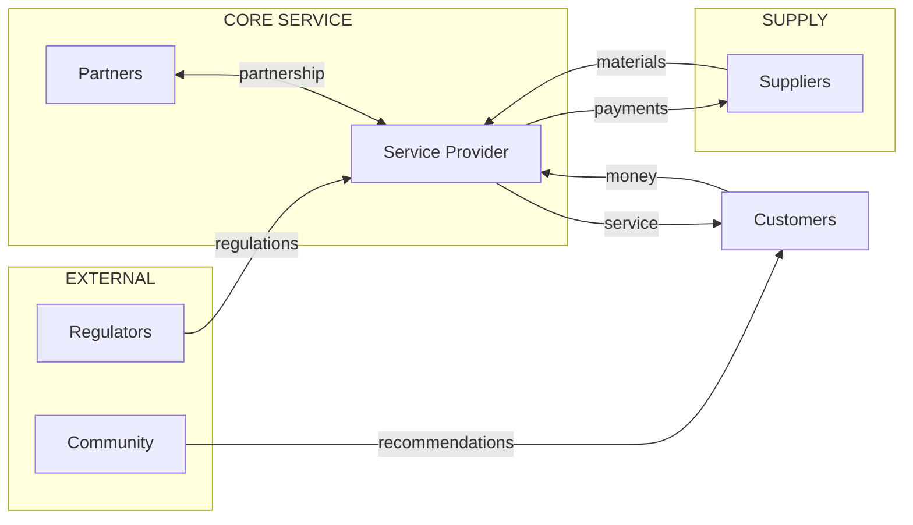
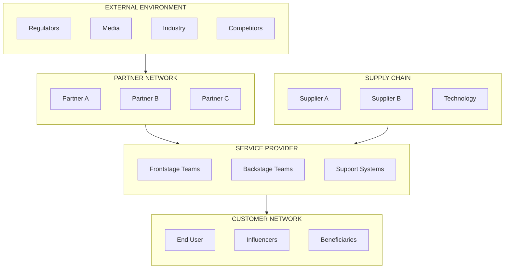

# Ecosystem Mapping

## Overview

An ecosystem map visualizes the complete network of actors, relationships, and value exchanges that make a service possible. It helps understand dependencies, identify opportunities, and design sustainable service systems.

## What Ecosystems Include

### Actors/Stakeholders
Everyone involved in the service ecosystem:

| Actor Type | Description | Examples |
|------------|-------------|----------|
| **Primary Users** | Direct service recipients | Customers, patients, students |
| **Service Providers** | Those delivering service | Employees, contractors, partners |
| **Supporting Actors** | Enablers of service delivery | Suppliers, technology vendors |
| **Influencers** | Those who affect decisions | Regulators, media, communities |
| **Beneficiaries** | Others who gain value | Families, employers, society |

### Relationships & Flows

| Flow Type | Description | Notation |
|-----------|-------------|----------|
| **Value** | What is exchanged | Money, products, services |
| **Information** | Data and communication | Orders, status, feedback |
| **Influence** | Power and decision-making | Regulations, recommendations |
| **Dependencies** | What must exist for service | Infrastructure, permissions |

## Ecosystem Map Structure

*Note: Arrow labels show value/information flows. Bidirectional arrows (`<-->`) indicate mutual exchange.*

## Creating an Ecosystem Map

### Step 1: Identify the Core Service
- What service is being mapped?
- Who is the primary customer?
- Who is the primary provider?

### Step 2: List All Actors
Brainstorm everyone connected to the service:
- Direct customers (end users)
- Internal teams (operations, support, leadership)
- Partners (distributors, affiliates, integrations)
- Suppliers (materials, technology, services)
- Regulators (government, industry bodies)
- Influencers (media, communities, experts)
- Indirect beneficiaries (families, employers)

### Step 3: Map Relationships
For each pair of actors, identify:
- What flows between them?
- What is exchanged (value, info, influence)?
- What is the direction of flow?
- What is the frequency/importance?

### Step 4: Identify Dependencies
- What must exist for the service to function?
- Where are single points of failure?
- What external factors affect the ecosystem?

### Step 5: Visualize the Map
- Place core service/customer at center
- Position actors by proximity to core service
- Draw connections with labeled flows (use `-->|label|` syntax in Mermaid)
- Use subgraphs to group related actors
- Color-code by actor type when possible

### Step 6: Analyze the Ecosystem
- Where are the critical relationships?
- Where are gaps or opportunities?
- Where are risks (dependencies, conflicts)?
- How might the ecosystem evolve?

## Ecosystem Map Template

## Value Exchange Matrix

Document what flows between key actors:

| From → To | Customer | Provider | Partner | Supplier |
|-----------|----------|----------|---------|----------|
| **Customer** | Referrals | Payment, Feedback | Reviews | - |
| **Provider** | Service, Support | - | Revenue share | Orders |
| **Partner** | Complementary services | Leads | Data sharing | - |
| **Supplier** | - | Materials, Tech | - | Coordination |

## Ecosystem Analysis Questions

### Opportunity Analysis
- Which actors are underserved?
- Where can new value be created?
- What relationships could be strengthened?
- What new actors could join the ecosystem?

### Risk Analysis
- Which relationships are most critical?
- Where are single points of failure?
- What happens if a key actor leaves?
- What external threats exist?

### Evolution Analysis
- How has the ecosystem changed over time?
- What trends are affecting actors?
- How might the ecosystem evolve?
- What scenarios should we plan for?

## Best Practices

1. **Start broad, then focus** – Map the whole ecosystem, then zoom into areas of interest
2. **Include indirect actors** – Regulators and influencers matter
3. **Map value, not just structure** – Show what flows, not just who exists
4. **Update regularly** – Ecosystems are dynamic
5. **Use for strategy** – Ecosystems reveal competitive opportunities
6. **Validate with stakeholders** – Check your map with actual actors
7. **Consider evolution** – Map future states, not just current
