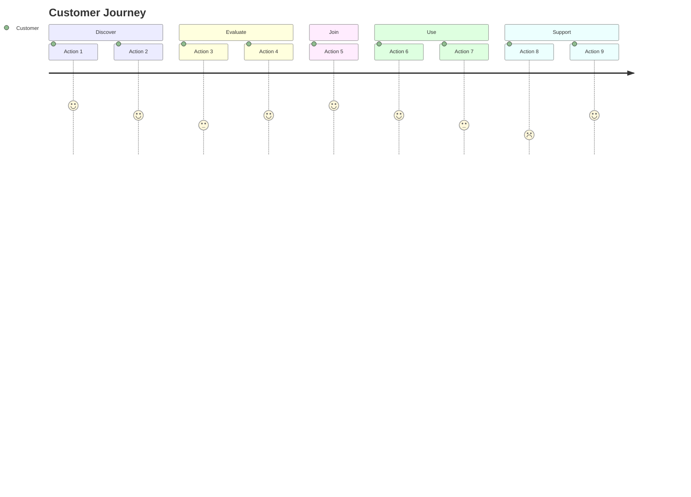
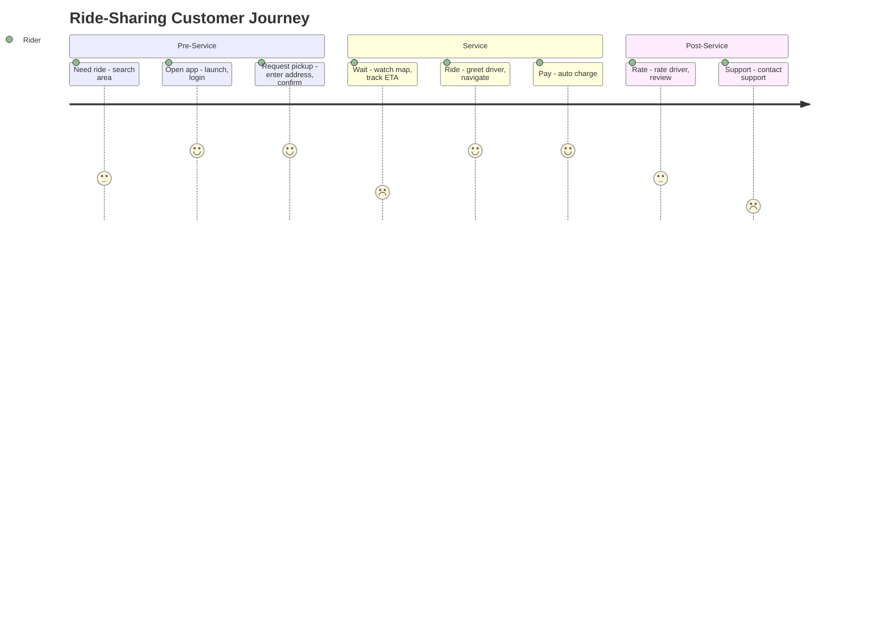

# Customer Journey Mapping

## Overview

A customer journey map visualizes the complete experience a customer has with a service, from initial awareness through post-service engagement. It reveals touchpoints, emotions, pain points, and opportunities for improvement.

## Journey Map Structure

### Timeline Phases

Organize the journey into three main periods:

1. **Pre-Service Period**
   - Awareness: How customers discover the service
   - Consideration: Research and evaluation
   - Decision: Commitment to use the service

2. **Service Period**
   - Onboarding: First interactions and setup
   - Core Usage: Main service delivery
   - Support: Help and problem resolution

3. **Post-Service Period**
   - Follow-up: Check-ins and continued engagement
   - Retention: Renewal or repeat usage
   - Advocacy: Referrals and reviews

### Journey Map Layers

For each phase, document:

| Layer | Description | Questions to Answer |
|-------|-------------|---------------------|
| **Stages** | Major steps in the journey | What are the key milestones? |
| **Actions** | What customer does | What tasks must they complete? |
| **Touchpoints** | Where interaction occurs | Which channels/interfaces? |
| **Emotions** | How customer feels | Frustrated? Delighted? Confused? |
| **Pain Points** | Friction and problems | What causes difficulty? |
| **Opportunities** | Improvement potential | How can we do better? |
| **Actors** | Who is involved | Which employees/systems? |

## Journey Map Template

**CUSTOMER JOURNEY MAP:** [Service Name]
**Persona:** [Target User]
**Scenario:** [Specific use case]

*Note: Numbers (1-5) represent emotional score at each action. Customize actions, sections, and scores based on research.*

**Mermaid limitation:** The `journey` diagram type only supports actions and emotional scores. Use supplementary tables (below) to document touchpoints, pain points, and opportunities for each stage.

**Additional layers to document per stage:**

| Layer | Description |
|-------|-------------|
| **Touchpoints** | Channels and interfaces used |
| **Pain Points** | Friction and problems encountered |
| **Opportunities** | Improvement potential |

## Creating a Journey Map

### Step 1: Define Scope
- Select specific persona and scenario
- Determine journey boundaries (start/end points)
- Identify the goal of mapping (discovery, improvement, communication)

### Step 2: Gather Data
- Customer interviews
- Observation of real service usage
- Analytics and behavioral data
- Employee insights
- Support ticket analysis

### Step 3: Map Current State
- List all stages chronologically
- Document customer actions at each stage
- Identify all touchpoints
- Note emotions (use research data, not assumptions)
- Mark pain points and bright spots

### Step 4: Analyze
- Find patterns in pain points
- Identify critical "moments of truth"
- Assess emotional peaks and valleys
- Compare to customer expectations

### Step 5: Identify Opportunities
- Prioritize pain points by impact and frequency
- Brainstorm improvements
- Connect opportunities to business metrics

## Moments of Truth

Critical interaction points that disproportionately impact customer perception:

- **First Moment of Truth**: Initial encounter with service
- **Second Moment of Truth**: Actual usage experience
- **Ultimate Moment of Truth**: When customers share their experience

Focus design effort on these high-impact moments.

## Example: Ride-Sharing Journey

**Pain Points by Stage:**

| Section | Stage | Pain Points |
|---|---|---|
| Pre-Service | Need ride | No signal |
| Pre-Service | Request pickup | Driver location unclear |
| Service | Wait | Unclear ETA |
| Service | Ride | Pick-up spot issues |
| Post-Service | Rate | No custom tip option |
| Post-Service | Support | Long wait times |

## Best Practices

1. **Use real data** – Base emotions and actions on research, not assumptions
2. **Stay persona-focused** – One map per persona/scenario
3. **Include all channels** – Digital, physical, human interactions
4. **Show the emotional arc** – Emotions drive memorable experiences
5. **Make it actionable** – Connect insights to specific improvements
6. **Keep it visual** – Use icons, colors, graphs for quick comprehension
7. **Validate with customers** – Test your map with real users
8. **Update regularly** – Journeys change as services evolve
