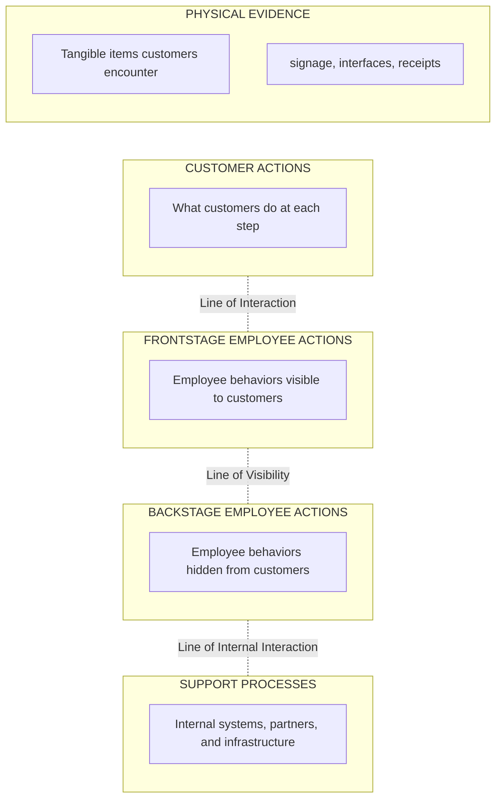

# Service Blueprints

## Overview

A service blueprint is an operational diagram that connects the customer journey to the internal processes that deliver it. It reveals both what customers see (frontstage) and what happens behind the scenes (backstage).

## Blueprint Structure

### Horizontal Axis: Time/Sequence
The journey flows left to right through service phases.

### Vertical Layers

From top to bottom (the diagram below shows the conceptual layer structure; see the table templates later for the horizontal timeline format):

### Key Lines

| Line | Separates | Design Implication |
|------|-----------|-------------------|
| **Line of Interaction** | Customer from employee | Touchpoint design decisions |
| **Line of Visibility** | What customer sees from what they don't | Service theater and perception |
| **Line of Internal Interaction** | Front-line from support | Operational handoffs |

## Blueprint Template

Use this table format to create blueprints with the horizontal timeline (phases as columns) and vertical layers (rows):

**SERVICE BLUEPRINT:** [Service Name]
**Scenario:** [Specific customer journey]

| Layer | Phase 1 | Phase 2 | Phase 3 | Phase 4 | Phase 5 | Phase 6 |
|-------|---------|---------|---------|---------|---------|---------|
| **Physical Evidence** | Website | Signage | Counter | Receipt | Email | Survey |
| **Customer Actions** | Browse | Enter | Order | Pay | Receive | Review |
| *(Line of Interaction)* | | | | | | |
| **Frontstage Actions** | Display menu | Greet customer | Take order | Process payment | Serve order | Thank customer |
| *(Line of Visibility)* | | | | | | |
| **Backstage Actions** | Update site | Staff briefing | Enter POS | Validate card | Prepare food | Send survey |
| *(Line of Internal Interaction)* | | | | | | |
| **Support Processes** | CMS | Schedule system | POS system | Payment gateway | Kitchen system | CRM system |

## Creating a Service Blueprint

### Step 1: Start with Customer Journey
- Use or create a customer journey map
- Define specific scenario and persona
- List all customer actions sequentially

### Step 2: Map Physical Evidence
For each customer action, identify:
- What tangible items does the customer see/interact with?
- What physical or digital artifacts are present?

### Step 3: Map Frontstage Actions
For each customer action:
- What do employees do that customers can see?
- What systems/interfaces do customers interact with directly?

### Step 4: Map Backstage Actions
For each frontstage action:
- What preparation happens that customers don't see?
- What internal processes support this moment?

### Step 5: Map Support Processes
For each backstage action:
- What systems, partners, or infrastructure enable this?
- What handoffs occur between teams/systems?

### Step 6: Identify Fail Points
Mark potential failure points with ⚠️:
- Where can processes break down?
- Where are there dependencies that might fail?
- What happens when things go wrong?

### Step 7: Add Time & Metrics
Note for each step:
- How long does/should this take?
- What metrics indicate success?
- Where are bottlenecks?

## Example: Coffee Shop Blueprint

**SERVICE BLUEPRINT:** Coffee Shop Order
**Scenario:** Customer orders specialty drink in-store

| Layer | Enter | Order | Pay | Wait | Receive |
|-------|-------|-------|-----|------|---------|
| **Physical Evidence** | Signage, Ambiance | Menu, Display, Barista | Receipt, Card terminal | Waiting area, Monitor | Cup with name |
| **Customer Actions** | Walk in, Find counter | Review, Order verbally | Present payment | Wait & watch | Take drink |
| *(Line of Interaction)* | | | | | |
| **Frontstage Actions** | Greet customer | Take order, Repeat back | Process payment | Call name | Hand over drink, Smile |
| *(Line of Visibility)* | | | | | |
| **Backstage Actions** | Open store, Prep station | Enter POS, Print ticket | Validate card | Make drink, Quality check | — |
| *(Line of Internal Interaction)* | | | | | |
| **Support Processes** | Cleaning schedule, Staff schedule | POS system, Inventory mgmt | Payment gateway ⚠️, Bank connection | Espresso machine ⚠️, Supplies inventory | — |

⚠️ = Potential fail points

## Using Blueprints

### For Design
- Identify touchpoints that need improvement
- Spot disconnects between frontstage promises and backstage capability
- Design new services with operational reality in mind

### For Communication
- Align teams on how service actually works
- Show developers how their systems connect to customer experience
- Train new employees on their role in the bigger picture

### For Improvement
- Find bottlenecks and fail points
- Optimize backstage to improve frontstage
- Reduce unnecessary complexity

## Best Practices

1. **Start with real customer journey** – Don't design backstage without frontstage
2. **Include failure scenarios** – Mark and plan for fail points
3. **Show time estimates** – Where does time accumulate?
4. **Involve all departments** – Backstage owners must participate
5. **Keep it readable** – Balance detail with clarity
6. **Version and update** – Blueprints are living documents
7. **Connect to metrics** – What does success look like at each point?
