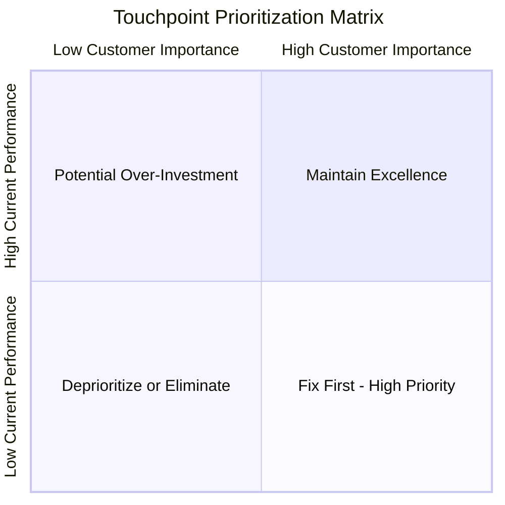

# Touchpoint Matrix

## Overview

A touchpoint matrix catalogs all points of interaction between customers and the service across channels and journey stages. It provides a comprehensive inventory for auditing, prioritizing, and improving touchpoints.

## Touchpoint Definition

A touchpoint is any moment of interaction between a customer and a service brand. Touchpoints include:

- **Human interactions** – Conversations with employees, partners
- **Digital interfaces** – Websites, apps, emails, chatbots
- **Physical elements** – Stores, packaging, products, signage
- **Communications** – Ads, social media, notifications
- **Documentation** – Contracts, receipts, instructions

## Touchpoint Matrix Template

### Basic Matrix

| Journey Stage | Digital | Human | Physical | Communication |
|---------------|---------|-------|----------|---------------|
| **Awareness** | | | | |
| **Consideration** | | | | |
| **Decision** | | | | |
| **Onboarding** | | | | |
| **Core Usage** | | | | |
| **Support** | | | | |
| **Follow-up** | | | | |
| **Retention** | | | | |
| **Advocacy** | | | | |

### Detailed Touchpoint Inventory

For each touchpoint, document:

| Field | Description |
|-------|-------------|
| **ID** | Unique identifier |
| **Name** | Touchpoint name |
| **Stage** | Journey stage |
| **Channel** | Digital/Human/Physical/Communication |
| **Description** | What happens at this touchpoint |
| **Owner** | Team/person responsible |
| **Customer Goal** | What customer wants to accomplish |
| **Emotion Target** | How customer should feel |
| **Current State** | Performance assessment |
| **Priority** | Importance for improvement |

## Example: E-commerce Touchpoint Matrix

| Stage | Digital | Human | Physical | Communication |
|-------|---------|-------|----------|---------------|
| **Awareness** | Social ads, SEO results, Blog content | - | Billboards | Influencer posts |
| **Consideration** | Product pages, Reviews, Comparison tools | Live chat | Store display | Email nurture |
| **Decision** | Checkout flow, Payment screen | Phone sales | In-store POS | Order confirmation |
| **Onboarding** | Account setup, Tutorial | Welcome call | Unboxing | Welcome email |
| **Core Usage** | Dashboard, Mobile app | Account manager | Product itself | Usage tips |
| **Support** | Help center, Chatbot | Phone support, Chat agents | Return process | Support emails |
| **Follow-up** | Satisfaction survey, Feature announcements | Check-in call | - | Follow-up emails |
| **Retention** | Renewal page, Upgrade options | Retention call | Renewal pack | Renewal reminder |
| **Advocacy** | Review prompts, Referral program | Thank you call | Referral cards | Referral emails |

## Detailed Touchpoint Card

```
┌─────────────────────────────────────────────────────────────────────┐
│ TOUCHPOINT: Order Confirmation Email                                │
├─────────────────────────────────────────────────────────────────────┤
│ ID: TC-023                                                          │
│ Stage: Purchase                                                     │
│ Channel: Digital (Email)                                            │
├─────────────────────────────────────────────────────────────────────┤
│ DESCRIPTION:                                                        │
│ Automated email sent immediately after order placement containing   │
│ order details, expected delivery, and next steps.                   │
├─────────────────────────────────────────────────────────────────────┤
│ CUSTOMER GOAL:                                                      │
│ Confirm order was placed correctly and know what happens next       │
├─────────────────────────────────────────────────────────────────────┤
│ EMOTION TARGET:                                                     │
│ Reassured, excited, confident in decision                           │
├─────────────────────────────────────────────────────────────────────┤
│ OWNER: Email Marketing Team                                         │
│ SYSTEMS: CRM, Email platform, Order management                      │
├─────────────────────────────────────────────────────────────────────┤
│ CURRENT STATE:                                                      │
│ Rating: 3/5                                                         │
│ Issues: Delayed sending, missing tracking info, generic design      │
├─────────────────────────────────────────────────────────────────────┤
│ PRIORITY: High                                                      │
│ IMPROVEMENT NOTES: Add real-time tracking, personalize content      │
└─────────────────────────────────────────────────────────────────────┘
```

## Creating a Touchpoint Inventory

### Step 1: Map All Touchpoints
Sources for identifying touchpoints:
- Customer journey maps
- Service blueprints
- Customer interviews
- Support ticket analysis
- Web/app analytics
- Employee interviews

### Step 2: Categorize Touchpoints
Organize by:
- Journey stage
- Channel type
- Customer segment
- Business function

### Step 3: Document Details
For each touchpoint:
- Write clear description
- Identify owner
- Define customer goal
- Note current performance

### Step 4: Assess and Prioritize
Evaluate each touchpoint:
- Customer importance (impact on satisfaction)
- Business importance (impact on conversion/retention)
- Current performance (how well it works today)
- Improvement effort (resources needed to improve)

### Step 5: Create Improvement Roadmap
Prioritize touchpoints by:
- High importance + Low performance = Fix immediately
- High importance + High performance = Maintain
- Low importance + Low performance = Consider eliminating
- Low importance + High performance = Potential over-investment

## Touchpoint Assessment Criteria

### Customer Experience Metrics

| Criterion | Description | Measurement |
|-----------|-------------|-------------|
| **Findability** | Can customers find this touchpoint? | Task success rate |
| **Usability** | Is it easy to use? | Effort score, errors |
| **Effectiveness** | Does it accomplish customer goal? | Completion rate |
| **Emotion** | How does it make customers feel? | Sentiment, feedback |
| **Consistency** | Is it consistent with other touchpoints? | Brand audit |

### Operational Metrics

| Criterion | Description | Measurement |
|-----------|-------------|-------------|
| **Reliability** | Does it work consistently? | Uptime, error rate |
| **Efficiency** | Resources required to deliver? | Cost per interaction |
| **Scalability** | Can it handle volume? | Capacity utilization |
| **Maintainability** | Easy to update and improve? | Change frequency |

## Touchpoint Prioritization Matrix



*Quadrant interpretation: Focus on quadrant-4 (high importance, low performance) for immediate improvements. Quadrant-1 touchpoints are working well—maintain them.*

## Omnichannel Consistency Audit

Check touchpoints across channels for:

| Consistency Element | Question |
|---------------------|----------|
| **Information** | Is the same information available across channels? |
| **Functionality** | Can customers do the same things across channels? |
| **Design** | Do touchpoints look and feel like the same brand? |
| **Handoff** | Can customers seamlessly switch between channels? |
| **History** | Is customer history available across channels? |

## Best Practices

1. **Be comprehensive** – Include all touchpoints, not just digital
2. **Involve all teams** – Each touchpoint has an owner
3. **Update regularly** – New touchpoints are constantly created
4. **Connect to journey** – Touchpoints are journey steps, not isolated moments
5. **Measure what matters** – Focus on customer-centric metrics
6. **Prioritize ruthlessly** – You can't improve everything at once
7. **Consider the ecosystem** – Partner touchpoints affect your brand too
